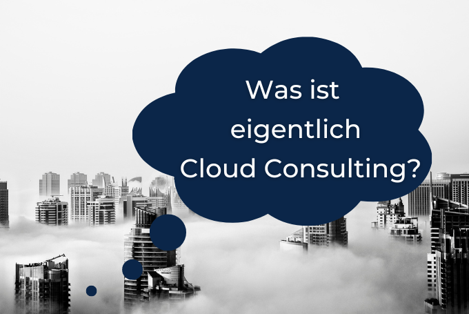

 

# Thinkport Ranks As One of The Top Cloud Consultants in Germany

The IT Consultancy industry is one that has flown under the radar for years. Mostly because people didn’t understand what it was about and what it can do for them. It was only when certain businesses began improving by leaps and bounds ahead of the competition did everyone take notice.

But can Cloud Consulting Companies be truly responsible for the success of those companies? Aren’t there other variables that contributed more to the success? While it’s possible that said companies are where they are because of the immense talent and resources at their disposal, it doesn’t diminish the impact IT consultancy has had on their growth.

To prove this, **Thinkport’s cloud consulting team** joined a B2B market research firm and platform called Clutch, to make our services available to everyone. Our hope is by working with as wide an audience as possible, we can eliminate all other variables from the assessment of our success.

After spending some time collecting feedback on our work, we’re happy to report we’ve proven our hypothesis. With a **five-star average rating** on our past performances (see **[here](https://clutch.co/profile/thinkport-gmbh#summary)**) , it’s safe to say we’ve had a big impact on our clients. Knowing that we’ve earned the trust of so many people is a great achievement that will help propel us toward bigger and better things in the coming years.

Our team has assembled some of the brightest minds in the industry and looking into what the technology can do and what it means for our clients. We truly believe these technologies can make a massive difference in the lives and trajectories of modern businesses.

We’ve built a highly motivated, enthusiastic, and talented team that’s hungry for new victories. Our clients can expect creative business solutions that will take advantage of their unique skills and offers. The goal is to use technology to transform our clients into unique and effective in their respective industries.

We are Thinkport - we do Cloud Consulting with Startup Spirit. We go all in for your migration and development in the cloud. And that goes down well. If you think we have what you need to get to the next level, don’t wait another minute to give us a call..

Our team will talk to you about your advantages, and how our services can elevate them to being the most desirable services in the market. Feel free to register to our Cloud Architecture Workshop **[here](https://thinkport.digital/cloud-architecture-review/)**. We look forward to working with you soon.

## Blog Kurator

Christina Friede

Business Development

Email:

[cfriede@thinkport.digital](mailto:cfriede@thinkport.digital)

*  

## [Weitere Beiträge](https://thinkport.digital/blog)

### [Kafka Streams](https://thinkport.digital/kafka-streams/ "Kafka Streams")

[Cloud General](https://thinkport.digital/category/cloud-general/), [Streaming](https://thinkport.digital/category/streaming/)

### [Kafka Streams](https://thinkport.digital/kafka-streams/ "Kafka Streams")

[Cloud General](https://thinkport.digital/category/cloud-general/), [Streaming](https://thinkport.digital/category/streaming/)

### [Hybrid-Cloud-Manifest](https://thinkport.digital/hybrid-cloud-manifest/ "Hybrid-Cloud-Manifest")

[Cloud General](https://thinkport.digital/category/cloud-general/), [Hybrid-Cloud](https://thinkport.digital/category/hybrid-cloud/)

### [Hybrid-Cloud-Manifest](https://thinkport.digital/hybrid-cloud-manifest/ "Hybrid-Cloud-Manifest")

[Cloud General](https://thinkport.digital/category/cloud-general/), [Hybrid-Cloud](https://thinkport.digital/category/hybrid-cloud/)

### [Streaming-Services](https://thinkport.digital/streaming-services/ "Streaming-Services")

[Cloud General](https://thinkport.digital/category/cloud-general/), [Streaming](https://thinkport.digital/category/streaming/)

### [Streaming-Services](https://thinkport.digital/streaming-services/ "Streaming-Services")

[Cloud General](https://thinkport.digital/category/cloud-general/), [Streaming](https://thinkport.digital/category/streaming/)

### [Azure Databricks](https://thinkport.digital/azure-databricks/ "Azure Databricks")

[Azure Cloud](https://thinkport.digital/category/azure-cloud/), [Cloud General](https://thinkport.digital/category/cloud-general/)

### [Azure Databricks](https://thinkport.digital/azure-databricks/ "Azure Databricks")

[Azure Cloud](https://thinkport.digital/category/azure-cloud/), [Cloud General](https://thinkport.digital/category/cloud-general/)

### [Was ist Cloud Consulting](https://thinkport.digital/was-ist-cloud-consulting/ "Was ist Cloud Consulting")

[Cloud General](https://thinkport.digital/category/cloud-general/)

### [Was ist Cloud Consulting](https://thinkport.digital/was-ist-cloud-consulting/ "Was ist Cloud Consulting")

[Cloud General](https://thinkport.digital/category/cloud-general/)

### [Core Strategies Cloud Migration](https://thinkport.digital/core-strategies-cloud-migration/ "Core Strategies Cloud Migration")

[Cloud General](https://thinkport.digital/category/cloud-general/), [Cloud Kubernetes](https://thinkport.digital/category/cloud-kubernetes/)

### [Core Strategies Cloud Migration](https://thinkport.digital/core-strategies-cloud-migration/ "Core Strategies Cloud Migration")

[Cloud General](https://thinkport.digital/category/cloud-general/), [Cloud Kubernetes](https://thinkport.digital/category/cloud-kubernetes/)
