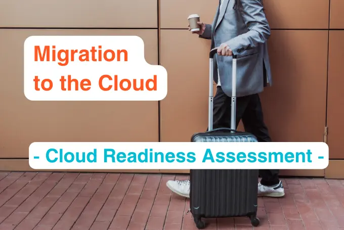
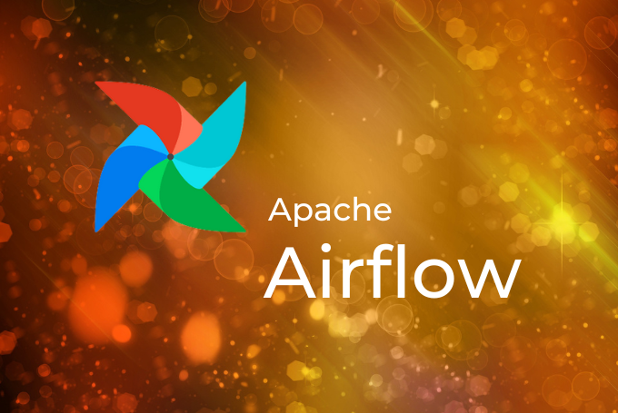

# Vom Kafka Cluster zum Event Mesh:  

Confluent vs. Solace

Die Welt der Event-Driven Architekturen ist voller neuer Innovationen. Während wir unseren Fokus auf hybride Cloud-Architekturen und Streaming Technologien wie Apache Kafka richten, liefern sich zwei Branchengrößen - Solace und Confluent - einen epischen Schlagabtausch. In diesem Artikel werden wir uns mit den technischen und architektonischen Unterschieden zwischen Solaces Event Mesh und Confluents Cluster Linking befassen und Einblicke liefern, um eine informierte Entscheidung treffen zu können.

## Technische und architektonische Unterschiede:

### Confluent Cluster Linking:

* **Architektur**: Confluent, auf Apache Kafka aufbauend, verwendet Cluster Linking, um Kafka-Cluster in verschiedene Umgebungen zu spiegeln.
* **Kafka-zentrierte Architektur**: Confluent, tief in Apache Kafka verwurzelt, bietet leistungsstarkes Daten-Streaming und gilt daher als beste Lösung im Rahmen eines auf Apache Kafka-zentrierten Ansatzes.
* **Skalierbarkeit**: Es bietet lineare Skalierbarkeit, erfordert jedoch eine intensivere Broker-Verwaltung für optimale Leistung. Die Skalierung kann durch Anpassung von Fetcher-Threads, Brokern oder Quoten in Confluent Cloud erfolgen.
* **Stabiles Daten-Streaming**: Confluent ist optimiert für das Streaming großer Datenmengen und gewährleistet hohe Durchsatzraten und geringe Latenzzeiten.
* **Einfach & Schnell**: Ermöglicht eine direkte Verbindung und Spiegelung von Topics zwischen Kafka- oder Confluent-Clustern.
* **Spiegelung/Mirroring**: Bietet eine Byte-für-Byte-Replikation von Topics und stellt so eine global konsistente Offsetpositionierung sicher.
* **Best Replica**: Bietet Vorteile gegenüber anderen Apache Kafka-Replikationsoptionen, wie beispielsweise die Integration in Confluent Server und Cloud, exakte Spiegelungserstellung, dynamische Aktualisierungen und höhere Durchsatzraten für komprimierte Nachrichten.
* **Herausforderungen in hybriden Clouds**: Confluent Cluster Linking steht vor Herausforderungen bei der Verbindung privater Clouds mit öffentlichen Clouds oder lokalen Umgebungen und erfordert sorgfältige Konfiguration und sichere Verbindungen.
* **Festplatte vs. Netzwerk**: Confluent mit Apache Kafka ist dank seiner festplattenbasierten Architektur super schnell und hat Vorteile gegenüber dem netzwerkbasierten Ansatz von Solace, wenn es darum geht, ein Cluster in einer instabilen Netzwerkumgebung zu verbinden.

Umfassende Zusatz-Informationen zu Apache Kafka von Confluent finden Sie auch **[hier](https://thinkport.digital/cloud-consulting-fuer-deutsche-grossunternehmen/apache-kafka/)**.

### Solace Event Mesh:

* **Architektur**: Solace verfügt über eine dynamische Mesh-Architektur, die Event-Broker miteinander verbindet und nahtlose Kommunikation in verschiedenen Umgebungen ermöglicht.
* **Protokollagnostisch**: Es unterstützt eine Vielzahl von Protokollen, darunter MQTT, AMQP, REST und WebSocket, was Flexibilität und Kompatibilität mit verschiedenen Systemen bietet.
* **Verteilter Charakter**: Solace zeichnet sich durch die Schaffung eines selbststeuernden und selbstreparierendem "Mesh" über geografisch verteilte, hybride und Multi-Cloud-Umgebungen aus.
* **Nahtlose Integration**: Solace integriert sich nahtlos in zahlreiche Technologien und Plattformen und ist daher eine vielseitige Wahl für komplexe Architekturen.
* **Verteiltes Tracing**: Mit seinem neuesten Update unterstützt Solace jetzt verteiltes Tracing, das eine vollständige Sichtbarkeit von Event-Streaming über das Mesh ermöglicht. Dies ist besonders in hybriden Cloud-Umgebungen von großem Nutzen, wo das Verständnis der Kommunikation zwischen internen Diensten entscheidend ist.
* **Wildcards**: Das dynamische erkennen von Topics, Edge-Fanout und Unterstützung für Wildcards in Topic-Abonnements.
* **Kafka Mesh**: Die Kafka Mesh-Funktion von Solace ermöglicht eine reibungslose Integration mit Apache Kafka und erleichtert die Kommunikation zwischen Kafka-Anwendungen und dem Event Mesh.
* **Partitionierte Queues**: Das neueste Update von Solace umfasst partitionierte Queues, die eine effiziente und skalierbare Verarbeitung von Events gewährleisten. Es ist, als würde man seinen Datenkuchen intelligent aufteilen, sodass jeder blitzschnell ein Stück erhält.
* **Kompetenz in hybriden Clouds**: Die Fähigkeit, eine dynamische Mesh-Architektur über lokale, private Cloud- und öffentliche Cloud-Umgebungen zu erstellen, macht Solace zu einem geschickten Navigator auf den Wogen der hybriden Cloud.

## Unterschiede:

* **Solace Event Mesh** hat jetzt das Konzept eines Kafka-Mesh übernommen, die Event-Broker und dynamisches Routing beinhaltet, während **Confluent Cluster Linking** direkt Topics zwischen Clustern verbindet und spiegelt.
* **Confluent Cluster Linking** konzentriert sich auf eine Byte-für-Byte-Replikation und Leistungsvorteile, während **Solace Event Mesh** die Vorteile intelligenter Event-Broker mit eingebauter Intelligenz im Mesh betont.
* **Confluent Cluster Linking** zielt auf Anwendungsfälle wie Notfallwiederherstellung, globale Replikation und Datenaustausch ab, während **Solace Event Mesh** Herausforderungen wie Echtzeitkonnektivität zu Edge-Geräten, Datenstreaming und -filterung bewältigt.

## Ähnlichkeiten:

* Beide Lösungen zielen darauf ab, Echtzeitkonnektivität und Datenbewegung zu ermöglichen und beinhalten auch Kafka-Cluster.
* Sie bieten Lösungen für hybride Cloud-Bereitstellungen und die Verbindung verschiedener Kafka-Cluster.
* Beide betonen die Bedeutung der Spiegelung und Replikation von Topics.

## Praktische Beispiele:

### Confluent Cluster Linking:

* **Anwendungsfall**: Eine große Einzelhandelskette möchte ein Echtzeit-Analytics-Dashboard zur Überwachung von Verkäufen und Kundenverhalten erstellen. Die Datenströme sind enorm und erfordern eine robuste Handhabung.
* **Herausforderung in hybriden Clouds**: Confluent glänzt bei der Bewältigung großer Datenströme mit seinen Wurzeln in Apache Kafka. Wenn die Einzelhandelskette jedoch versucht, ihr lokales Inventarsystem über eine private Cloud mit cloud-basierter Analytik zu integrieren, stößt Confluent Cluster Linking auf Hindernisse aufgrund seiner Komplexität bei der Verbindung privater Clouds.

### Solace Event Mesh:

* **Anwendungsfall**: Stellen Sie sich einen globalen Einzelhandelsriesen mit physischen Geschäften, Online-Präsenz und einer umfangreichen Lieferkette vor. Der Einzelhändler benötigt eine Echtzeit-Inventarverwaltung, eine Analyse des Kundenverhaltens und einen effizienten Datenfluss zwischen verschiedenen Systemen in verschiedenen Regionen und Clouds.
* **Stärke mit Updates**: Das Distributed Tracing von Solace ermöglicht eine vollständige Sichtbarkeit der Daten in hybriden Umgebungen. Kafka Mesh gewährleistet eine nahtlose Integration mit bestehenden Inventarverwaltungssystemen. Partitioned Queues erleichtern die effiziente Verarbeitung von Verkaufsdaten mit hoher Volumen während Spitzenzeiten wie dem Black Friday. Darüber hinaus gewährleistet die Kompetenz von Solace in hybriden Clouds einen harmonischen Datenfluss zwischen Lagern, physischen Geschäften und E-Commerce-Plattformen.

Siehe auch den Award Winning Case von Thinkport für Edeka Digital mit der Technologie von Solace. Die Cloud-basierte Event-Streaming- und Management-Lösung hilft bei der Verteilung von Stammdaten an die Märkte, Rechenzentren und Cloud-Dienste in Echtzeit. Weitere Details erfahren Sie **[hier](https://thinkport.digital/reta-award-winning-cooperation/)**.

## Fazit:

Auf die Frage, welche Lösung die beste wäre, ist unsere Antwort: "Es hängt davon ab..." ; -)  
  
Im Kontext hybrider Cloud-Umgebungen zeigt Solace Event Mesh eine starke Übereinstimmung mit den komplexen Anforderungen an die Integration und Verwaltung von Datenflüssen in verschiedenen Systemen und Umgebungen. Die Ergänzung von Distributed Tracing ist eine bedeutende Verbesserung, die entscheidende Einblicke in Ereignispfade bietet, was für die Leistungsoptimierung und Fehlerbehebung unverzichtbar ist. Kafka Mesh erleichtert die nahtlose Integration mit Apache Kafka, das weit verbreitet für die Verarbeitung von Datenströmen mit hoher Durchsatzrate verwendet wird. Darüber hinaus sind partitionierte Queues entscheidend für die effiziente Zuweisung von Verarbeitungsressourcen, insbesondere in Umgebungen, in denen eine Ressourcenoptimierung entscheidend ist.  
  
Auf der anderen Seite zeichnet sich Confluent Cluster Linking durch robustes Daten-Streaming aus, stößt jedoch in hybriden Cloud-Szenarien auf Grenzen, insbesondere bei der Verbindung privater Clouds mit anderen Umgebungen. Dies kann für Organisationen, die eine agile und nahtlose Integration zwischen lokalen, privaten und öffentlichen Clouds benötigen, eine Herausforderung darstellen.  
  
Bei der Wahl zwischen Solace Event Mesh und Confluent Cluster Linking für eine Event-Driven Architektur sollten Sie sorgfältig Skalierbarkeit, Integrationsmöglichkeiten und Unterstützung für hybride Cloud-Konfigurationen berücksichtigen. Organisationen, die in hybriden Cloud-Umgebungen tätig sind, finden möglicherweise die Fähigkeiten und Flexibilität von Solace Event Mesh besser auf ihre technischen Anforderungen abgestimmt.unser

## Quiz

**1\. Integration und Kompatibilität:**  
Ist Ihre Organisation stark auf Kafka als zentralen Datenstrom für Daten-Streaming und -verarbeitung ausgerichtet?

Ja

Wenn Ihre Umgebung hauptsächlich auf Apache Kafka ausgerichtet ist und der Schwerpunkt auf Datenstreaming mit hoher Durchsatzrate liegt ist Confluent Cluster Linking die bessere Lösung für Sie.

Nein

Sie könnten sich eher für Solace Event Mesh entscheiden, aufgrund seiner protokollagnostischen Natur und der Funktion Kafka Mesh.

**2\. Echtzeitkonnektivität zu Edge-Geräten:**  
Benötigen Sie Echtzeitkonnektivität zwischen Ihren Backend-Kafka-Clustern und Edge-Anwendungen und -Geräten an verschiedenen Standorten?

Ja

Solace Event Mesh bietet die Möglichkeit, Echtzeitkonnektivität zu Edge-Anwendungen und -Geräten herzustellen und ist somit eine geeignete Wahl.

Nein

Wenn Ihr Fokus hauptsächlich auf hoher Verfügbarkeit und Notfallwiederherstellung oder anderen Anwendungsfällen liegt, könnte Confluent Cluster Linking besser geeignet sein.

**3\. Selektiver Eventstream:**  
Ist es für Ihr System wichtig, nur bestimmte Events oder ein Subset von Eventsstreams mit einem hohen Grad an Kontrolle zu übertragen, während die Reihenfolge beibehalten wird?

Ja Dann haben Sie die Qual der Wahl, denn beide Produkte bieten ein sehr hohes Mass an Kontrolle bei der Filterung ihrer Eventstreams.  
  
Solace Event Mesh bietet die Möglichkeit durch Wildcards einen neuen virtuellen Eventstream aus verschiedenen Quellen zu bilden, während die Reihenfolge beibehalten wird.  
  
Confluent Cluster Linking kann eine effektive Replikation und Spiegelung von Topics bieten. Für die Filterung können sie mittels Kafka-Streams oder dem Schreiben von KSQL ein neuen Topic mit dem gewünschten Eventstream bereitstellen. Nein Beide Technologien bieten Out-of-the-Box die Möglichkeit ein oder mehrere Eventsstreams komplett zu übertragen.  
  
In einem reinem Kafka-Szenario profitieren sie von Confluents Cluster-Linking als native Lösung am meisten.

**4\. Verbindung verschiedener Apache Kafka Cluster:**  
Müssen Sie Daten/Ereignisse zwischen verschiedenen Apache Kafka Clustern in verteilten Umgebungen verbinden und replizieren?

Ja Wenn Sie Apache Kafka Cluster mit einander Verbinden möchten und keine Verbindung zu anderen Event-Architekruen benötigen, kann Confluent Cluster Linking Ihre Replikationsanforderungen am besten erfüllen. Nein Solace Event Mesh unterstützt die Verbindung verschiedener Event-Driven Architekturen und wäre somit eine geeignete Wahl für Ihre Anforderung.

**5\. Standardisierung von Tools und Governance:**  
Suchen Sie nach einer Lösung, die standardisierte Tools und bewährte Verfahren zur Verwaltung und Governance von Apache Kafka- und Nicht-Kafka-Ereignisströmen bereitstellt?

Ja Solace Event Mesh bietet Funktionen zur Verwaltung und Governance von Ereignisströmen und ist somit eine empfohlene Wahl für die Standardisierung von Tools und Governance. Nein Wenn Ihr Schwerpunkt hauptsächlich auf nahtloser Datenreplikation und Spiegelung zwischen Kafka-Clustern liegt, kann Confluent Cluster Linking Ihre Anforderungen erfüllen.

**6\. Herausfordernde Netzwerkumgebungen:**  
Haben Sie es mit herausfordernden Netzwerkumgebungen zu tun, in denen Netzwerklatenz und Verfügbarkeit unvorhersehbar sein können?

Ja Confluent Cluster Linking ist darauf ausgelegt, mit herausfordernden Netzwerkumgebungen umzugehen und bietet eine sichere, leistungsstarke und tolerante Replikation von Topics, auch bei vorhandener Netzwerklatenz. Nein Obwohl Confluent Cluster Linking immer noch von Vorteil sein kann, ist dies möglicherweise nicht der Hauptvorteil für Ihre Organisation. Bei der Entscheidungsfindung sollten andere Faktoren berücksichtigt werden.

## Quiz

1\. Integration und Kompatibilität:

Ist Ihre Organisation stark auf Kafka als zentralen Datenstrom für Daten-Streaming und -verarbeitung ausgerichtet?

Ja

Wenn Ihre Umgebung hauptsächlich auf Apache Kafka ausgerichtet ist und der Schwerpunkt auf Datenstreaming mit hoher Durchsatzrate liegt ist Confluent Cluster Linking die bessere Lösung für Sie.

Nein

Sie könnten sich eher für Solace Event Mesh entscheiden, aufgrund seiner protokollagnostischen Natur und der Funktion Kafka Mesh.

2\. Echtzeitkonnektivität zu Edge-Geräten:

Benötigen Sie Echtzeitkonnektivität zwischen Ihren Backend-Kafka-Clustern und Edge-Anwendungen und -Geräten an verschiedenen Standorten?

Ja

Solace Event Mesh bietet die Möglichkeit, Echtzeitkonnektivität zu Edge-Anwendungen und -Geräten herzustellen und ist somit eine geeignete Wahl.

Nein

Wenn Ihr Fokus hauptsächlich auf hoher Verfügbarkeit und Notfallwiederherstellung oder anderen Anwendungsfällen liegt, könnte Confluent Cluster Linking besser geeignet sein.

3\. Selektiver Eventstream:

Ist es für Ihr System wichtig, nur bestimmte Events oder ein Subset von Eventsstreams mit einem hohen Grad an Kontrolle zu übertragen, während die Reihenfolge beibehalten wird?

Ja

Dann haben Sie die Qual der Wahl, denn beide Produkte bieten ein sehr hohes Mass an Kontrolle bei der Filterung ihrer Eventstreams.  
  

Solace Event Mesh bietet die Möglichkeit durch Wildcards einen neuen virtuellen Eventstream aus verschiedenen Quellen zu bilden, während die Reihenfolge beibehalten wird.  
  

Confluent Cluster Linking kann eine effektive Replikation und Spiegelung von Topics bieten. Für die Filterung können sie mittels Kafka-Streams oder dem Schreiben von KSQL ein neuen Topic mit dem gewünschten Eventstream bereitstellen.

Nein

Beide Technologien bieten Out-of-the-Box die Möglichkeit ein oder mehrere Eventsstreams komplett zu übertragen.  
  
In einem reinem Kafka-Szenario profitieren sie von Confluents Cluster-Linking als native Lösung am meisten.

4\. Verbindung verschiedener Apache Kafka Cluster:

Müssen Sie Daten/Ereignisse zwischen verschiedenen Apache Kafka Clustern in verteilten Umgebungen verbinden und replizieren?

Ja

Wenn Sie Apache Kafka Cluster mit einander Verbinden möchten und keine Verbindung zu anderen Event-Architekruen benötigen, kann Confluent Cluster Linking Ihre Replikationsanforderungen am besten erfüllen.

Nein

Solace Event Mesh unterstützt die Verbindung verschiedener Event-Driven Architekturen und wäre somit eine geeignete Wahl für Ihre Anforderung.

5\. Standardisierung von Tools und Governance:

Suchen Sie nach einer Lösung, die standardisierte Tools und bewährte Verfahren zur Verwaltung und Governance von Apache Kafka- und Nicht-Kafka-Ereignisströmen bereitstellt?

Ja

Solace Event Mesh bietet Funktionen zur Verwaltung und Governance von Ereignisströmen und ist somit eine empfohlene Wahl für die Standardisierung von Tools und Governance.

Nein

Wenn Ihr Schwerpunkt hauptsächlich auf nahtloser Datenreplikation und Spiegelung zwischen Kafka-Clustern liegt, kann Confluent Cluster Linking Ihre Anforderungen erfüllen.

6\. Herausfordernde Netzwerkumgebungen:

Haben Sie es mit herausfordernden Netzwerkumgebungen zu tun, in denen Netzwerklatenz und Verfügbarkeit unvorhersehbar sein können?

Ja

Confluent Cluster Linking ist darauf ausgelegt, mit herausfordernden Netzwerkumgebungen umzugehen und bietet eine sichere, leistungsstarke und tolerante Replikation von Topics, auch bei vorhandener Netzwerklatenz.

Nein

Obwohl Confluent Cluster Linking immer noch von Vorteil sein kann, ist dies möglicherweise nicht der Hauptvorteil für Ihre Organisation. Bei der Entscheidungsfindung sollten andere Faktoren berücksichtigt werden.

## Quiz

1\. Integration und Kompatibilität: Ja Nein 1. Integration und Kompatibilität:

Ist Ihre Organisation stark auf Kafka als zentralen Datenstrom für Daten-Streaming und -verarbeitung ausgerichtet?

Ja

Wenn Ihre Umgebung hauptsächlich auf Apache Kafka ausgerichtet ist und der Schwerpunkt auf Datenstreaming mit hoher Durchsatzrate liegt ist Confluent Cluster Linking die bessere Lösung für Sie.

Nein

Sie könnten sich eher für Solace Event Mesh entscheiden, aufgrund seiner protokollagnostischen Natur und der Funktion Kafka Mesh.

2\. Echtzeitkonnektivität zu Edge-Geräten: Ja Nein 2. Echtzeitkonnektivität zu Edge-Geräten:

Benötigen Sie Echtzeitkonnektivität zwischen Ihren Backend-Kafka-Clustern und Edge-Anwendungen und -Geräten an verschiedenen Standorten?

Ja

Solace Event Mesh bietet die Möglichkeit, Echtzeitkonnektivität zu Edge-Anwendungen und -Geräten herzustellen und ist somit eine geeignete Wahl.

Nein

Wenn Ihr Fokus hauptsächlich auf hoher Verfügbarkeit und Notfallwiederherstellung oder anderen Anwendungsfällen liegt, könnte Confluent Cluster Linking besser geeignet sein.

3\. Selektiver Eventstream: Ja Nein 3. Selektiver Eventstream:

Ist es für Ihr System wichtig, nur bestimmte Events oder ein Subset von Eventsstreams mit einem hohen Grad an Kontrolle zu übertragen, während die Reihenfolge beibehalten wird?

Ja

Dann haben Sie die Qual der Wahl, denn beide Produkte bieten ein sehr hohes Mass an Kontrolle bei der Filterung ihrer Eventstreams.  
  

Solace Event Mesh bietet die Möglichkeit durch Wildcards einen neuen virtuellen Eventstream aus verschiedenen Quellen zu bilden, während die Reihenfolge beibehalten wird.  
  

Confluent Cluster Linking kann eine effektive Replikation und Spiegelung von Topics bieten. Für die Filterung können sie mittels Kafka-Streams oder dem Schreiben von KSQL ein neuen Topic mit dem gewünschten Eventstream bereitstellen.

Nein

Beide Technologien bieten Out-of-the-Box die Möglichkeit ein oder mehrere Eventsstreams komplett zu übertragen.  
  
In einem reinem Kafka-Szenario profitieren sie von Confluents Cluster-Linking als native Lösung am meisten.

4\. Verbindung verschiedener Apache Kafka Cluster: Ja Nein 4. Verbindung verschiedener Apache Kafka Cluster:

Müssen Sie Daten/Ereignisse zwischen verschiedenen Apache Kafka Clustern in verteilten Umgebungen verbinden und replizieren?

Ja

Wenn Sie Apache Kafka Cluster mit einander Verbinden möchten und keine Verbindung zu anderen Event-Architekruen benötigen, kann Confluent Cluster Linking Ihre Replikationsanforderungen am besten erfüllen.

Nein

Solace Event Mesh unterstützt die Verbindung verschiedener Event-Driven Architekturen und wäre somit eine geeignete Wahl für Ihre Anforderung.

5\. Standardisierung von Tools und Governance: Ja Nein 5. Standardisierung von Tools und Governance:

Suchen Sie nach einer Lösung, die standardisierte Tools und bewährte Verfahren zur Verwaltung und Governance von Apache Kafka- und Nicht-Kafka-Ereignisströmen bereitstellt?

Ja

Solace Event Mesh bietet Funktionen zur Verwaltung und Governance von Ereignisströmen und ist somit eine empfohlene Wahl für die Standardisierung von Tools und Governance.

Nein

Wenn Ihr Schwerpunkt hauptsächlich auf nahtloser Datenreplikation und Spiegelung zwischen Kafka-Clustern liegt, kann Confluent Cluster Linking Ihre Anforderungen erfüllen.

6\. Herausfordernde Netzwerkumgebungen: Ja Nein 6. Herausfordernde Netzwerkumgebungen:

Haben Sie es mit herausfordernden Netzwerkumgebungen zu tun, in denen Netzwerklatenz und Verfügbarkeit unvorhersehbar sein können?

Ja

Confluent Cluster Linking ist darauf ausgelegt, mit herausfordernden Netzwerkumgebungen umzugehen und bietet eine sichere, leistungsstarke und tolerante Replikation von Topics, auch bei vorhandener Netzwerklatenz.

Nein

Obwohl Confluent Cluster Linking immer noch von Vorteil sein kann, ist dies möglicherweise nicht der Hauptvorteil für Ihre Organisation. Bei der Entscheidungsfindung sollten andere Faktoren berücksichtigt werden.

## [Weitere Beiträge](https://thinkport.digital/blog)

[")](https://thinkport.digital/cloud-consulting-for-development/)

### [Cloud Consulting for development](https://thinkport.digital/cloud-consulting-for-development/ "Cloud Consulting for development")

[Cloud General](https://thinkport.digital/category/cloud-general/)

### [Cloud Consulting for development](https://thinkport.digital/cloud-consulting-for-development/ "Cloud Consulting for development")

[Cloud General](https://thinkport.digital/category/cloud-general/)

### [Cloud Consulting for Migration to the Cloud](https://thinkport.digital/cloud-consulting-for-migration-to-the-cloud/ "Cloud Consulting for Migration to the Cloud")

[Cloud General](https://thinkport.digital/category/cloud-general/)

### [Cloud Consulting for Migration to the Cloud](https://thinkport.digital/cloud-consulting-for-migration-to-the-cloud/ "Cloud Consulting for Migration to the Cloud")

[Cloud General](https://thinkport.digital/category/cloud-general/)

### [Core Strategies Cloud Migration](https://thinkport.digital/core-strategies-cloud-migration/ "Core Strategies Cloud Migration")

[Cloud General](https://thinkport.digital/category/cloud-general/), [Cloud Kubernetes](https://thinkport.digital/category/cloud-kubernetes/)

### [Core Strategies Cloud Migration](https://thinkport.digital/core-strategies-cloud-migration/ "Core Strategies Cloud Migration")

[Cloud General](https://thinkport.digital/category/cloud-general/), [Cloud Kubernetes](https://thinkport.digital/category/cloud-kubernetes/)

### [Cloud Consulting with Kubernetes and Docker](https://thinkport.digital/cloud-consulting-with-kubernetes-and-docker/ "Cloud Consulting with Kubernetes and Docker")

[Cloud General](https://thinkport.digital/category/cloud-general/)

### [Cloud Consulting with Kubernetes and Docker](https://thinkport.digital/cloud-consulting-with-kubernetes-and-docker/ "Cloud Consulting with Kubernetes and Docker")

[Cloud General](https://thinkport.digital/category/cloud-general/)

### [Modernisierung ist ein Kontinuum](https://thinkport.digital/modernisierung-ist-ein-kontinuum/ "Modernisierung ist ein Kontinuum")

[Cloud General](https://thinkport.digital/category/cloud-general/), [Cloud Kubernetes](https://thinkport.digital/category/cloud-kubernetes/)

### [Modernisierung ist ein Kontinuum](https://thinkport.digital/modernisierung-ist-ein-kontinuum/ "Modernisierung ist ein Kontinuum")

[Cloud General](https://thinkport.digital/category/cloud-general/), [Cloud Kubernetes](https://thinkport.digital/category/cloud-kubernetes/)

### [Apache Airflow](https://thinkport.digital/apache-airflow/ "Apache Airflow")

[Cloud General](https://thinkport.digital/category/cloud-general/), [Hybrid-Cloud](https://thinkport.digital/category/hybrid-cloud/)

### [Apache Airflow](https://thinkport.digital/apache-airflow/ "Apache Airflow")

[Cloud General](https://thinkport.digital/category/cloud-general/), [Hybrid-Cloud](https://thinkport.digital/category/hybrid-cloud/)
