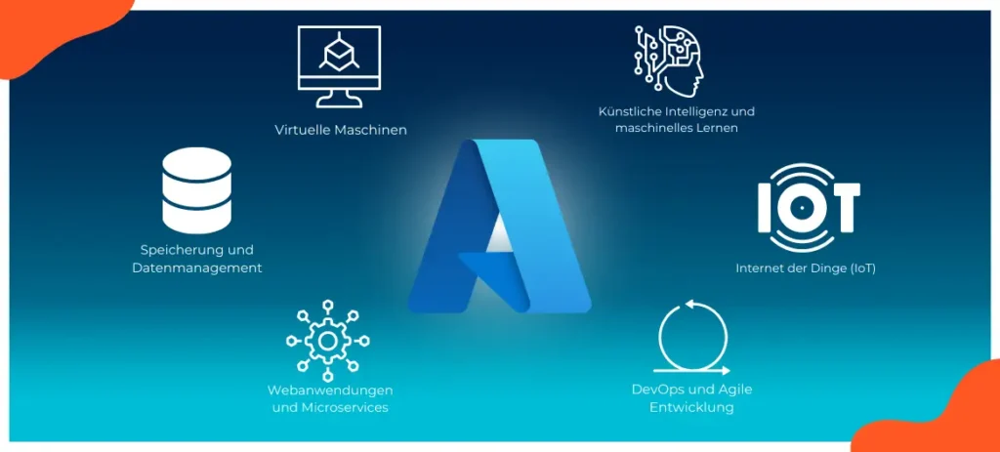
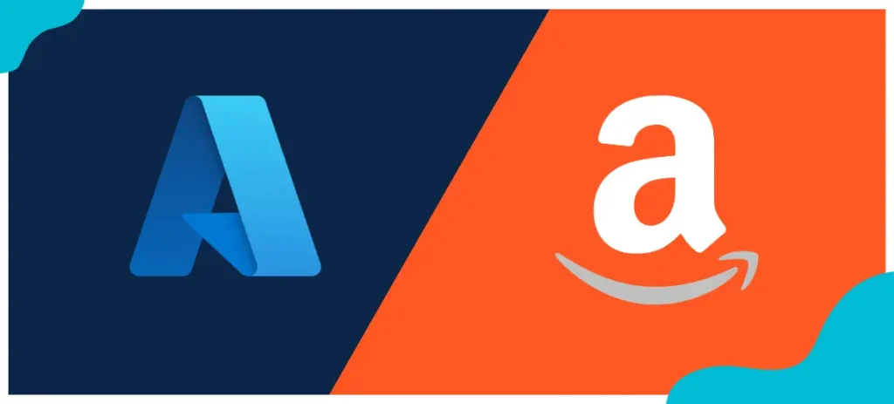
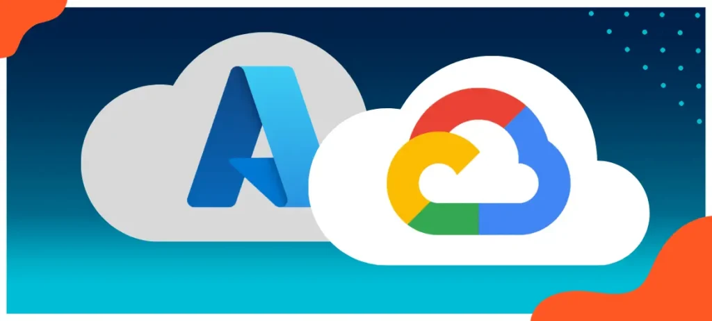

# Was ist Azure?

# Die Microsoft Cloud in 2024

Inhaltsverzeichnis

## Was ist Azure?

Azure ist die Cloud-Computing-Plattform von Microsoft. Sie bietet eine ebenso breite wie tiefe Palette von Cloud-Diensten. Darunter Bereitstellung und Verwaltung von virtuellen Maschinen, Speicherung und Analyse von Daten, Entwicklung und Bereitstellung von Webanwendungen, künstliche Intelligenz, maschinelles Lernen, IoT (Internet of Things) und mehr als 200 weitere Anwendungen.

Mit Azure können Unternehmen ihre IT-Infrastruktur in die Cloud verlagern und von den Vorteilen einer flexiblen, skalierbaren und kosteneffizienten Computing-Umgebung profitieren. Azure bietet eine globale Präsenz mit einer Vielzahl von Rechenzentren in fast allen Regionen weltweit.

Eine Vielzahl von Diensten und Tools ermöglicht es Entwicklern, Anwendungen zu erstellen, zu implementieren und zu verwalten, unabhängig von der Plattform oder dem Programmiersprachen-Stack. Dazu gehören auch DevOps-Tools und -Dienste, mit denen die kontinuierliche Integration, Bereitstellung und Überwachung von Anwendungen unterstützt werden.

Azure bietet Diensten und Lösungen für Unternehmen jeder Größe und aus verschiedensten Branchen. Von Startups über mittelständische Unternehmen bis hin zu großen Konzernen nutzen viele Organisationen Azure, um ihre IT-Infrastruktur zu erweitern, zu modernisieren und ihre Geschäftsprozesse zu optimieren.

<iframe title="YouTube video player" src="https://www.youtube-nocookie.com/embed/oPSHs71mTVU" width="560" height="630" frameborder="0" allowfullscreen="allowfullscreen"></iframe>

## Was bietet Azure?

Folgende Funktionen und Dienste gehören zu den Hauptleistungen von Azure:

* **1\. Virtuelle Maschinen**: Azure ermöglicht die Bereitstellung und Verwaltung virtueller Maschinen (VMs) in der Cloud. Dadurch können Unternehmen ihre bestehenden Anwendungen und Systeme in die Cloud migrieren und von der Skalierbarkeit und Flexibilität der Azure-Infrastruktur profitieren.
* **2\. Speicherung und Datenmanagement**: Azure bietet vielfältige Speicherlösungen, darunter Blob Storage (für unstrukturierte Daten), File Storage (für Dateifreigaben) und Table Storage (für NoSQL-Daten). Darüber hinaus auch Dienste für Datenbanken, wie z. B. Azure SQL Database, Azure Cosmos DB und Azure Data Lake, um Daten effizient zu speichern, zu verwalten und zu analysieren.

* **3\. Webanwendungen und Microservices**: Die Entwicklung, Bereitstellung und Skalierung von Webanwendungen und Microservices ist eine zentrale Leistung von Azure. Mit Diensten wie Azure App Service, Azure Functions und Azure Kubernetes Service können Entwickler schnell Anwendungen erstellen, ohne sich um die zugrunde liegende Infrastruktur kümmern zu müssen.
* **4\. Künstliche Intelligenz und maschinelles Lernen**: Azure bietet eine Vielzahl von Diensten und Tools für künstliche Intelligenz (KI) und maschinelles Lernen (ML). Dazu gehören Dienste wie Azure Machine Learning, Azure Cognitive Services und Azure Bot Service, mit denen Unternehmen KI-Funktionen in ihre Anwendungen integrieren können, wie z. B. Bilderkennung, Sprachverarbeitung, Chatbots und vieles mehr.

* **5\. Internet der Dinge (IoT)**: Azure IoT Hub ist ein zentraler Dienst für die Verbindung, Überwachung und Verwaltung von IoT-Geräten. Unternehmen können IoT-Geräte nahtlos in Azure integrieren, Daten sammeln, analysieren und daraus Erkenntnisse gewinnen. Azure bietet auch Dienste wie Azure IoT Central und Azure IoT Edge, um IoT-Lösungen zu vereinfachen und näher an der Edge-Computing-Umgebung auszuführen.
* **6\. DevOps und Agile Entwicklung**: Mit einer Reihe von Tools und Diensten unterstützt Azure die agile Entwicklung und DevOps-Praktiken. Hierzu gehören Azure DevOps, Azure Repos, Azure Pipelines und Azure Boards, die die Zusammenarbeit zwischen Entwicklungsteams verbessern, die kontinuierliche Integration und Bereitstellung ermöglichen und die Anwendungsüberwachung unterstützen.

Dies sind nur einige wenige Beispiele für die Leistungen von Azure. Die Plattform umfasst noch hunderte weiterer Dienste und Funktionen, die Unternehmen bei der Modernisierung ihrer IT-Infrastruktur, der Skalierung ihrer Anwendungen und der Optimierung ihrer Geschäftsprozesse unterstützen.

## Azure in Zahlen und Statistiken

Microsoft Azure konnte im Cloud-Markt für Infrastruktur-Services **im 1. Quartal 2023 einen Marktanteil von 23 %** verbuchen. Damit gehört Microsoft neben anderen großen Anbietern wie AWS zu den weltweiten Marktführern im Bereich Cloud-Computing.

Inzwischen nutzt ein Großteil der deutschen Firmen das Cloud-Angebot. Davon profitieren in erster Linie die großen Anbieter, zu denen auch Microsoft zählt. Der Umsatz des Unternehmens mit Cloud-Computing-Services ist **in den letzten 5 Jahren um fast 500 % gewachsen** – Tendenz steigend.

Weltweit verwenden **95 % der Fortune-500-Unternehmen Microsoft Azure**. Zum Kundenstamm gehören führende Firmen aus den Bereichen Technologie, Gesundheitswesen und Finanzen, aber auch zahlreiche Start-ups und kleinere Unternehmen. Dank einfacher Skalierbarkeit wird der Service jeder Größe gerecht.

Azure verfügt über ein umfangreiches Netzwerk von Rechenzentren auf der ganzen Welt. Laut Microsoft gibt es **über 200 physische Rechenzentren in 60 Azure-Regionen**, die in über 140 Ländern verteilt sind. So stehen die neuesten Entwicklungen der Cloudinfrastruktur an jedem Standort zur Verfügung.

Microsoft Azure stellt eine Vielzahl von Diensten bereit – beispielsweise in den Bereichen KI, IoT, Compute, DevOps, Speicher, Netzwerk, Sicherheit und Web. Seitdem Azure 2010 offiziell an den Start ging, hat sich die Zahl der Produkte und Dienstleistungen auf mehr als 200 erhöht.

Die Service Level Agreements beschreiben Microsofts Verpflichtungen in Bezug auf die Betriebszeit und Konnektivität der einzelnen Dienstleistungen. Für wichtige Dienste aus dem Compute- und Storage-Bereich sichert Microsoft eine **Verfügbarkeit von 99, 9 %** zu.

## Für wen eignet sich Azure?

Azure qualifiziert sich für eine Vielzahl von Unternehmen und Organisationen, unabhängig von ihrer Größe oder Branche. Hier sind einige Beispiele für Unternehmen, für die Azure besonders geeignet erscheint:

* **1\. Startups und kleinere Unternehmen**: Azure bietet Startups und Klein-Unternehmen die Möglichkeit, ihre IT-Infrastruktur kosteneffizient in die Cloud zu verlagern. Sie werden von hohen anfänglichen Investitionen in physische Hardware entlastet und können direkt von der Skalierbarkeit, Flexibilität und den umfangreichen Diensten profitieren.

* **2\. Mittelständische Unternehmen**: Azure bietet mittelständischen Unternehmen die Möglichkeit, ihre bestehenden Anwendungen und Systeme zu modernisieren und von den Vorteilen der Cloud zu profitieren. Sie können ihre Infrastruktur in Azure migrieren, um Kosten zu reduzieren, die Skalierbarkeit zu verbessern und Innovationen voranzutreiben.
* **3\. Großunternehmen**: Azure ist auch für große Unternehmen geeignet, die eine skalierbare und flexible Cloud-Plattform benötigen, um ihre geschäftskritischen Anwendungen und Workloads zu betreiben. Azure bietet umfangreiche Funktionen für Sicherheit, Compliance und Governance, die den Anforderungen großer Organisationen gerecht werden.

* **4\. Entwicklern und IT-Profis** wird eine Vielzahl von Diensten und Tools geboten, um Anwendungen zu erstellen, zu implementieren und zu verwalten. Azure unterstützt alle gängigen Programmiersprachen, Frameworks und Entwicklungsmodelle und bietet DevOps-Funktionen, die die Zusammenarbeit und die kontinuierliche Bereitstellung erleichtern.
* **5\. Branchen- und spezialisierte Lösungen**: Azure bietet auch branchen-spezifische Lösungen an für z. B. Gesundheitswesen, Finanzdienstleistungen, Einzelhandel, Fertigung und öffentlicher Sektor. Diese Branchenlösungen umfassen vorgefertigte Vorlagen, Best Practices und spezifische Dienste, die auf die Bedürfnisse der jeweiligen Branche zugeschnitten sind.

Es ist wichtig, dass jedes Unternehmen seine individuellen Anforderungen, Ziele und Budgets definiert, um anhand dessen Azure als die richtige Wahl für seine Cloud-Computing-Bedürfnisse zu prüfen.

## Azure 2023 – Aussichten und Entwicklungen

Der rasante Fortschritt im Bereich der künstlichen Intelligenz und im Machine Learning geht an der digitaltransformierten Wirtschaft nicht vorbei. Ganz im Gegenteil: Immer mehr Unternehmen nutzen die neuen Chancen für ihr operatives Geschäft. Dementsprechend ist es keine Überraschung, dass dieses Jahr auch bei Microsoft der **Einsatz künstlicher Intelligenz im Mittelpunkt** steht.

So kündigte Microsoft bereits eine Reihe von Tools und Erweiterungen rund um die Azure OpenAI Services an. Diese ermöglichen die eigene Entwicklung leistungsfähiger KI-Anwendungen und stellen dabei gleichzeitig die verantwortungsvolle Verwendung sicher. Allen voran: das neue **Azure AI-Studio**. Es unterstützt bei der Erstellung, Inbetriebnahme und Bereitstellung von Applikationen und soll nun zusätzlich die Integration externer Datenquellen für OpenAI und Azure Machine Learning vereinfachen.

Am Azure AI-Studio schließt auch direkt eine weitere Plattform an: **Microsoft Fabric**. Entwickler haben damit die Möglichkeit, das Potenzial generativer KI für die Erschließung von Daten zu nutzen. Ob Erstellung von Daten-Pipelines, Code und Funktionen oder Visualisierung von Ergebnissen – Nutzer können dafür nun einfach natürliche Sprache verwenden.

Im gleichen Zug bekommt **Azure Cosmos DB** – die führende Cloud-Datenbank für generative KI-Workloads und Anwendungsentwicklung – einige Updates. So sollen die Leistung und Effizienz verbessert und die Entwicklerproduktivität optimiert werden. Der Trend ist also klar zu erkennen: Microsoft will die Potenziale von KI und ML mit Azure 2023 weiter ausbauen und Unternehmen auf der ganzen Welt zur Verfügung stellen.

## Azure in der Praxis

Azure wird in der Praxis in verschiedenen Szenarien eingesetzt. Hier sind einige Beispiele, wie Azure von Unternehmen genutzt wird:

* **1\. Infrastrukturmigration**: Unternehmen können ihre bestehende lokale IT-Infrastruktur in die Azure-Cloud migrieren. Dies umfasst die Virtualisierung von Servern, Speicherung von Daten in der Cloud, Einrichtung von Netzwerken und die Bereitstellung von Anwendungen in virtuellen Maschinen.
* **2\. Webanwendungen und APIs**: Azure ermöglicht die Entwicklung und Bereitstellung von Webanwendungen und APIs. Unternehmen können Azure App Service nutzen, um ihre Webanwendungen auf der Plattform zu hosten und zu skalieren. Azure Functions ermöglicht die Erstellung serverloser Anwendungen und Azure API Management bietet die Möglichkeit, APIs zu erstellen, zu veröffentlichen und zu verwalten.

* **3\. Datenanalyse und -verarbeitung**: Azure bietet verschiedene Dienste für die Datenanalyse und -verarbeitung. Unternehmen können Azure SQL Database für relationale Datenbanken verwenden, Azure Cosmos DB für NoSQL-Datenbanken und Azure Data Lake Storage für die Speicherung und Analyse großer Datensätze. Azure Synapse Analytics ermöglicht erweiterte Analysen und Big-Data-Verarbeitung.
* **4\. Künstliche Intelligenz und maschinelles Lernen**: Azure bietet eine Reihe von Diensten und Tools für künstliche Intelligenz und maschinelles Lernen. Unternehmen können Azure Machine Learning nutzen, um Modelle zu entwickeln und zu trainieren. Azure Cognitive Services bietet vorgefertigte KI-Funktionen wie Bilderkennung, Sprachverarbeitung und Chatbots.

* **5\. Internet der Dinge (IoT)**: Azure IoT Hub ermöglicht die Verbindung und Verwaltung von IoT-Geräten. Unternehmen können IoT-Daten sammeln, analysieren und in Echtzeit Erkenntnisse gewinnen. Azure IoT Central bietet eine benutzerfreundliche Plattform für die Entwicklung und Verwaltung von IoT-Lösungen, während Azure IoT Edge die Verarbeitung von IoT-Daten näher an den Geräten ermöglicht.
* **6\. DevOps und Continuous Integration/Continuous Deployment (CI/CD)**: Azure bietet Tools und Dienste für DevOps-Praktiken und die Automatisierung von Softwarebereitstellung und -verwaltung. Unternehmen können Azure DevOps verwenden, um ihre Entwicklungs- und Betriebsprozesse zu verbessern, Continuous Integration und Continuous Deployment umzusetzen und Anwendungen effizient zu überwachen.

Dies sind nur einige Beispiele dafür, wie Azure in der Praxis genutzt werden kann. Die Plattform bietet eine breite Palette von Diensten, die es Unternehmen ermöglichen, ihre spezifischen Anforderungen zu erfüllen und ihre Geschäftsprozesse zu optimieren.

## Microsoft Azure – Preismodelle im Überblick

Das Preismodell für Microsoft Azure wirkt auf den ersten Blick etwas unübersichtlich, denn allgemeine Aussagen können nicht getroffen werden. Stattdessen variieren die Kosten je nach den spezifischen Anforderungen und den Diensten, die Sie nutzen möchten. Zur Auswahl stehen zahlreiche Optionen, bei denen für alle Geschäftsanforderungen und Budgetvorgaben etwas Passendes dabei sein dürfte.

* **Pay-as-you-go**: Beim nutzungsbasierten Preismodell zahlen Sie nur für die Funktionen und Ressourcen, die Sie im Geschäftsalltag tatsächlich verwenden. Das macht es zu einer flexiblen Lösung ohne große Vorabinvestitionen oder langfristige Bindung – ideal, um sofort mit Azure durchzustarten.
* **Abonnements**: Für die Cloud-Computing-Plattform stehen auch klassische Abonnementpläne zur Verfügung, bei denen Sie eine feste monatliche Gebühr für Ihre gewünschten Dienste zahlen. Häufig ergeben sich dabei Preisvorteile gegenüber der Pay-as-you-go-Nutzung. Zusätzlich profitieren Sie von einfacher und vorhersehbarer Budgetierung, weiteren Funktionen und erweiterten Supportoptionen.
* **Reservierte Instanzen**: Sie wissen genau, was Sie benötigen? Reservieren Sie sich Ihre Ressourcen über einen festgelegten Zeitraum und erhalten Sie einen reduzierten Stundensatz im Vergleich zum On-Demand-Preis. Mit dieser Variante lassen sich langfristige Projekte mit vorhersehbaren Anforderungen kosteneffizient realisieren.
* **Kostenloses Angebot**: Neben den Bezahlmodellen bietet Microsoft Azure auch eine Reihe an kostenfreien Diensten an. Hier gibt es Einschränkungen bezüglich der Ressourcenkapazität und Nutzungsdauer. Trotzdem eignet sich das kostenfreie Kontingent hervorragend, um Azure auszuprobieren und erste Erfahrungen zu sammeln.

Sie wollen sich im Detail über die Kosten der einzelnen Funktionen von Azure informieren? Microsoft stellt einen **[Azure-Preisrechner](https://azure.microsoft.com/de-de/pricing/calculator/)** zur Verfügung, mit dem Sie eine erste Einschätzung erhalten. Wenn Sie Ihre Anforderungen bereits kennen, wählen Sie einfach die benötigten Dienste aus. Alternativ entscheiden Sie sich für eins der vorgefertigten Beispielszenarien.

## Azure vs. AWS

Azure und Amazon Web Services (AWS) sind zwei der drei führenden Cloud-Computing-Plattformen auf dem Markt. Obwohl sie ähnliche Dienste anbieten, gibt es einige Unterschiede zwischen Azure und AWS. Hier sind einige Punkte, die Azure von AWS unterscheiden:

* **1\. Anbieter**: Azure wird von Microsoft betrieben, während AWS ein Service von Amazon ist. Beide Unternehmen sind führende Akteure in der Technologiebranche und verfügen über langjährige Erfahrung im Cloud-Bereich.
* **2\. Marktführerschaft**: AWS hat einen größeren Marktanteil als Azure und war einer der ersten Anbieter von Cloud-Services. Azure hat jedoch in den letzten Jahren stark aufgeholt und konnte seinen Marktanteil erheblich steigern.

* **3\. Ökosystem**: Beide Plattformen bieten ein umfangreiches Ökosystem von Diensten, Tools und Partnern. AWS hat aufgrund seiner Vorreiterrolle eine größere Auswahl an Diensten und eine größere Benutzerbasis. Azure hingegen profitiert von der Integration mit anderen Microsoft-Produkten und -Diensten, was für Unternehmen, die bereits Microsoft-Technologien verwenden, von Vorteil sein kann.
* **4\. Regionale Präsenz**: Azure hat eine starke globale Präsenz mit einer Vielzahl von Rechenzentren in verschiedenen Regionen weltweit. AWS hat jedoch eine noch größere Anzahl von Rechenzentren und eine breitere geografische Abdeckung.

* **5\. Unterstützung für hybride Umgebungen**: Azure hat eine starke Integration mit lokalen IT-Infrastrukturen und bietet umfangreiche Hybrid Cloud-Lösungen, die es Unternehmen ermöglichen, nahtlos zwischen der Cloud und lokalen Ressourcen zu arbeiten. AWS hat ebenfalls Hybrid-Cloud-Optionen, jedoch legt Azure einen besonderen Schwerpunkt auf die nahtlose Integration von Cloud- und On-Premises-Infrastrukturen.
* **6\. Dienste und Funktionen**: Azure und AWS bieten ähnliche Dienste, aber es gibt Unterschiede in der Spezifikation und Benennung. Einige Dienste haben möglicherweise ähnliche Funktionen, aber unterschiedliche Bezeichnungen in den beiden Plattformen.

Letztendlich hängt die Wahl zwischen Azure und AWS von den spezifischen Anforderungen und Präferenzen eines Unternehmens ab. Es ist wichtig, die Anforderungen der eigenen Organisation zu analysieren und die jeweiligen Stärken und Schwächen beider Plattformen zu berücksichtigen, um eine fundierte Entscheidung zu treffen. Oftmals entscheiden Unternehmen sich auch dafür, beide Plattformen in einer Multi-Cloud-Strategie zu nutzen, um von den Vorteilen beider Anbieter zu profitieren.

Siehe auch folgenden **[Link](https://thinkport.digital/streaming-services/)**

## Azure vs. Google Cloud Platform

Azure (Microsoft Azure) und Google Cloud Platform (GCP) sind zwei der drei führenden Cloud-Computing-Plattformen auf dem Markt. Hier sind einige Unterschiede zwischen Azure und GCP:

* **1\. Anbieter**: Azure wird von Microsoft betrieben, während GCP von Google betrieben wird. Beide Unternehmen sind etablierte Technologieunternehmen mit umfangreicher Erfahrung im Cloud-Bereich.
* **2\. Marktposition**: Azure und GCP haben unterschiedliche Marktanteile. Laut aktuellen Statistiken hat Azure einen größeren Marktanteil als GCP, aber GCP hat in den letzten Jahren ebenfalls stark zugelegt.

* **3\. Ökosystem**: Sowohl Azure als auch GCP bieten ein breites Ökosystem von Diensten, Tools und Partnern. Azure hat eine enge Integration mit anderen Microsoft-Produkten und -Diensten, während GCP von der Expertise von Google in Bereichen wie künstliche Intelligenz und maschinelles Lernen profitiert.
* **4\. Regionale Präsenz**: Azure hat eine starke globale Präsenz mit einer Vielzahl von Rechenzentren weltweit. GCP hat auch eine beträchtliche Anzahl von Rechenzentren, aber Azure hat möglicherweise eine etwas breitere geografische Abdeckung.

* **5\. Unterstützung für hybride Umgebungen**: Azure bietet umfangreiche Unterstützung für hybride Cloud-Szenarien, wobei die nahtlose Integration von Cloud- und On-Premises-Ressourcen betont wird. GCP bietet ebenfalls Hybrid-Cloud-Optionen, hat aber möglicherweise nicht den gleichen Fokus darauf wie Azure.
* **6\. Dienste und Funktionen**: Azure und GCP bieten eine Vielzahl ähnlicher Dienste, aber es gibt Unterschiede in den spezifischen Funktionen und Angeboten. Einige Dienste können ähnliche Funktionen haben, aber unterschiedliche Namen und Implementierungen in den beiden Plattformen.

Bei der Entscheidung zwischen Azure und GCP sollte man die spezifischen Anforderungen und Präferenzen des Unternehmens berücksichtigen. Es ist wichtig, die Dienste und Funktionen jeder Plattform zu vergleichen und zu evaluieren, wie gut sie die eigenen Anforderungen erfüllen. Darüber hinaus können auch Aspekte wie Support, Preismodell, Zuverlässigkeit und Sicherheit in die Entscheidung einfließen. Manchmal entscheiden Unternehmen auch, beide Plattformen in einer Multi-Cloud-Strategie zu nutzen, um von den Stärken beider Anbieter zu profitieren.

## Datenschutz, Sicherheit und Compliance in Microsoft Azure

Datenschutz, Sicherheit und Compliance sind entscheidende Aspekte bei der Nutzung von Cloud-Diensten wie Microsoft Azure. Microsoft legt großen Wert auf den Schutz der Kundendaten und hat umfangreiche Sicherheits- und Compliance-Maßnahmen implementiert. Hier sind einige wichtige Punkte zum Datenschutz, zur Sicherheit und zur Compliance in Microsoft Azure:

* **1\. Datenschutz**: Microsoft Azure bietet verschiedene Mechanismen und Kontrollen, um den Datenschutz zu gewährleisten. Kunden haben die Kontrolle über ihre Daten und können festlegen, wo ihre Daten gespeichert und verarbeitet werden. Azure stellt auch Werkzeuge zur Verfügung, um Datenverschlüsselung, Zugriffssteuerung und Datenübertragung zu ermöglichen.
* **2\. Sicherheit**: Azure hat eine mehrschichtige Sicherheitsarchitektur, die physische Sicherheit, Netzwerksicherheit, Identitäts- und Zugriffsmanagement, Datensicherheit und Bedrohungserkennung umfasst. Microsoft investiert erheblich in Sicherheitsmaßnahmen wie regelmäßige Sicherheitsaudits, Patches und Updates, um eine sichere Umgebung für Azure-Kunden zu gewährleisten.
* **3\. Compliance**: Azure erfüllt eine Vielzahl von branchenspezifischen und globalen Compliance-Anforderungen. Microsoft führt regelmäßige Audits durch, um die Konformität mit Standards wie ISO 27001, HIPAA, GDPR und SOC 2/3 sicherzustellen. Azure ermöglicht Kunden auch die Einhaltung spezifischer regulatorischer Anforderungen durch Kontrollen, Berichte und Compliance-Dokumentation.

* **4\. Datenschutzvereinbarungen**: Microsoft stellt Kunden Datenschutzvereinbarungen zur Verfügung, die den Umgang mit personenbezogenen Daten regeln. Diese Vereinbarungen definieren die Verantwortlichkeiten von Microsoft und des Kunden in Bezug auf den Datenschutz und legen fest, wie Microsoft personenbezogene Daten verarbeitet.
* **5\. Transparenz und Kontrolle**: Azure bietet Kunden Transparenz und Kontrollmöglichkeiten über ihre Daten. Kunden können Überwachungs- und Protokolldaten einsehen, um Aktivitäten zu überprüfen und potenzielle Sicherheitsvorfälle zu erkennen. Azure stellt auch Werkzeuge zur Verfügung, um Zugriffsrechte zu verwalten und Sicherheitsrichtlinien durchzusetzen.

Es ist wichtig zu beachten, dass die Sicherheit und Compliance in Azure eine gemeinsame Verantwortung zwischen Microsoft und dem Kunden ist. Microsoft stellt die Sicherheits- und Compliance-Funktionen der Plattform bereit, während der Kunde verantwortlich ist, seine Anwendungen und Daten angemessen zu schützen und die erforderlichen Compliance-Anforderungen einzuhalten.

Microsoft Azure hat umfangreiche Sicherheits- und Compliance-Maßnahmen implementiert, um den Datenschutz, die Sicherheit und die Einhaltung von Vorschriften zu gewährleisten. Unternehmen, die Azure nutzen, können auf diese Funktionen vertrauen, um ihre Daten und Anwendungen in der Cloud sicher und konform zu halten.

## Best Practices für die Nutzung von Microsoft Azure

Bei der Nutzung von Microsoft Azure gibt es eine Reihe bewährter Verfahren, die dazu beitragen können, die Effizienz, Sicherheit und Skalierbarkeit Ihrer Cloud-Umgebung zu maximieren. Hier sind einige Best Practices für die Nutzung von Microsoft Azure:

* **1\. Ressourcenoptimierung**: Optimieren Sie Ihre Ressourcennutzung, um Kosten zu sparen und die Leistung zu verbessern. Verwenden Sie skalierbare Ressourcen wie virtuelle Maschinen und Speicher so effizient wie möglich. Nutzen Sie Auto Scaling, um die Ressourcen automatisch basierend auf der Nachfrage anzupassen.
* **2\. Sicherheitsmaßnahmen**: Implementieren Sie umfassende Sicherheitsmaßnahmen, um Ihre Daten und Anwendungen zu schützen. Verwenden Sie Sicherheitsdienste wie Azure Security Center, um Bedrohungen zu erkennen und zu überwachen. Aktualisieren Sie regelmäßig Ihre virtuellen Maschinen und Anwendungen, um bekannte Sicherheitslücken zu beheben. Verwenden Sie Firewalls und Netzwerksicherheitsgruppen, um den Zugriff auf Ihre Ressourcen zu kontrollieren.

* **3\. Skalierbarkeit und Verfügbarkeit**: Entwerfen Sie Ihre Anwendungen und Dienste so, dass sie skalierbar und hochverfügbar sind. Verwenden Sie Azure Load Balancer und Azure Traffic Manager, um den Datenverkehr auf Ihre Anwendungen zu verteilen und die Verfügbarkeit zu verbessern. Nutzen Sie Azure Functions oder den Azure App Service, um serverlose Architekturen zu erstellen, die automatisch auf Nachfrage skalieren.

* **4\. Datensicherung und Wiederherstellung**: Implementieren Sie eine zuverlässige Datensicherungsstrategie, um Ihre Daten vor Verlust zu schützen. Verwenden Sie Azure Backup oder Azure Site Recovery, um Ihre Daten in der Cloud zu sichern und im Notfall wiederherstellen zu können. Testen Sie regelmäßig Ihre Wiederherstellungsmechanismen, um sicherzustellen, dass sie ordnungsgemäß funktionieren.
* **5\. Überwachung und Leistungsoptimierung**: Überwachen Sie Ihre Azure-Ressourcen kontinuierlich, um die Leistung und Zuverlässigkeit Ihrer Anwendungen zu gewährleisten. Verwenden Sie Azure Monitor, um Metriken, Protokolle und Alarme zu überwachen. Analysieren Sie Leistungsdaten, um Engpässe zu identifizieren und die Leistung zu optimieren.
* **6\. Automatisierung und DevOps**: Automatisieren Sie Ihre Bereitstellungs- und Verwaltungsprozesse mit Tools wie Azure Resource Manager, Azure DevOps und PowerShell. Verwenden Sie Infrastructure-as-Code (IaC), um Ihre Infrastruktur in Azure zu definieren und zu verwalten. Implementieren Sie kontinuierliche Integration und Bereitstellung (CI/CD), um eine effiziente Entwicklung und Bereitstellung von Anwendungen zu ermöglichen.
* **7\. Compliance und Datenschutz**: Stellen Sie sicher, dass Ihre Azure-Umgebung den geltenden Compliance-Anforderungen entspricht. Befolgen Sie die Datenschutzbestimmungen und -richtlinien, um den Schutz personenbezogener Daten zu gewährleisten. Überprüfen Sie regelmäßig die Compliance-Dokumentation von Azure, um sicherzustellen, dass Ihre Umgebung den erforderlichen Standards entspricht.

Diese Best Practices dienen als Richtlinien, um Azure effektiv und sicher zu nutzen. Es ist wichtig, die spezifischen Anforderungen Ihres Unternehmens zu berücksichtigen und die besten Vorgehensweisen entsprechend anzupassen. Microsoft Azure bietet eine umfangreiche Dokumentation, Ressourcen und Support, um Ihnen bei der Umsetzung dieser Best Practices zu helfen.

## Azure Community

Die Azure Community ist eine vielfältige und engagierte Gemeinschaft von Entwicklern, IT-Experten, Unternehmensnutzern und Enthusiasten, die sich für Microsoft Azure interessieren. Die Community bietet eine Plattform für den Austausch von Wissen, Erfahrungen, Best Practices und Ressourcen rund um Azure.

Die Azure Community besteht aus verschiedenen Gruppen und Ressourcen, darunter:

* **1\. Microsoft Azure Forums**: Die offiziellen Azure-Foren von Microsoft bieten eine Plattform für Fragen, Diskussionen und den Austausch von Wissen. Entwickler und Benutzer können ihre Herausforderungen und Erfahrungen teilen, Lösungen vorschlagen und anderen helfen, Azure effektiv zu nutzen.
* **2\. Azure User Groups**: Azure User Groups sind lokale Treffen von Azure-Nutzern in verschiedenen Städten auf der ganzen Welt. Diese Gruppen ermöglichen es Mitgliedern, sich persönlich zu treffen, um sich über Azure-Technologien, Best Practices und Anwendungsfälle auszutauschen. Sie bieten Networking-Möglichkeiten und die Chance, von Experten in der Community zu lernen.

* **3\. Online-Communities**: Es gibt zahlreiche Online-Communities, einschließlich Social-Media-Gruppen, Foren und Diskussionsplattformen, die sich auf Azure spezialisieren. Diese Communities bieten eine interaktive Umgebung, in der Mitglieder Fragen stellen, Antworten erhalten, Erfahrungen teilen und Ressourcen finden können.
* **4\. Konferenzen und Veranstaltungen**: Azure-bezogene Konferenzen, Meetups und Veranstaltungen finden weltweit statt. Diese Veranstaltungen bieten Vorträge, Workshops, Präsentationen von Experten und die Möglichkeit, sich mit Gleichgesinnten zu vernetzen. Sie bieten wertvolle Einblicke, aktuelle Informationen und die Möglichkeit, sich über die neuesten Trends und Entwicklungen in der Azure-Welt auf dem Laufenden zu halten.
* **5\. Blogging und Online-Ressourcen**: Viele Azure-Experten teilen ihr Wissen, Erfahrungen und Best Practices über Blogs, Artikel und Online-Ressourcen. Diese Inhalte decken verschiedene Aspekte von Azure ab, darunter technische Tutorials, Anwendungsfälle, Architekturdesigns und Lösungen für bestimmte Probleme. Durch das Lesen und Teilen solcher Inhalte können Mitglieder von der Expertise und dem Fachwissen anderer profitieren.

Die Azure Community bietet zahlreiche Vorteile für Einzelpersonen und Organisationen, die Azure nutzen oder daran interessiert sind. Sie bietet eine unterstützende Umgebung, in der Mitglieder ihr Wissen erweitern, ihre Fähigkeiten verbessern, Herausforderungen überwinden und innovative Lösungen entwickeln können. Durch die Zusammenarbeit und den Austausch von Ideen trägt die Azure Community zur Stärkung des Ökosystems bei und fördert das Wachstum und die Akzeptanz von Azure als führende Cloud-Plattform.

## DIY Azure vs. Azure Consulting

Wenn es um die Implementierung von Azure geht, haben Unternehmen zwei Hauptoptionen: DIY (Do-It-Yourself) oder Azure-Beratungsdienste. Lassen Sie uns die Unterschiede zwischen diesen beiden Möglichkeiten untersuchen:

## 1\. DIY-Azure:

* **Kostengünstig**: Die Wahl des DIY-Ansatzes kann anfänglich kostengünstiger sein, da keine Beratungskosten anfallen.
* **Lernkurve**: Die eigenständige Implementierung von Azure erfordert ein gewisses Maß an technischem Know-how und eine Lernkurve. Dazu gehört das Verständnis von Azure-Diensten, Architekturen und bewährten Verfahren.
* **Zeitaufwendig**: Das Einrichten und Konfigurieren von Azure-Diensten kann zeitaufwändig sein, vor allem, wenn Sie neu auf der Plattform sind. Ohne Anleitung kann es länger dauern, die gewünschte Lösung zu implementieren.
* **Begrenztes Fachwissen**: Ohne beratende Unterstützung können Sie auf dem Weg dorthin auf Herausforderungen oder Hindernisse stoßen. Die Fehlersuche und -behebung kann zusätzliche Recherchen und Selbststudium erfordern.

## 2\. Azure Beratung:

* **Anleitung durch Experten**: Azure-Beratungsdienste bieten fachkundige Beratung durch erfahrene Experten, die sich mit Azure-Technologien bestens auskennen. Sie können Ihnen helfen, Ihre Azure-Infrastruktur auf der Grundlage Ihrer spezifischen Anforderungen zu entwerfen, zu implementieren und zu optimieren.
* **Schnellere Implementierung**: Azure-Berater verfügen über fundierte Kenntnisse und Erfahrungen bei der Implementierung von Azure-Lösungen. Sie können dazu beitragen, den Implementierungsprozess zu beschleunigen und einen reibungslosen und effizienten Übergang in die Cloud zu gewährleisten.

* **Bewährte Verfahren und Optimierung**: Berater können Best Practices, Industriestandards und Optimierungstechniken weitergeben, um Ihnen zu helfen, die Vorteile von Azure zu maximieren. Sie können sicherstellen, dass Ihre Azure-Architektur sicher, skalierbar und kostengünstig ist.
* **Maßgeschneiderte Lösungen**: Azure-Berater können Lösungen auf Ihre individuellen Geschäftsanforderungen zuschneiden und dabei Faktoren wie Arbeitslastmuster, Compliance-Anforderungen und die Integration mit bestehenden Systemen berücksichtigen.
* **Laufende Unterstützung**: Berater können kontinuierlichen Support, Überwachung und Wartung Ihrer Azure-Umgebung anbieten, um einen reibungslosen Betrieb zu gewährleisten und alle auftretenden Probleme zu beheben.

Die Entscheidung zwischen DIY-Azure und Azure-Consulting hängt von den Ressourcen, dem technischen Know-how, dem Budget und den zeitlichen Beschränkungen Ihres Unternehmens ab. Wenn Sie über die erforderlichen Fähigkeiten und Ressourcen verfügen, kann Azure zum Selbermachen eine praktikable Option sein. Wenn Sie jedoch fachkundige Anleitung, eine schnellere Implementierung und fortlaufenden Support benötigen, kann die Inanspruchnahme von Azure-Beratungsdiensten ein höheres Maß an Fachwissen bieten und eine erfolgreiche Azure-Implementierung gewährleisten.

## Azure Consulting von Thinkport

Mehr über **[Azure Consulting](https://thinkport.digital/cloud-consulting-fuer-deutsche-grossunternehmen/azure/)** von Thinkport kann man u.a. in den Erfolgsstories, von denen hier eine kleine Auswahl getroffen wurde, nachlesen. Zum Einen, wie die Cloud Experten von Thinkport die **[Azure Cloud Infrastruktur für den ersten Quantencomputer](https://thinkport.digital/azure-cloud-fuer-den-ersten-quantencomputer/)** gebaut hat sowie zum Anderen, wie Thinkport **[Edeka zur Auszeichnung des Reta Award](https://thinkport.digital/reta-award-winning-cooperation/)** verhalf und selbst zum "Top Supplier Retail 2023" betitelt wurde und vieles mehr.

## Azure Trainings & Workshops von Thinkport

* **[Azure Trainings](https://thinkport.digital/azure-trainings/)**
* **[Terraform für Azure](https://thinkport.digital/terraform-fuer-azure-lernen/)**
* **[Datenplattformen mit Azure und Databricks](https://thinkport.digital/datenplattform-mit-azure-und-databricks/)**
* **[Event-Streaming-Services auf Azure](https://thinkport.digital/event-streaming-services-auf-aws-and-azure/)**
* **[Azure für Javascript Developer](https://thinkport.digital/azure-fuer-javascript-developer/)**
* **[CI/CD mit Azure](https://thinkport.digital/ci-cd-mit-azure/)**

## Azure Blog-Artikel & Success Stories von Thinkport

* **[Azure Databricks](https://thinkport.digital/azure-databricks/)**
* **[Azure Data Analytics Infrastruktur für LSG](https://thinkport.digital/azure-data-analytics-infrastruktur-fur-lsg/)**
* **[Terraform AzureRM3.0](https://thinkport.digital/terraform-azurerm//)**

## Azure zusammengefasst

Azure ist eine Cloud-Computing-Plattform von Microsoft, die eine breite Palette von Diensten und Tools für die Bereitstellung, Verwaltung und Skalierung von Anwendungen und Infrastrukturen in der Cloud bietet. Hier sind die wichtigsten Punkte zur Zusammenfassung von Azure:

* **1\. Cloud-Services**: Azure ermöglicht es Unternehmen, ihre IT-Infrastruktur in die Cloud zu verlagern. Es bietet eine Vielzahl von Diensten, darunter Computing (virtuelle Maschinen, Container), Speicherung (Datenbanken, Dateispeicher, Datensee), Netzwerke (VNETs, Load Balancer), Analysen (Big Data, künstliche Intelligenz), Sicherheit und Identität, IoT (Internet der Dinge) und vieles mehr.
* **2\. Skalierbarkeit und Flexibilität**: Azure ermöglicht es Unternehmen, ihre Ressourcen bedarfsgerecht zu skalieren. Es bietet die Möglichkeit, schnell und einfach zusätzliche Ressourcen hinzuzufügen oder zu entfernen, um den Anforderungen des Unternehmens gerecht zu werden. Dies ermöglicht eine effiziente Nutzung der Ressourcen und optimiert die Kosten.

* **3\. Hybrid Cloud**: Azure bietet umfangreiche Funktionen für hybride Cloud-Szenarien, bei denen Unternehmen ihre lokale IT-Infrastruktur mit der Cloud verbinden. Dies ermöglicht eine nahtlose Integration von On-Premises- und Cloud-Ressourcen, um Flexibilität, Skalierbarkeit und Datenkonsistenz zu gewährleisten.
* **4\. Entwicklerfreundlichkeit**: Azure stellt eine Vielzahl von Entwicklertools und -diensten bereit, um die Entwicklung und Bereitstellung von Anwendungen zu unterstützen. Es unterstützt verschiedene Programmiersprachen, Frameworks und Entwicklungsmodelle. Azure DevOps bietet Funktionen für die kontinuierliche Integration und Bereitstellung (CI/CD) sowie für die Zusammenarbeit im Entwicklungsteam.

* **5\. Sicherheit und Compliance**: Azure legt großen Wert auf Sicherheit und Compliance. Es bietet eine breite Palette von Sicherheitsdiensten, um Daten zu schützen und Compliance-Standards einzuhalten. Azure ist nach international anerkannten Standards zertifiziert und erfüllt branchenspezifische Anforderungen in verschiedenen Bereichen wie Gesundheitswesen, Finanzdienstleistungen und Regierung.
* **6\. Ökosystem und Integration**: Azure ist gut in das Microsoft-Ökosystem integriert, was für Unternehmen, die bereits Microsoft-Technologien verwenden, von Vorteil ist. Es bietet auch Integrationen mit anderen beliebten Tools, Plattformen und Diensten von Drittanbietern, um die Erweiterbarkeit und Flexibilität zu verbessern.

Azure bietet Unternehmen die Möglichkeit, ihre IT-Infrastruktur in die Cloud zu verlagern, Skalierbarkeit und Flexibilität zu nutzen, Entwicklungsprozesse zu optimieren und eine sichere und compliance-konforme Umgebung zu schaffen. Es ist wichtig, die spezifischen Anforderungen des Unternehmens zu berücksichtigen, um festzustellen, ob Azure die richtige Wahl für die Cloud-Computing-Bedürfnisse ist.

## FAQs

Hier finden Sie eine kurze Zusammenstellung von oft gestellten Fragen und den dazugehörigen Antworten.

Was ist Azure?

Azure ist eine Cloud-Computing-Plattform von Microsoft, die eine breite Palette von Diensten und Tools bietet, um Anwendungen, Daten und Infrastrukturen in der Cloud zu erstellen, bereitzustellen und zu verwalten.

Welche Dienste bietet Azure?

Azure bietet eine Vielzahl von Diensten, darunter Computing (virtuelle Maschinen, Container), Speicherung (Datenbanken, Dateispeicher, Datensee), Netzwerke (VNETs, Load Balancer), Analysen (Big Data, künstliche Intelligenz), Sicherheit und Identität, IoT (Internet der Dinge) und vieles mehr.

Wie unterscheidet sich Azure von anderen Cloud-Plattformen wie AWS oder GCP?

Azure, AWS und GCP sind die drei führenden Cloud-Computing-Plattformen. Azure bietet eine starke Integration mit anderen Microsoft-Produkten, hat eine gute Unterstützung für hybride Cloud-Szenarien und profitiert von Microsofts langjähriger Erfahrung im Unternehmensbereich. AWS und GCP haben hingegen eine größere Marktpräsenz und bieten eine breitere Palette von Diensten und Funktionen.

Was sind die Vorteile der Verwendung von Azure?

Die Verwendung von Azure bietet mehrere Vorteile, darunter Skalierbarkeit und Flexibilität, kosteneffiziente Ressourcennutzung, hybride Cloud-Unterstützung, umfangreiches Ökosystem von Diensten und Tools, starke Sicherheitsfunktionen und globale Präsenz mit vielen Rechenzentren.

Ist Azure sicher?

Ja, Azure legt großen Wert auf Sicherheit und bietet eine Vielzahl von Sicherheitsdiensten, um Daten und Anwendungen zu schützen. Azure ist nach international anerkannten Standards zertifiziert und erfüllt branchenspezifische Compliance-Anforderungen.

Wieviel kostet die Nutzung von Azure?

Die Kosten für Azure variieren je nach den genutzten Diensten, der Nutzungsdauer und dem Umfang der Ressourcen. Azure bietet flexible Preismodelle, einschließlich Pay-as–you–go-Optionen und Abonnementplänen. Es ist möglich, die Kosten durch eine effiziente Ressourcennutzung und Skalierung zu optimieren.

Welche Unternehmen nutzen Azure?

Azure wird von einer breiten Palette von Unternehmen genutzt, darunter Startups, kleine und mittlere Unternehmen sowie große Konzerne. Zu den bekannten Unternehmen, die Azure nutzen, gehören BMW, Adobe, Samsung, Walmart und Schneider Electric.

Was verbindet Azure mit ChatGPT? Microsoft, Anbieter der Cloud-Computing-Plattform Azure, ist auch ein strategischer Partner von OpenAI, dem Unternehmen hinter ChatGPT. Damit spielt Microsoft eine wichtige Rolle bei ChatGPT, einem LLM (Large Language Modell) Sprachmodell von OpenAI, das auf der GPT-3.5-Architektur basiert und natürliche Sprache versteht und generiert.

Auf Basis dieser Partnerschaft hat Microsoft ChatGPT in Azure-basierte Chatbot-Anwendungen integriert, um eine natürlichere und interaktivere Konversation mit Benutzern zu ermöglichen. Entwickler können Azure verwenden, um Anwendungen und Dienste zu hosten, die auf ChatGPT zugreifen, um Interaktionen mit Benutzern zu ermöglichen. Dies könnte beispielsweise bedeuten, dass Entwickler Azure einsetzen, um Texteingaben von Benutzern zu analysieren und relevante Antworten zu generieren. Diese Antworten können dann über den Azure Bot Service an die Benutzer zurückgesendet werden.

Die Kombination von Azure und ChatGPT ermöglicht es Unternehmen und ihren Entwicklern, leistungsstarke und skalierbare Chatbot-Anwendungen zu erstellen, die natürliche Sprache verstehen und auf komplexe Fragen und Anfragen reagieren können. Wie kann ich mit Azure starten?

Um mit Azure zu starten, können Sie die Azure-Website besuchen und ein kostenloses Konto erstellen. Microsoft bietet auch eine umfangreiche Dokumentation, Tutorials und Lernressourcen, um Ihnen den Einstieg zu erleichtern.

Bietet Azure Unterstützung und Schulungen?

Ja, Azure bietet umfangreiche Unterstützung und Schulungen. Es gibt eine offizielle Dokumentation, Online-Foren, Community-Ressourcen und Support-Optionen. Microsoft bietet auch offizielle Schulungen und Zertifizierungen für Azure.

## [Weitere Beiträge](https://thinkport.digital/blog)

### [Cloud Consulting for Migration to the Cloud](https://thinkport.digital/cloud-consulting-for-migration-to-the-cloud/ 'Cloud Consulting for Migration to the Cloud')

[Cloud General](https://thinkport.digital/category/cloud-general/)

### [Cloud Consulting for Migration to the Cloud](https://thinkport.digital/cloud-consulting-for-migration-to-the-cloud/ 'Cloud Consulting for Migration to the Cloud')

[Cloud General](https://thinkport.digital/category/cloud-general/)

### [Apache Airflow](https://thinkport.digital/apache-airflow/ 'Apache Airflow')

[Cloud General](https://thinkport.digital/category/cloud-general/), [Hybrid-Cloud](https://thinkport.digital/category/hybrid-cloud/)

### [Apache Airflow](https://thinkport.digital/apache-airflow/ 'Apache Airflow')

[Cloud General](https://thinkport.digital/category/cloud-general/), [Hybrid-Cloud](https://thinkport.digital/category/hybrid-cloud/)

### [Core Strategies Cloud Migration](https://thinkport.digital/core-strategies-cloud-migration/ 'Core Strategies Cloud Migration')

[Cloud General](https://thinkport.digital/category/cloud-general/), [Cloud Kubernetes](https://thinkport.digital/category/cloud-kubernetes/)

### [Core Strategies Cloud Migration](https://thinkport.digital/core-strategies-cloud-migration/ 'Core Strategies Cloud Migration')

[Cloud General](https://thinkport.digital/category/cloud-general/), [Cloud Kubernetes](https://thinkport.digital/category/cloud-kubernetes/)

### [Setup Hashicorp Nomad Ansible nomad](https://thinkport.digital/setup-hashicorp-nomad-ansible-nomad/ 'Setup Hashicorp Nomad Ansible nomad')

[Cloud General](https://thinkport.digital/category/cloud-general/), [Cloud Kubernetes](https://thinkport.digital/category/cloud-kubernetes/)

### [Setup Hashicorp Nomad Ansible nomad](https://thinkport.digital/setup-hashicorp-nomad-ansible-nomad/ 'Setup Hashicorp Nomad Ansible nomad')

[Cloud General](https://thinkport.digital/category/cloud-general/), [Cloud Kubernetes](https://thinkport.digital/category/cloud-kubernetes/)

### [Setup Hashicorp Nomad Ansible ufw](https://thinkport.digital/setup-hashicorp-nomad-ansible-ufw/ 'Setup Hashicorp Nomad Ansible ufw')

[Cloud General](https://thinkport.digital/category/cloud-general/), [Streaming](https://thinkport.digital/category/streaming/)

### [Setup Hashicorp Nomad Ansible ufw](https://thinkport.digital/setup-hashicorp-nomad-ansible-ufw/ 'Setup Hashicorp Nomad Ansible ufw')

[Cloud General](https://thinkport.digital/category/cloud-general/), [Streaming](https://thinkport.digital/category/streaming/)

### [Kafka Streams](https://thinkport.digital/kafka-streams/ 'Kafka Streams')

[Cloud General](https://thinkport.digital/category/cloud-general/), [Streaming](https://thinkport.digital/category/streaming/)

### [Kafka Streams](https://thinkport.digital/kafka-streams/ 'Kafka Streams')

[Cloud General](https://thinkport.digital/category/cloud-general/), [Streaming](https://thinkport.digital/category/streaming/)
