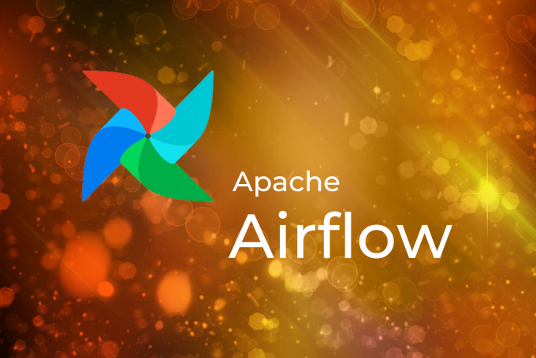

 

# Was ist eigentlich Cloud Consulting?

## Grundlegende Einordnung und Best Practise Tipps mit Checklisten

Cloud Consulting bezieht sich auf die Unterstützung von Unternehmen bei der Überführung ihrer IT-Systeme in die Cloud. Ein Cloud Consultant hilft bei der Bewertung der besten Cloud-Lösungen für ein Unternehmen, bei der Überführung von Daten und Anwendungen in die Cloud und bei der Implementierung von Sicherheits- und Datenschutzmaßnahmen. Die Zusammenarbeit mit einem Cloud Consultant kann helfen, Kosten zu reduzieren, die Agilität zu erhöhen und die Compliance mit geltenden Gesetzen und Vorschriften sicherzustellen.

Ausgangspunkt einer Cloud Beratung ist, dass ein Unternehmen eine Migration oder Weiterentwicklung in der Cloud erwägt. Dies kann aus einer Vielzahl von Gründen geschehen. Hier sind einige typische Anlässe:

* **A. Kosteneinsparungen:** Eine Migration in die Cloud kann Kosteneinsparungen durch den Verzicht auf teure Hardware und den Einsatz von flexibleren Abrechnungsmodellen ermöglichen.
* **B. Skalierbarkeit:** Eine Cloud-Infrastruktur ist skalierbar und kann dem wachsenden Bedarf an Ressourcen schnell und effizient begegnen.
* **C. Mobilität:** Die Cloud ermöglicht es Mitarbeitern, von überall auf Unternehmensdaten und -anwendungen zuzugreifen, was die Flexibilität und Mobilität erhöht.
* **D. Kontinuität des Geschäftsbetriebs:** Eine Cloud-Infrastruktur bietet eine höhere Verfügbarkeit und Zuverlässigkeit, um den Geschäftsbetrieb bei Ausfällen oder Störungen sicherzustellen.

* **E. Integration von Anwendungen:** Die Cloud ermöglicht eine einfache Integration von Anwendungen, was die Zusammenarbeit und Effizienz verbessert.
* **F. Datensicherheit:** Die Cloud bietet hochwertige Sicherheitsfunktionen, um die Datensicherheit und den Schutz sensibler Daten zu gewährleisten.
* **G. Technologie-Updates:** In der Cloud können Technologie-Updates schneller und einfacher durchgeführt werden, um die Anwendungen aktuell und leistungsfähig zu halten.

## Checkliste für eine erfolgreiche Projekt Durchführung

Wenn Sie überlegen, in die Cloud zu wechseln, kann ein Cloud Consultant Ihnen helfen, eine effiziente und sichere Cloud-Strategie zu entwickeln. Hier ist eine Checkliste, die Ihnen dabei helfen kann, ein erfolgreiches Cloud-Consulting-Projekt durchzuführen:

* **1\. Bedarfsermittlung:** Überprüfen Sie Ihre aktuellen IT-Systeme und Anwendungen, um festzustellen, welche in die Cloud migriert werden sollten. Hierbei ist es wichtig, ein Verständnis für die Anforderungen und Ziele Ihres Unternehmens zu entwickeln, um zu entscheiden, welche Anwendungen und Systeme in die Cloud migriert werden sollten und welche auf lokalen Servern bleiben sollten. Dies ist auch ein guter Zeitpunkt, um zu überprüfen, ob bestehende Systeme modernisiert oder ersetzt werden müssen.
* **2\. Cloud-Lösungen evaluieren:** Vergleichen Sie verschiedene Cloud-Lösungen, um die beste für Ihr Unternehmen zu finden. Hierbei sollten Sie Faktoren wie Kosten, Leistung, Skalierbarkeit, Sicherheit und Compliance berücksichtigen. Es ist wichtig, eine Lösung zu wählen, die den Bedürfnissen Ihres Unternehmens gerecht wird und auch in Zukunft flexibel ist, um sich an die sich ändernden Anforderungen anzupassen. Es ist wichtig, bei der Auswahl einer Plattform alle folgenden Faktoren zu berücksichtigen, um die beste Option für Ihre Bedürfnisse zu finden. Eine erfahrene Cloud-Beratung kann bei der Auswahl und Implementierung der richtigen Plattform unterstützend zur Seite stehen:

* **(1) Produktangebot:** AWS, Azure und GCP bieten unterschiedliche Produkte und Dienstleistungen, die auf unterschiedliche Bedürfnisse und Anforderungen abgestimmt sind. Es ist wichtig zu verstehen, welche Produkte und Dienstleistungen jede Plattform bietet, um die beste Option für Ihre Bedürfnisse auszuwählen.
* **(2) Kosten:** Die Kosten für die Verwendung der Plattformen variieren und sind von verschiedenen Faktoren wie Verwendung, Datenmenge und Konfiguration abhängig. Es ist wichtig zu verstehen, wie die Kosten berechnet werden und wie man sie optimieren kann, um Kosteneinsparungen zu erzielen.
* **(3) Leistung und Skalierbarkeit:** Die Leistung und Skalierbarkeit der Plattformen unterscheiden sich und hängen von verschiedenen Faktoren ab, wie der Größe der Umgebung und den verwendeten Ressourcen. Es ist wichtig zu verstehen, wie man die Leistung optimieren und die Umgebung skalieren kann, um den Anforderungen Ihrer Anwendungen gerecht zu werden.
* **(4) Integrationsmöglichkeiten:** Die Plattformen unterscheiden sich auch in Bezug auf ihre Integrationsmöglichkeiten mit anderen Anwendungen und Diensten. Es ist wichtig zu verstehen, welche Integrationsmöglichkeiten verfügbar sind und wie man sie nutzen kann, um die Effizienz und die Zusammenarbeit zu verbessern.
* **(5) Sicherheit und Compliance:** Die Sicherheit und Compliance der Plattformen unterscheiden sich ebenfalls. Es ist wichtig zu verstehen, wie die Plattformen Daten schützen und geltenden Vorschriften entsprechen, um sicherzustellen, dass Ihre Daten geschützt und gesetzeskonform sind.

* **3\. Datenübertragung planen:** Überlegen Sie sich, wie Sie Ihre Daten in die Cloud übertragen werden und wie lange dies dauern wird. Hierbei ist es wichtig, einen Zeitplan zu erstellen und sicherzustellen, dass die Datenübertragung reibungslos verläuft und keine Ausfallzeiten verursacht. Es ist auch wichtig, Vorkehrungen für den Schutz Ihrer Daten während der Übertragung zu treffen, um sicherzustellen, dass keine Daten verloren gehen.
* **4\. Sicherheit und Datenschutz:** Überprüfen Sie, welche Sicherheitsmaßnahmen erforderlich sind, um Ihre Daten in der Cloud zu schützen. Dazu gehören Maßnahmen wie die Verwendung von Verschlüsselung, die Überwachung von Zugriffsberechtigungen und die Überwachung des Netzwerkverkehrs. Es ist auch wichtig, Maßnahmen zur Überwachung und Reaktion auf Bedrohungen zu implementieren, um eine effektive Verteidigung gegen Cyber-Angriffe zu gewährleisten.
* **5\. Compliance:** Stellen Sie sicher, dass Ihre Cloud-Lösung den geltenden Gesetzen und Vorschriften entspricht. Dies beinhaltet die Überprüfung von Datenschutzgesetzen, Branchenvorschriften und internationalen Gesetzen. Es ist wichtig, sicherzustellen, dass Ihre Daten in der Cloud geschützt und gesetzeskonform sind, um rechtliche Konsequenzen zu vermeiden.
* **6\. Überwachung und Management:** Überwachen und verwalten Sie Ihre Cloud-Umgebung regelmäßig, um sicherzustellen, dass sie optimal funktioniert. Dies beinhaltet die Überwachung von Leistung, Verfügbarkeit und Sicherheit, die Überwachung von Datenmigrationen und die Überwachung von Upgrades und Patches. Es ist auch wichtig, einen Notfallplan zu haben, um im Falle eines Ausfalls oder einer Bedrohung schnell handeln zu können.
* **7\. Schulung und Dokumentation:** Schulen Sie Ihre Mitarbeiter und Dokumentieren Sie Prozesse und Verfahren, um sicherzustellen, dass alle verstehen, wie die Cloud-Umgebung funktioniert und wie sie genutzt werden soll. Dies hilft bei der Vermeidung von Fehlern und bei der effektiven Nutzung der Cloud-Ressourcen. Es ist auch wichtig, regelmäßig Schulungen und Überprüfungen durchzuführen, um sicherzustellen, dass alle auf dem neuesten Stand bleiben.

Für weitergehende Fragen steht Ihnen Thinkport gerne zur Verfügung. Ein passendes und speziell auf Sie zugeschnittenes Trainingsangebot finden Sie **[hier](https://thinkport.digital/cloud-trainings-workshops/)**.

## Weitere Artikel

## [Weitere Beiträge](https://thinkport.digital/blog)

### [Sustainability of the Cloud](https://thinkport.digital/sustainability-of-the-cloud/ "Sustainability of the Cloud")

[Cloud General](https://thinkport.digital/category/cloud-general/)

### [Sustainability of the Cloud](https://thinkport.digital/sustainability-of-the-cloud/ "Sustainability of the Cloud")

[Cloud General](https://thinkport.digital/category/cloud-general/)

### [Modernisierung ist ein Kontinuum](https://thinkport.digital/modernisierung-ist-ein-kontinuum/ "Modernisierung ist ein Kontinuum")

[Cloud General](https://thinkport.digital/category/cloud-general/), [Cloud Kubernetes](https://thinkport.digital/category/cloud-kubernetes/)

### [Modernisierung ist ein Kontinuum](https://thinkport.digital/modernisierung-ist-ein-kontinuum/ "Modernisierung ist ein Kontinuum")

[Cloud General](https://thinkport.digital/category/cloud-general/), [Cloud Kubernetes](https://thinkport.digital/category/cloud-kubernetes/)

### [Azure Databricks](https://thinkport.digital/azure-databricks/ "Azure Databricks")

[Azure Cloud](https://thinkport.digital/category/azure-cloud/), [Cloud General](https://thinkport.digital/category/cloud-general/)

### [Azure Databricks](https://thinkport.digital/azure-databricks/ "Azure Databricks")

[Azure Cloud](https://thinkport.digital/category/azure-cloud/), [Cloud General](https://thinkport.digital/category/cloud-general/)

### [Was ist Cloud Consulting](https://thinkport.digital/was-ist-cloud-consulting/ "Was ist Cloud Consulting")

[Cloud General](https://thinkport.digital/category/cloud-general/)

### [Was ist Cloud Consulting](https://thinkport.digital/was-ist-cloud-consulting/ "Was ist Cloud Consulting")

[Cloud General](https://thinkport.digital/category/cloud-general/)

### [Core Strategies Cloud Migration](https://thinkport.digital/core-strategies-cloud-migration/ "Core Strategies Cloud Migration")

[Cloud General](https://thinkport.digital/category/cloud-general/), [Cloud Kubernetes](https://thinkport.digital/category/cloud-kubernetes/)

### [Core Strategies Cloud Migration](https://thinkport.digital/core-strategies-cloud-migration/ "Core Strategies Cloud Migration")

[Cloud General](https://thinkport.digital/category/cloud-general/), [Cloud Kubernetes](https://thinkport.digital/category/cloud-kubernetes/)

### [Apache Airflow](https://thinkport.digital/apache-airflow/ "Apache Airflow")

[Cloud General](https://thinkport.digital/category/cloud-general/), [Hybrid-Cloud](https://thinkport.digital/category/hybrid-cloud/)

### [Apache Airflow](https://thinkport.digital/apache-airflow/ "Apache Airflow")

[Cloud General](https://thinkport.digital/category/cloud-general/), [Hybrid-Cloud](https://thinkport.digital/category/hybrid-cloud/)
