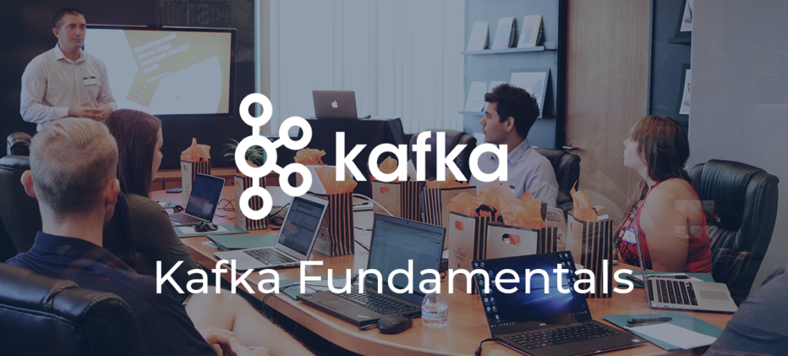
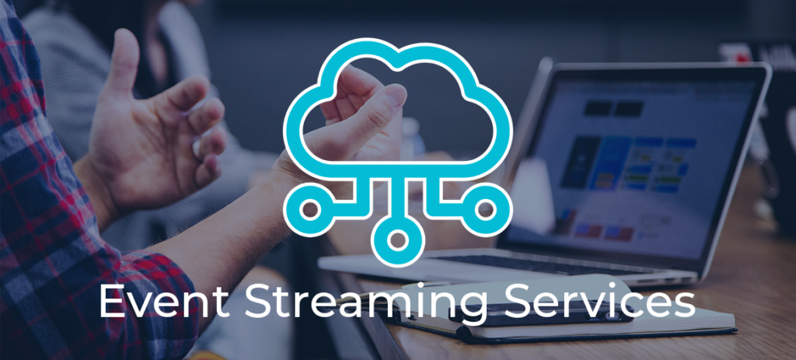

 

# Apache Kafka Consulting:  

High-Performance-Lösungen von Thinkport

0 Kafka Zertifikate 0 Erfolgreiche Projekte 0 Qualifizierte Mitarbeiter [Linkedin](https://www.linkedin.com/company/11759873) [Instagram](https://www.instagram.com/thinkport/) [Youtube](https://www.youtube.com/channel/UCnke3WYRT6bxuMK2t4jw2qQ) [Envelope](mailto:tdrechsel@thinkport.digital)

Das Apache Kafka Consulting von Thinkport unterstützt Sie und Ihr Team bei der Implementierung von Apache Kafka® für ein **einfaches und effizientes Datenstreaming**. Nutzen Sie die Anwendung außerdem als Zwischenspeicher: Confluent, gegründet von den ursprünglichen Entwicklern von Apache Kafka, verarbeitet Daten in Echtzeit und bietet sowohl Daten-Streaming Pipelines als auch **APIs für weitere Systeme und Anwendungen**. Verwalten Sie Echtzeitdaten problemlos und skalieren Sie sie einfach und schnell für jede Art von IT-Infrastruktur. Mit Confluent wurde Kafka enterprise ready!  
  
Confluent Cloud ist ein Cloud-nativer Service für Apache Kafka®, ohne sich Gedanken über eine Infrastruktur machen zu müssen. Datenströme können ohne die Herausforderungen des Infrastruktur-Managements genutzt werden, damit sich Unternehmen auf das Wesentliche konzentrieren können: Ihr Kerngeschäft. Confluent Cloud ist ein vollständig verwalteter, cloud-nativer Kafka-Dienst für die Verbindung und Verarbeitung sämtlicher Daten überall dort, wo sie benötigt werden.

## Kafka & Thinkport

„Profitieren Sie von der Expertise von Thinkport: Dank unserer Erfahrung und unserem technischen Know-how entwickeln wir die idealen Digitalisierungsansätze für Ihre speziellen Bedürfnisse. Mit unserem Apache Kafka Consulting sparen Sie Zeit und Ressourcen und vermeiden Fehler. Aufgrund unserer Partnerschaften mit namhaften IT-Providern stehen uns die neuesten Tools und Technologien zur Verfügung. Wir unterstützen Sie bei der Umsetzung Ihrer digitalen Vision.“  
Laszlo Csoti, Circle Lead Streaming

 Termin vereinbaren

## Apache-Kafka-Consulting von Thinkport:  

volles Potenzial entfalten und durchstarten

Gehen Sie den **ersten Schritt in eine Zukunft mit Echtzeit-Daten** und profitieren Sie von der Apache Kafka Beratung von Thinkport. Wir begleiten Sie bei Entwicklungs- und Migrationsprozessen und beraten Sie vollumfänglich über Ihre technologischen und unternehmerischen Perspektiven.  
  
Wir verfügen über langjährige Erfahrung und Expertise und lösen auch komplexe Unterfangen erfolgreich und effizient. Mit unserer Hilfe **schöpfen Sie das volle Potenzial mit Apache Kafka aus:** Wir wissen genau, an welchen Stellen sich der Einsatz bestimmter Technologien lohnt. Durch unser Apache Kafka Consulting vermeiden Sie Fallstricke sowie hohe Kosten und sparen Zeit. Das Know-how unseres Teams ermöglicht es Ihnen, mit bereits vorhandenen Ressourcen beste Ergebnisse in Ihrem Apache Kafka Projekt zu erzielen

 Termin vereinbaren

Mit Apache Kafka nutzen Sie die Vorteile einer technisch ausgereiften Daten-Streaming-Plattform, die es Ihnen ermöglicht, die Daten direkt zu durchsuchen und zu verarbeiten. Die Anwendung bietet **eine Vielzahl von Möglichkeiten**, die Ihnen und Ihrem Unternehmen **entscheidende Vorteile bei der Datenverarbeitung** verschaffen:

## Kafka Stärken

* **Kafka-Datenpipelines**  
    Apache Kafka integriert die Daten, sobald sie in den jeweiligen Sources erstellt werden. So stehen sie an einem oder mehreren Zielen sofort zum Streamen zur Verfügung. Dank des Apache Kafka Consultings von Thinkport migrieren Sie erfolgreich.

* **Kafka Stream Processing**  
    Verarbeiten Sie die Daten mithilfe von Anwendungen wie Joins, Filtern und vielen mehr, die für zahlreiche Fälle nutzbar sind. Mit der Stream-Processing-Bibliothek Kafka Streams können Sie Daten in Echtzeit verarbeiten. Erfahren Sie in unserer Apache Kafka Beratung alles über Ihre Anwendungsmöglichkeiten und Einsparpotenziale.

* **Streaming Analytics von Apache Kafka**  
    Kombinieren Sie zum Beispiel Apache Kafka mit einer Open-Source-Anwendung wie Druid und erzeugen Sie so einen leistungsstarken Streaming-Analytics-Manager. Streaming-Daten werden zunächst von Apache Kafka geladen, um im Anschluss von Druid für analytische Echtzeit-Abfragen zur Verfügung gestellt zu werden. Im Rahmen unseres Apache Kafka Consultings entwickeln wir optimale Prozesse zur Unterstützung Ihrer Vorgänge.

* **Streaming-ETL**  
    ETL steht für die Datenbankfunktionen Extract, Transform und Load und beschreibt die Verarbeitung und Übertragung von Daten. Das Echtzeit-ETL von Apache Kafka kombiniert unterschiedliche Funktionen und Komponenten, um Daten über die API von anderen Datenbanken und Anwendungen zu integrieren oder an diese weiterzuleiten.

* **Ereignisbezogene Microservices mit Apache Kafka**  
    Apache Kafka ist in der Lage, zahlreiche Probleme der Microservice-Orchestrierung zu lösen und verbessert zugleich die Geschwindigkeit, Skalierbarkeit und Effizienz. Außerdem fördert es die Übertragung zwischen den Diensten und vermeidet Verzögerungen und Fehler.

## Thinkport's Kernkompetenzen für ihr Kafka Projekt

Sie benötigen eine Beratung zur Ihrem Kafka Projekt? Oder eine neue Anwendung in beliebiger Größe  
oder für beliebige Zwecke? Oder Unterstützung für die bestehende Infrastruktur?  
Wir teilen gerne unser Wissen und unsere Erfahrung mit Ihnen.

Beratung Unsere erfahrenen Berater navigieren Sie zu den passenden Cloud-Lösungen, die Ihre Geschäftsleistung steigern und Kosten optimieren.

&

Entwicklung Unser Entwicklerteam setzt modernste Cloud-Technologien ein, um zukunftsfähige Lösungen zu erstellen, die perfekt auf Ihre Bedürfnisse zugeschnitten sind.  Cloud Strategy Unsere Cloud-Strategie umfasst eine ganzheitliche Analyse Ihrer Geschäftsziele, um maßgeschneiderte Lösungen darzulegen, die Ihre digitale Transformation unterstützen. Cloud Planung Unserer Cloud-Planung berücksichtigt sorgfältig Ihre Anforderungen und erstellt eine umfassende Roadmap, die eine nahtlose Integration von Cloud-Technologien ermöglicht. Cloud Development Im Cloud-Developments setzen wir modernste Technologien ein, die nicht nur leistungsstark und skalierbar sind, sondern auch nahtlos in Ihre bestehende IT-Infrastruktur integriert werden. Cloud Migration Bei der Cloud-Migration sorgen wir für einen reibungslosen Übergang Ihrer Anwendungen und Daten in die Cloud, inkl. Berücksichtigung von Sicherheitsaspekten und Optimierung der Leistung. Dev OPS DevOps ist ein integraler Bestandteil unseres Ansatzes, bei dem Entwicklung und Betrieb nahtlos zusammenarbeiten. Data Daten bilden das Fundament, wobei wir durch umfassende Analyse und intelligente Verarbeitung dazu beitragen, wertvolle Einblicke zu gewinnen und datengetriebene Entscheidungen zu ermöglichen.

## Unsere Apache Kafka - Success Story

<figure>

<figcaption>

Data Streaming / IoT

</figcaption>

</figure>

## Unsere Top 3:  

Kafka Trainings & Workshops

Die Lerninhalte unserer vielfältigen Apache Kafka Trainings werden von unseren Experten spannend und eingängig vermittelt. In den Trainings lernen Sie praxisorientiert von zertifizierten Cloud Profis, wie Sie moderne Anwendungen erstellen und bereitstellen.  
  
Gerne schneiden wir auch unsere bestehenden Trainingsmaßnahmen oder Workshops ganz individuell auf Ihre Bedürfnisse zu. Sprechen Sie uns diesbezüglich gerne an, gemeinsam finden wir eine Lösung.

[Mehr ](https://thinkport.digital/cloud-trainings-workshops/)

## Wissen & Kompetenz: Unsere erfahrenen Cloud Experten.

### Laszlo

Senior Cloud Architect[

### Laszlo

Senior Cloud Architect](mailto:lcsoti@thinkport.digital)

### Thomas

Senior Cloud Engineer[

### Thomas

Senior Cloud Engineer](mailto:tiffland@thinkport.digital)

### Patrick

Senior Cloud Engineer[

### Patrick

Senior Cloud Engineer](mailto:ppolster@thinkport.digital)

Inspiriert? Werde Teil unseres Expertenteams

## Unsere Thinkport Versprechen

      

Nutzen Sie das Apache Kafka Consulting von Thinkport und profitieren Sie von der simplen Anwendbarkeit und der starken Performance der Streaming-Plattform. Mit unserer Expertise entwickeln wir die perfekten Voraussetzungen für optimale Performance und Ergebnisse. Wir freuen uns auf Ihre Kontaktaufnahme.

Cloud-Beratung mit Start-Up Mentalität

## Ihr Ansprechpartner

Dominik Fries

CTO & Lead Cloud Architect

[dfries@thinkport.digital](mailto:dfries@thinkport.digital)

+49 151 63417156

* 
* 
