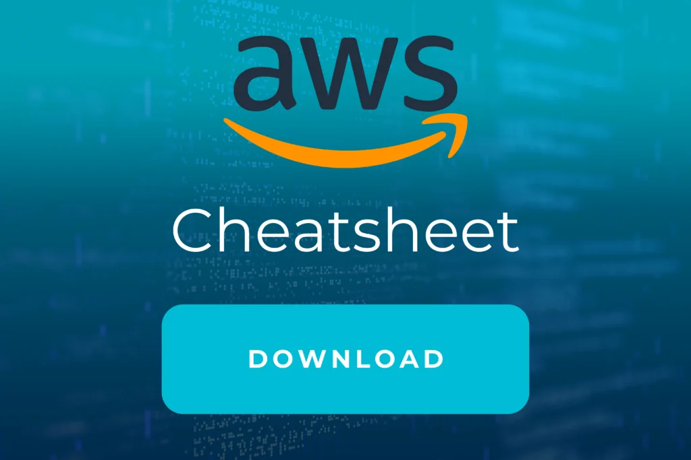

Werden Sie Experte mit dem

## AWS CDK Essentials Training

### Auf einen Blick

* 1 Tag
* Monatlich und Individuell
* Technisches Training
* Remote und vor Ort verfügbar

Lernen Sie im AWS CDK Training, die Cloud-Infrastruktur mit vorhandenen Kenntnissen und vertrauter Programmiersprache aufzubauen. Profitieren Sie von Projekterfahrung unserer Experten und Cloud-Architekten mit Erfahrung direkt aus der Industrie.

[Anfragen](#sec1)

Infrastructure as Code ist ein Muss für moderne Anwendungen, die Cloud-Services nutzen. AWS CDK ist die zweite Generation der AWS IaC-Tools, die sich derzeit sehr schnell und intensiv entwickelt. Mit CDK können Sie die Infrastruktur mit echten Programmiersprachen schreiben und voll ausnutzen. Da CDK immer noch auf Cloudformation basiert, beinhaltet dieses Training auch notwendige Cloudformation-Themen. Diese Themen muss man bei der DevOps-Arbeit auf AWS kennen.

[Linkedin](https://www.linkedin.com/company/11759873) [Instagram](https://www.instagram.com/thinkport/) [Youtube](https://www.youtube.com/channel/UCnke3WYRT6bxuMK2t4jw2qQ) [Envelope](mailto:tdrechsel@thinkport.digital)

## Termine

18.06.24 AWS CDK Essentials Training

15.07.24 AWS CDK Essentials Training

21.08.24 AWS CDK Essentials Training

\* individuelle Termine möglich

## Preis

700 € zzgl. MwSt.

## Lernerfolge

Teilnehmer können nach Abschluss...

* Neue CDK-Anwendungen erstellen
* IaC mit Programmiersprachen schreiben
* Mit dem Cloud Development-Kit entwickeln

## Zielgruppe

Der Kurs ist geeignet für...

* Personen mit DevOps Erfahrung
* Personen, mit Erfahrung als AWS- und Cloudformation-Entwickler und AWS-Architekten
* Unternehmen, die Anwendungen mit AWS erstellen

## Aufbau

[AWS CDK im Handumdrehen lernen](https://www.hashicorp.com/)

### Übersicht über IaC Modul I

* Was ist IaC?
* Vorstellung und Vergleich Cloudformation, Terraform und CDK
* Konzeptionelle Unterschiede zwischen den Frameworks

### Cloudformation Essentials Modul II

* Stacks: Stacks Lifecycle & Stack Sets
* Import/Export
* Nutzung der vorhandenen Ressourcen

### Cloud Development Kit Modul III

* Architektur des CDK
* Abstraktion mir Konstrukten
* Wie starte ich mit dem CDK?

### Entwicklungsablauf Modul IV

* Initialisierung
* Projektstart
* Teststufen

### VPC und IAM mit dem CDK Modul V

* Netzinfrastruktur mit dem CDK erstellen
* Rechteverwaltung
* EC2 Instanzen

## Erfolge

Die Lerninhalte des AWS CDK Trainings werden von unseren Experten spannend und eingänglich vermittelt. In diesem Kurs lernen Sie von unseren zertifizierten Experten den einfacheren Einstieg in die Cloud und den beschleunigten Entwicklungsprozess.

## Unterstützung

Wir haben die von unseren Entwicklern am häufigsten verwendeten Befehle in einem Cheatsheet zusammengefasst, das während der Schulung und nach deren Abschluss verwendet werden kann. Wenn Sie sich damit vertraut machen wollen, können Sie es hier herunterladen.

## Kontakt

Erfahren Sie mehr zu diesem Training in einem persönlichen Gespräch

Sie setzen mit uns individuelle Schwerpunkte und erhalten ein zugeschnittenes Angebot für Ihre Anforderungen 24h nach dem Termin

Termin vereinbaren

## FAQs

Hier finden Sie eine kurze Zusammenstellung von oft gestellten Fragen und den dazugehörigen Antworten.

Was ist AWS CDK?

AWS CDK steht für AWS Cloud Development Kit und ist ein Open-Source-Framework für die Softwareentwicklung. Damit lässt sich Cloud-Infrastruktur als Code mit modernen Programmiersprachen definieren und über AWS CloudFormation bereitstellen.

Wie funktioniert AWS CDK?

Unter Verwendung vertrauter Programmiersprachen, wie z. B. JavaScript, TypeScript, Python, Java, C# und Go, werden die gewünschten Cloud-Anwendungsressourcen mit Hilfe des AWS CDK definiert. Der geschriebene Code wird in CloudFormation (CFN)-Vorlagen transpiliert und erstellt mit AWS CloudFormation die Infrastruktur.

Welche Vorteile bringt AWS CDK?

AWS CDK (Cloud Development Kit) bietet eine Reihe von Vorteilen für Entwickler, die AWS-Infrastruktur bereitstellen und verwalten müssen. Einige der wichtigsten Vorteile sind:

* - Schnelle Bereitstellung
    - Einfache Verwaltung
    - Wiederverwendbarkeit
    - Unterstützung für eine Reihe von Programmiersprachen und Frameworks
    - Verwaltung von AWS-Infrastruktur als Code

Insgesamt bietet AWS CDK eine leistungsstarke, flexible und effiziente Möglichkeit, AWS-Infrastruktur als Code zu definieren und zu verwalten. Es hilft Entwicklern, schnell und wiederholbar eine zuverlässige und skalierbare Infrastruktur bereitzustellen und zu verwalten.

### Weitere Trainings
