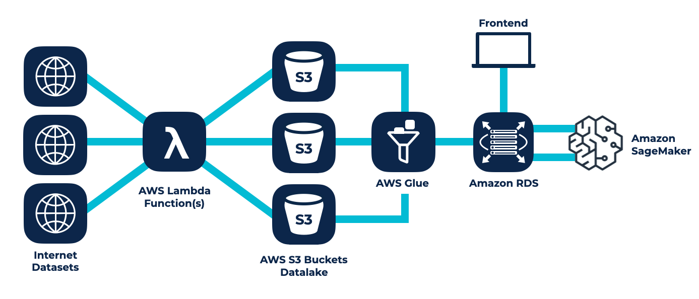

# AWS Machine Learning Infrastruktur für SparkView - Umsatz-

prognosen in der Cloud

0 + Unternehmensprognosen 0 Mio+ Datapoints 0 AWS Services

## Der Kunde

## SparkView GmbH

SparkView will mit einer avantgardistischen AWS Machine Learning Infrastruktur die Branche der Finanzanalyse automatisieren. Mit ihrer Software wollen Alexander Bergmann und Andreas Naujoks zuverlässige KI-generierte Risikobewertungen und Umsatzprognosen für Unternehmen weltweit anbieten. Dazu wird die Plattform mit zahllosen Datensätzen aus dem Internet gespeist.

Thinkport hilft dem Seed Stage Start-Up die Vision des maschinellen Finanzanalysten zu realisieren. In diesem AWS-Projekt arbeiten unsere Cloud Architekten an allen Ecken und Enden mit: Das gesamte Modell - von der Extraktion über die Aufarbeitung der Daten bis hin zum Statistical Learning - wird von unseren Consultants in enger Zusammenarbeit mit SparkView ganzheitlich betreut.

Experten für einzigartige

## Konzepte

Ob Performance, Kosteneinsparung oder Skalierung. 

Wir bieten pragmatische Lösungen für den individuellen Projektfokus jedes unserer Kunden.

[Experten Kontaktieren](https://thinkport.digital/kontaktieren)

### Prognosemodell

Es muss entschieden werden, welche Daten und Informationen für die Umsatzprognose von Unternehmen relevant und aussagekräftig sind. Die fachliche Expertise von SparkView und das technische Know-how von Thinkport sollen sich ganzheitlich ergänzen.

### Datenqualität

Wichtig für den Erfolg des gesamten Konzepts ist die Qualität der dem Modell zugrunde-liegenden Daten. Es muss analysiert werden welche Datenquellen und -kombinationen infrage kommen. Darüber hinaus müssen die Daten in regel-mäßigen Intervallen aktualisiert werden.

### Automatisierung

Um wiederkehrenden Wartungsaufwand zu minimieren soll das gesamte Backend automatisiert funktionieren. Insbesondere sollen die Einspeisung und Verarbeitung der Daten automatisch erfolgen.

Die ML-Prognosen bauen auf Datensätzen aus dem Internet auf. Aus verschiedenen APIs werden Datensätze entnommen und von AWS Lambda Funktionen in einem Amazon S3 Bucket Datalake zusammengefasst. Mithilfe von AWS Glue werden die Daten für die spätere Verarbeitung mit ML-Modellen vorbereitet und entsprechend transformiert. Auf Amazon Amazon RDS werden die Daten gelagert. Amazon StageMaker kann auf diese Datenbanken zugreifen und die Machine Learning Modelle anwenden. Die Prognosen werden wieder auf RDS gespeichert und sind mit dem Frontend verknüpft. AWS Elastic Beanstalk kümmert sich um die nahtlose Koordinierung zwischen Backend und Frontend.

## Herausragende

Technologien

AWS Machine Learning Infrastruktur

## Ergebnisse mit Weitsicht

Unsere Experten arbeiten an innovativen Lösungen, um deutsche Unternehmen fit für die Zukunft zu machen.

### Personalisiertes Frontend

Der Zugang wurde auf allerlei Ebenen auf die Wünsche und Bedürfnisse des Kunden angepasst: Sowohl das Design als auch die Funktionalitäten sind von Grund auf erarbeitet worden. So wurde ein voll funktionsfähiger Prototyp für das zukünftige Endprodukt von SparkView geschaffen.

### Zuverlässige Machine Learning Modelle

Die hochentwickelten  Modelle bauen auf cutting-edge Researchsergebnissen aus dem Bereich der künstlichen Intelligenz auf. Das Produkt lernt anhand gegebener Datensätze selbstständig und liefert mit jedem verarbeiteten Datenpunkt präzisere Prognosen.

### Automatisiertes Backend & ETL

Das Backend operiert wie gewünscht vollautomatisch. Die ETL Pipeline extrahiert neue Datenpunkte aus gegebenen APIs und schleust sie nach entsprechenden Transformationen an die ML-Anwendung. Die Daten und Prognosen werden somit nach Veröffentlichung von Bilanzdaten automatisch aktualisiert.

Was mir besonders gefallen hat, ist die Professionalität des Teams und dass eigenverantwortlich und initiativ Ideen eingebracht wurden. Insgesamt war hohe Zuverlässigkeit in der Zusammenarbeit da.

Andreas Naujoks, SparkView

https://www.youtube.com/watch?v=EE5DNjCa4CI

Cloud-Beratung mit Start-Up Mentalität

## Ihr Ansprechpartner

Philipp D'Angelo

Standortleiter Leipzig

pdangelo@thinkport.digital

+49 151 63417156

- 

## [Weitere Success Stories](https://thinkport.digital/cloud-excellence-workshops)

## [Thinkport - Silicon Valley technologies for German enterprises](https://thinkport.digital/kontaktieren/)
