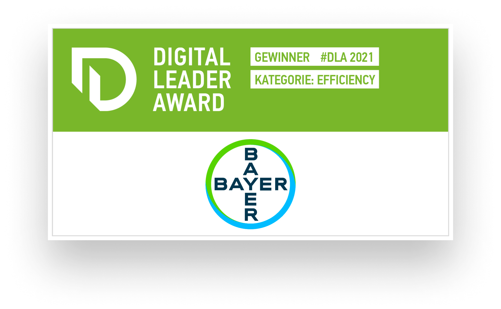

## Ihr AWS Consulting Partner für die bessere Cloud

> Wir machen Sie fit für die AWS - Cloud!

Sie prüfen eine Migration in die moderne AWS-Welt und planen Ihre zukünftige Architektur und Services?  
Oder nutzen Sie bereits AWS und sind unsicher über die nächsten Entwicklungsschritte?  
Als AWS Consulting Partner bieten wir Ihnen den kompletten Full Service der AWS Beratung an.  
Gerne unterstützen wir Sie individuell. Und entwickeln mit Ihnen die zukunftsfähige Cloud Strategie  
Ihres Unternehmens sowie deren Umsetzung.

## AWS & Thinkport

„AWS ist nicht nur der marktführende Cloud-Anbieter. Er bietet auch nahezu alle Aspekte der modernen IT an. Wir, als Thinkport, sind stolz darauf, AWS Consulting Partner der ersten Stunde zu sein. So haben wir eine ausgefeilte Expertise in Sachen Sicherheit, Zuverlässigkeit, Skalierbarkeit und Kosteneffizienz entwickelt. Unser Portfolio umfasst zahl- und erfolgreiche AWS-Applikationen. Dabei liegt uns die fortlaufende Weiterbildung unserer Mitarbeiter in Bezug auf die neuesten AWS-Services immer am Herzen.“  
Kristian Nikolic

Termin vereinbaren

## AWS Stärken

- Der marktführende und ausgereifteste Cloud-Anbieter
- AWS unterstützt mehr Sicherheitsstandards und Compliance-Zertifizierungen als jedes andere Angebot, einschließlich PCI-DSS, HIPAA/HITECH, FedRAMP, GDPR, FIPS 140-2 und NIST 800-171
- Drittanbieter-Validierung für 1.000 globale Anforderungen
- Große Anzahl von Regionen und Edge-Standorten, die es ermöglichen, Daten in Ihrer Region zu speichern oder sie näher an Ihre Kunden zu liefern
- Größte Entwicklergemeinschaft auf der Welt

## Thinkport's Kernkompetenzen für ihr AWS Projekt

Sie benötigen eine Beratung zur AWS-Architektur? Oder eine neue Anwendung in beliebiger Größe  
oder für beliebige Zwecke? Oder Unterstützung für die bestehende Infrastruktur?  
Wir teilen gerne unser Wissen und unsere Erfahrung mit Ihnen.

Beratung Unsere erfahrenen Berater navigieren Sie zu den passenden Cloud-Lösungen, die Ihre Geschäftsleistung steigern und Kosten optimieren.

&

Entwicklung Unser Entwicklerteam setzt modernste Cloud-Technologien ein, um zukunftsfähige Lösungen zu erstellen, die perfekt auf Ihre Bedürfnisse zugeschnitten sind.  Cloud Strategy Unsere Cloud-Strategie umfasst eine ganzheitliche Analyse Ihrer Geschäftsziele, um maßgeschneiderte Lösungen darzulegen, die Ihre digitale Transformation unterstützen. Cloud Planung Unserer Cloud-Planung berücksichtigt sorgfältig Ihre Anforderungen und erstellt eine umfassende Roadmap, die eine nahtlose Integration von Cloud-Technologien ermöglicht. Cloud Development Im Cloud-Developments setzen wir modernste Technologien ein, die nicht nur leistungsstark und skalierbar sind, sondern auch nahtlos in Ihre bestehende IT-Infrastruktur integriert werden. Cloud Migration Bei der Cloud-Migration sorgen wir für einen reibungslosen Übergang Ihrer Anwendungen und Daten in die Cloud, inkl. Berücksichtigung von Sicherheitsaspekten und Optimierung der Leistung. Dev OPS DevOps ist ein integraler Bestandteil unseres Ansatzes, bei dem Entwicklung und Betrieb nahtlos zusammenarbeiten. Data Daten bilden das Fundament, wobei wir durch umfassende Analyse und intelligente Verarbeitung dazu beitragen, wertvolle Einblicke zu gewinnen und datengetriebene Entscheidungen zu ermöglichen.

## Unsere AWS - Success Stories

<figure>

<figcaption>

Data Streaming / IoT

</figcaption>

</figure>

<figure>

<figcaption>

Digital App Innovation

</figcaption>

</figure>

<figure>

<figcaption>

API für einen 360° Kunden-Dialog

</figcaption>

</figure>

## Unsere Top 3

AWS Trainings & Workshops

Die Lerninhalte unserer vielfältigen AWS Trainings werden von unseren Experten spannend und eingänglich vermittelt. In den Trainings lernen Sie praxisorientiert von zertifizierten Cloud Profis, wie Sie moderne Anwendungen erstellen und bereitstellen.

Gerne schneiden wir auch unsere bestehenden Trainingsmaßnahmen oder Workshops ganz individuell auf Ihre Bedürfnisse zu. Sprechen Sie uns diesbezüglich gerne an, gemeinsam finden wir eine Lösung.

[Mehr ](https://thinkport.digital/cloud-trainings-workshops/)

## Wissen & Expertise: Unsere erfahrenen Cloud Coaches.

### Kristian

Cloud Architect[

### Kristian

Cloud Architect](mailto:knikolic@thinkport.digital)

### Samir

Senior Cloud Engineer[

### Samir

Senior Cloud Engineer](mailto:kontakt@thinkport.digital)

### Thomas

Senior Cloud Engineer[

### Thomas

Senior Cloud Engineer](mailto:tiffland@thinkport.digital)

Inspiriert? Werde Teil unseres Trainerteams

## Unsere Thinkport Versprechen

      

## AWS Consulting von Thinkport

Als ausgezeichneter AWS Consulting Partner bieten wir Ihrem Unternehmen ein qualifiziertes, zertifiziertes und engagiertes Team an. Unsere umfangreichen Praxis-Erfahrungen decken das komplette Spektrum aller Leistungen rund um die Cloud von AWS ab. Ob Private, Public, Hybrid oder Multi-Cloud – wir sind Ihr Partner auf Augenhöhe. Und finden mit Ihnen gemeinsam die besten Cloud-Lösungen. Wir freuen uns auf Ihre Kontaktaufnahme.

Cloud-Beratung mit Start-Up Mentalität

## Ihr Ansprechpartner

### Dominik Fries

CTO & Lead Cloud Architect

- [dfries@thinkport.digital](mailto:dfries@thinkport.digital)
- [+49 151 63417156](tel:+4915163417156)
- [LinkedIn](https://www.linkedin.com/in/dominik-fries-497ab7107/?originalSubdomain=de)
- [Dominik Fries](https://www.xing.com/profile/Dominik_Fries5)
