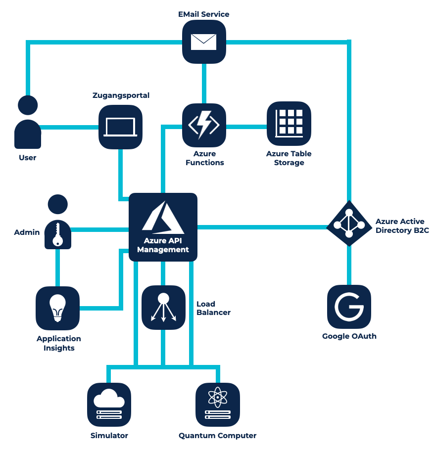

 

# Azure Cloud Infrastruktur für  
den weltweit ersten all-purpose Quanten-computer

0 + Aktive Nutzer 0 Azure Services 0 % Cloud Gehostetes Backend

## AWS Azure Cloud Computing AQT Cloud Beratung Development Innovative Infrastruktur

## der kunde

[Alpine Quantum Technologies GmbH](https://www.aqt.eu/)

Thinkport Experten bauen eine Azure Cloud Infrastruktur für AQT, dem österreichischen Forschungsunternehmen das den weltweit ersten all-purpose Quantencomputer bereitstellt.

AQT wurde im Jahr 2018 als ein Spin-Off der Universität Innsbruck und der österreichischen Akademie der Wissenschaften gegründet. Das Expertenteam wurde aufgrund seiner bahnbrechenden Forschungsleistungen im Bereich der Ion-trap-Technologien von Seiten des Weltwirtschaftsforums als Technology Pioneer 2020 ausgezeichnet. Das österreichische Start-Up hat sich als Ziel gesetzt, bis spätestens 2022 Quanten Computing flexibel und skalierbar für jedermann anzubieten.

Um das Angebot umzusetzen und ihren Service zu monetarisieren braucht AQT eine innovative Cloud-Infrastruktur um einen sicheren Zugang zum Quantencomputer zu gewähren, Nutzerdaten zu tracken und die Leistung allgemein zu verwalten.

Die von Thinkport gebaute Oberfläche ist darüber hinaus auf die bestehenden Systeminterfaces zugeschnitten, um sowohl für den Nutzer als auch für die Administratoren eine nahtlose und unkomplizierte Arbeit zu ermöglichen.

Experten für einzigartige

## Konzepte

Ob Performance, Kosteneinsparung oder Skalierung. 

Wir bieten pragmatische Lösungen für den individuellen Projektfokus jedes unserer Kunden.

[Experten Kontaktieren](https://thinkport.digital/kontaktieren)

### Access Control

Langfristig soll das Betreiben des Computers Umsätze generieren. Daher soll gemessen werden, wieviel Computerleistung von welchem Nutzer in Anspruch genommen wird. Darauf aufbauend wird später ein unkompliziertes und zugleich sicheres Zahlungsmodell benötigt.

### Monetarisierung

Der Zugriff auf einen Quantencomputer muss auf zweierlei Ebenen sicher sein: Es muss reguliert werden können, wer auf das System zugreift und es soll ein Rechtesystem für unterschiedliche Nutzergruppen entwickelt werden. Insgesamt muss eine smarte Technologie zur Verwaltung der Zugänge auf den Computer her.​

### User Experience

Um möglichst viele Kunden anzusprechen muss das gesamte Frontend bequem und nutzerfreundlich gestaltet werden. Von der Registrierung über die Nutzung bis hin zur Zahlung soll das Interface intuitiv sein ohne Kompromisse in punkto Funktionalität einzugehen.​

Der Nutzer meldet sich über das von Thinkport entwickelte Registrierungsportal an. Das Herz der Cloud Architektur bildet das Azure API Management, das mit allen Anwendungen kommuniziert. Die Autorisierung für die Zugänge auf das System wird über Azure Active Directory B2C verwaltet. Über OAuth können sich die User auch über ihr Google Konto anmelden. Zusätzlich können AGBs unkompliziert in Azure Table Storage gespeichert und über eine Azure Function implementiert werden. Dank eines externen Email-Versandservices verfügt die Infrastruktur über eine professionelle Customer Contact Funktion.   

Das Monitoring Dashboard baut auf Azure Application Insights auf. Hier werden Nutzerzahlen und Metrics übersichtlich dargestellt. Darauf aufbauend hat Thinkport ein auf Subscription Keys basierendes Zahlungsmodell entwickelt, das sichere und bequeme Transaktionen ermöglicht. Darüber hinaus kümmert sich ein Load Balancer um eine sichere und stabile Lastverteilung zwischen dem Quantencomputer selbst und einem Simulator. Unsere Cloud Architekten haben eine Infrastruktur entwickelt die nutzerfreundlich, funktional und zugleich kompromisslos sicher ist.  

Das Frontend wurde mit CSS, HTML, Javascript und jQuery auf die Beine gestellt. Ein großer Vorteil ist hierbei, dass das gesamte Interface visuell an die bestehenden Systeme und das Corporate Design des Kunden angepasst werden konnte. Das gesamte System fühlt sich für den Nutzer für eine einzige Software an, obwohl im Hintergrund eine Vielzahl an Anwendungen den Service realisiert.

## Herausragende  
Technologien

Moderne Azure  
Cloud Infrastruktur

## Ergebnisse mit Weitsicht

Unsere Experten arbeiten an innovativen Lösungen, um deutsche Unternehmen fit für die Zukunft zu machen.

### Unkompliziertes Zugangsportal mit custom UI

Die Anmeldung für das Portal sowie der Zugriff zum Quantencomputer sind dank des von Grund auf neu entwickelten Systems kinderleicht. Das Produkt wurde passgenau auf die Bedürfnisse des Kunden zugeschnitten: Und zwar sowohl im Bereich functionality als auch in punkto Design.

### Sicheres Payment Modell mit Fokus auf Effizienz

Das eingebaute Payment-Modell ermöglicht es AQT die Leistung des Quantencomputers zu verwirtschaftlichen. Anhand der Nutzerdaten, die in dem Cloud-System gesammelt und ausgewertet werden, kann die Nutzung der Quantenpower für jeden Nutzer quantifiziert und in Rechnung gestellt werden.

### Automatisierte  
Smart-Verwaltung  

Der Einsatz von modernen Technologien sorgt für lückenlose Sicherheit und starke Leistung ohne hohen wiederkehrenden Arbeitsaufwand. Zahlungsabwicklung, Datenauswertung und Performance-Management erfolgen entsprechend den modernsten Standards automatisiert.

Cloud-Beratung mit Start-Up Mentalität

## Ihr Ansprechpartner

Keith Schuijlenburg

Cloud Architect

kschuijlenburg@thinkport.digital

+49 151 63417156

- 

## [Weitere Success Stories](https://thinkport.digital/cloud-excellence-workshops)

## [Thinkport - Silicon Valley technologies for German enterprises](https://thinkport.digital/kontaktieren/)
