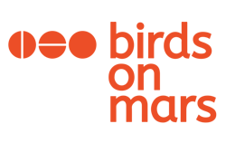
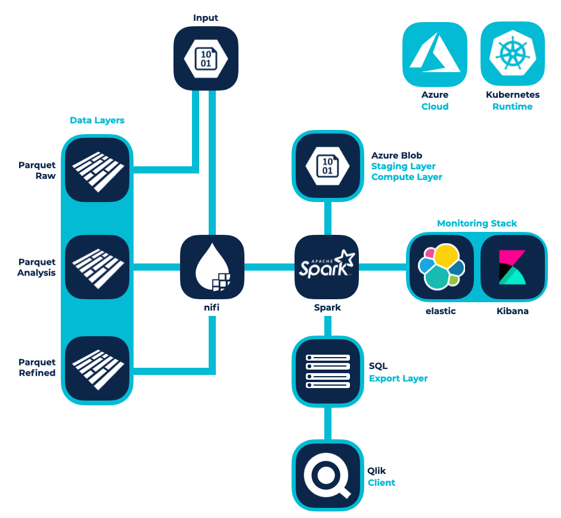

# Azure Data Analytics Infrastruktur für LSG

0 + Use Cases 0 + Datenobjekte 0 + ETL Prozesse

## [Der Kunde](https://www.fairside.capital/)

Die [LSG Group](https://www.lsg-group.com/news/press-release/lsg-group-caters-for-esa-astronaut-matthias-maurer/) ist der weltweit führende Anbieter eines lückenlosen Produkt- und Dienstleistungsangebots für Reisebranche und Gastgewerbe. Das Portfolio des Unternehmens umfasst Catering für Fluggesellschaften, Zugbetreiber und Einzelhandel, aber auch die Entwicklung anspruchsvoller Software-Lösungen für Bordverkaufsprogramme und deren Abwicklung. Mit seiner logistischen, kulinarischen und technischen Expertise ist die LSG Group damit der perfekte Partner für Mahlzeiten auf Reisen und zum Mitnehmen. | [www.lsg-group.com](https://www.lsg-group.com/)

Um das Angebot noch genauer auf die Kunden zuschneiden zu können, braucht LSG eine breit angelegte Infrastruktur für Data Analytics. Thinkport bietet eine Azure basierte Lösung, die modernste Technologien aus dem Fachbereich der Datenauswertung einsetzt und gleichzeitig den strikten Protokollen der Endkunden gerecht wird. 

Thinkport hat dieses Projekt mit ihrem Partner Birds on Mars verwirklicht. In enger Zusammenarbeit wurde ein Proof of Concept für eine Data-Analytics-Plattform entwickelt. Hierbei lag der Schwerpunkt im Auswerten von wichtigen Unternehmenskennzahlen aus verschiedenen Source-Systemen. Die größte Herausforderung bestand dabei darin, dass der Kunde aufgrund interner Auflagen die Auswahl an Cloud Services und Tools stark einschränken musste. Trotz dieser restriktiven Ausgangslage konnte Birds on Mars zusammen mit Thinkports Cloud Experten eine innovative Strategie für den Use Case entwickeln. Die Birds haben hierbei ein einzigartiges Data-Lake-Konzept hervorgebracht, das von Thinkports Azure-Architekten realisiert wurde.  

## [Der Partner](https://www.fairside.capital/)

Experten für einzigartige

## Konzepte

Ob Performance, Kosteneinsparung oder Skalierung. 

Wir bieten pragmatische Lösungen für den individuellen Projektfokus jedes unserer Kunden.

[Experten Kontaktieren](https://thinkport.digital/kontaktieren/)

### Strategie

Zusammen mit unserem Partner Birds on Mars haben wir eine Cloud-Plattform-Strategie geschaffen, die von der Auswertung von KPIs bis hin zu der Abbildung komplexer AI Prozesse, verschiedenste Use-Cases abbildet. Das Konzept konnten wir von Beginn an iterativ in der bestehenden Systemlandschaft verproben.

### Data Plattform

Neben betrieblichen Themen wie Monitoring, Datenklassifizierung und -sicherheit oder die Einführung von CI/CD, konnten wir durch die Auswahl geeigneter Cloud Services in Microsoft Azure, alle benötigen Anforderungen abdecken. Mit unserer bewährten Data Plattform Konzeption, sind alle technologischen Herausforderungen abgebildet und konnten gelöst worden.

### Implementierung

Trotz starker Restriktionen bei der möglichen Auswahl der Cloud Services, konnten wir dem Kunden, mit der Umsetzung der ersten Use- Cases, die Praxistauglichkeit der Plattform veranschaulichen.

Bei der technischen Verprobung wurden die Daten über verschiedene Quell-Systeme eingespeist und in einem Layer Modell organisiert. Als Dateiformat wurde Parquet verwendet, um die Datensätze möglichst Kosten- und Abfrageoptimiert abzulegen. 

Weil für die Orchestrierung der Daten die  Azure Data Factory noch nicht verfügbar war, nutzen wir Apache Nifi um die Daten über die verschiedenen Layer zu verteilen und die ETL Prozesse anzustoßen. Mithilfe von Apache Spark konnten wir sowohl einen generischen Datenqualität-Check als auch die eigentliche Business-Logik implementieren.

Über ein Data Vault Schema, welches über Apache Spark befüllt wurde, konnten wir die Reports für den QLik Server bereitstellen.

Außerdem wurden verschiedene technische und fachliche Metriken an den Monitoring Stack übergeben und in Dashboards visualisiert

Die gesamte Infrastruktur wurde in Containern auf Kubernetes bereitgestellt.

## Herausragende  

Technologien

Azure Data Analytics Infrastruktur

 

Dominik Fries

CTO & Lead Cloud Architect

dfries@thinkport.digital

+49 151 63417156

* 
* 

## [Weitere Success Stories](https://thinkport.digital/cloud-excellence-workshops)

## [Thinkport - Silicon Valley technologies for German enterprises](https://thinkport.digital/kontaktieren/)
