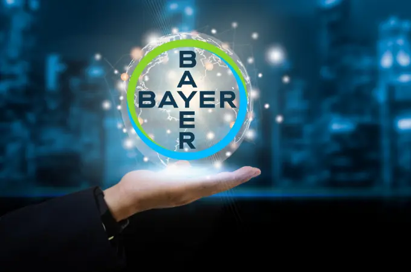
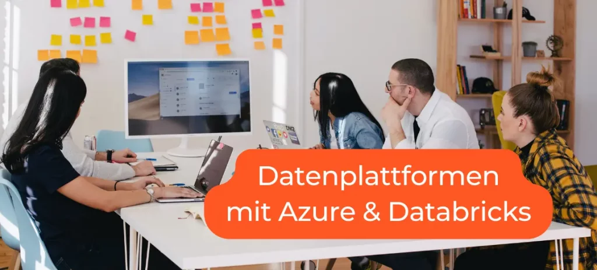
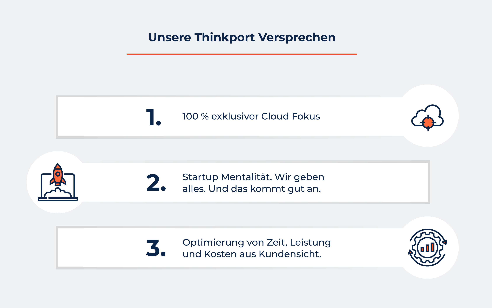

Wir machen Sie fit für die Azure - Cloud!

## Ihr Azure Consulting Partner für die bessere Cloud

0 + Azure Zertifikate 0 Erfolgreiche Projekte 0 Qualifizierte Mitarbeiter [Linkedin](https://www.linkedin.com/company/11759873) [Instagram](https://www.instagram.com/thinkport/) [Youtube](https://www.youtube.com/channel/UCnke3WYRT6bxuMK2t4jw2qQ) [Envelope](mailto:tdrechsel@thinkport.digital)

Sie prüfen eine Migration in die moderne **[Azure](https://thinkport.digital/was-ist-azure/)**\-Welt und planen Ihre zukünftige Architektur und Services?  
Oder nutzen Sie bereits Azure und sind unsicher über die nächsten Entwicklungsschritte?  
Als Azure Consulting Partner bieten wir Ihnen den kompletten Full Service der Azure Beratung an.  
Gerne unterstützen wir Sie individuell. Und entwickeln mit Ihnen die zukunftsfähige Cloud Strategie  
Ihres Unternehmens sowie deren Umsetzung.

## Azure & Thinkport

„[Azure](https://thinkport.digital/was-ist-azure/)\-überzeugt mich immer wieder mit seinen ausgereiften Lösungen für nahezu jeden IT-Anwendungsfall. Dabei hat Microsoft früh erkannt, dass Unternehmen nicht nur von einem Cloud-Anbieter abhängig sein wollen: Es unterstützt verschiedenste hybride Szenarien mit Lösungen anderer Cloud-Anbieter sowie dem eigenen Rechenzentrum. Wir als Thinkport haben eine 5-jährige Historie in der Entwicklung von Anwendungen auf und mit der Azure Cloud-Plattform. Dazu gehört, dass unser Team von Experten kontinuierlich zertifiziert und weitergebildet wird, um stets am Zahn der Zeit zu bleiben.“

Keith Schuijlenburg

Termin vereinbaren

## Azure Stärken

* Erfüllen regulatorische und Security-Anforderungen am besten
* Ausgereifte und innovative Lösungen
* Gute Analytics- und KI-Funktionen
* Haben die meisten Erfahrungswerte
* Marktführer
* Zuverlässiger Partner
* Gute Debugging-Tools

## Thinkport's Kernkompetenzen für ihr Azure Projekt

Sie benötigen eine Beratung zur [Azure](https://thinkport.digital/was-ist-azure/)\-Architektur? Oder eine neue Anwendung in beliebiger Größe  
oder für beliebige Zwecke? Oder Unterstützung für die bestehende Infrastruktur?  
Wir teilen gerne unser Wissen und unsere Erfahrung mit Ihnen.

Beratung Unsere erfahrenen Berater navigieren Sie zu den passenden Cloud-Lösungen, die Ihre Geschäftsleistung steigern und Kosten optimieren.

&

Entwicklung Unser Entwicklerteam setzt modernste Cloud-Technologien ein, um zukunftsfähige Lösungen zu erstellen, die perfekt auf Ihre Bedürfnisse zugeschnitten sind.  Cloud Strategy Unsere Cloud-Strategie umfasst eine ganzheitliche Analyse Ihrer Geschäftsziele, um maßgeschneiderte Lösungen darzulegen, die Ihre digitale Transformation unterstützen. Cloud Planung Unserer Cloud-Planung berücksichtigt sorgfältig Ihre Anforderungen und erstellt eine umfassende Roadmap, die eine nahtlose Integration von Cloud-Technologien ermöglicht. Cloud Development Im Cloud-Developments setzen wir modernste Technologien ein, die nicht nur leistungsstark und skalierbar sind, sondern auch nahtlos in Ihre bestehende IT-Infrastruktur integriert werden. Cloud Migration Bei der Cloud-Migration sorgen wir für einen reibungslosen Übergang Ihrer Anwendungen und Daten in die Cloud, inkl. Berücksichtigung von Sicherheitsaspekten und Optimierung der Leistung. Dev OPS DevOps ist ein integraler Bestandteil unseres Ansatzes, bei dem Entwicklung und Betrieb nahtlos zusammenarbeiten. Data Daten bilden das Fundament, wobei wir durch umfassende Analyse und intelligente Verarbeitung dazu beitragen, wertvolle Einblicke zu gewinnen und datengetriebene Entscheidungen zu ermöglichen.

## Unsere Azure - Success Stories

<figure>

<figcaption>

Event Streaming Projekt

</figcaption>

</figure>

<figure>

<figcaption>

Quantencomputer

</figcaption>

</figure>

<figure>

<figcaption>

Data Sciene

</figcaption>

</figure>

## Unsere Top 3:

Azure Trainings & Workshops

Die Lerninhalte unserer vielfältigen [Azure](https://thinkport.digital/was-ist-azure/)\-Trainings werden von unseren Experten spannend und eingänglich vermittelt. In den Trainings lernen Sie praxisorientiert von zertifizierten Cloud Profis, wie Sie moderne Anwendungen erstellen und bereitstellen.

Gerne schneiden wir auch unsere bestehenden Trainingsmaßnahmen oder Workshops ganz individuell auf Ihre Bedürfnisse zu. Sprechen Sie uns diesbezüglich gerne an, gemeinsam finden wir eine Lösung.

[Mehr ](https://thinkport.digital/cloud-trainings-workshops/)

## Wissen & Kompetenz: Unsere erfahrenen Cloud Experten.

### Keith

Senior Cloud Architect[

### Senior Cloud Architect [Keith](mailto:kontakt@thinkport.digital)

### Mathias

Cloud Architect[Mathias](mailto:mbecher@thinkport.digital)

### Gökhan

Cloud Engineer [Gökhan](mailto:gyildirim@thinkport.digital)

Inspiriert? Werde Teil unseres Expertenteams

## Unsere Thinkport Versprechen

      

Als ausgezeichneter Azure Consulting Partner bieten wir Ihrem Unternehmen ein qualifiziertes, zertifiziertes und engagiertes Team an. Unsere umfangreichen Praxis-Erfahrungen decken das komplette Spektrum aller Leistungen rund um die Cloud von Azure ab. Ob Private, Public, Hybrid oder Multi-Cloud – wir sind Ihr Partner auf Augenhöhe. Und finden mit Ihnen gemeinsam die besten Cloud-Lösungen. Wir freuen uns auf Ihre Kontaktaufnahme.

Cloud-Beratung mit Start-Up Mentalität

## Ihr Ansprechpartner

### Dominik Fries

CTO & Lead Cloud Architect

* [dfries@thinkport.digital](mailto:dfries@thinkport.digital)
* [+49 151 63417156](tel:+4915163417156)
* [LinkedIn](https://www.linkedin.com/in/dominik-fries-497ab7107/?originalSubdomain=de)
* [Dominik Fries](https://www.xing.com/profile/Dominik_Fries5)
