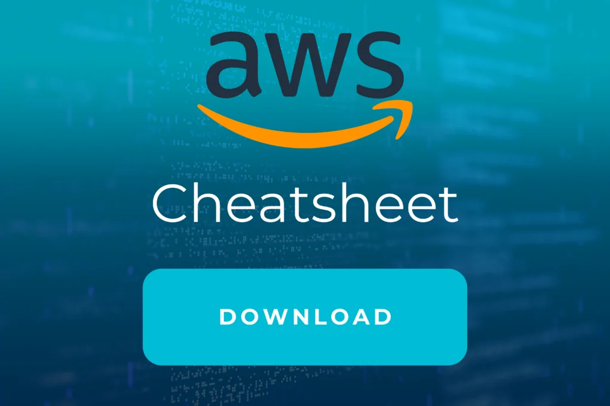

 

Werden Sie Experte mit dem

# CI/ CD mit AWS Training

## Auf einen Blick

* 1 Tag
* Monatlich und Individuell
* Technisches Training
* Remote und vor Ort verfügbar

Lernen Sie mit CI CD AWS robuste und hochverfügbare Pipelines zu entwickeln. Profitieren Sie von Projekterfahrung unserer Experten und Cloud-Architekten mit Erfahrung direkt aus der Industrie.

[Anfragen](#sec1)

Fast keine Anwendungen werden heutzutage ohne CI/CD (Continuous Integration / Continuous Delivery) Pipelines und Deployment Automation entwickelt. Es gibt verschiedene Möglichkeiten, dies zu implementieren. AWS als der ausgereifteste Cloud-Anbieter bietet jedoch viele verwaltete Lösungen zur Entwicklung robuster und hochverfügbarer Pipelines, die sich perfekt mit anderen Services im AWS-Ökosystem integrieren lassen.

[Linkedin](https://www.linkedin.com/company/11759873) [Instagram](https://www.instagram.com/thinkport/) [Youtube](https://www.youtube.com/channel/UCnke3WYRT6bxuMK2t4jw2qQ) [Envelope](mailto:tdrechsel@thinkport.digital)

## Termine

21.06.24 CI/ CD AWS  

19.07.24 CI/ CD AWS  

16.08.24 CI/ CD AWS  

\* individuelle Termine möglich

## Preis

700 € zzgl. MwSt.  

## Lernerfolge

Teilnehmer können nach Abschluss...

* Architektur und Aufbau ausgereifter und moderner CI/CD Pipelines mit AWS
* Schlüsselkomponente einbeziehen
* Effektive Kombination aus AWS-Berechnungen und -Services nutzen

## Zielgruppe

## Der Kurs ist geeignet für Personen mit...

* Kenntnissen und Erfahrung in AWS-Entwicklung und -Architektur
* Kenntnissen in DevOps
* die Anwendungen mit AWS erstellen

## Aufbau

[CI/CD für AWS im Handumdrehen lernen](https://www.hashicorp.com/)

### CI/CD Tag I

* Einführung: Was ist CI/CD und warum sie das brauchen
* AWS DevOps Services im Überblick: CodePipeline, CodeBuild, CodeDeploy, CodeStar
* Integration mit Git: CodeCommit & GitHub
* Erstellen und Bereitstellen einer Hello-World Anwendung

* Einführung: Was ist CI/CD und warum sie das brauchen
* AWS DevOps Services im Überblick: CodePipeline, CodeBuild, CodeDeploy, CodeStar
* Integration mit Git: CodeCommit & GitHub
* Erstellen und Bereitstellen einer Hello-World Anwendung

## Erfolge

Die Lerninhalte unseres CI CD AWS Trainings werden von unseren Experten spannend und eingänglich vermittelt. In diesem Training lernen Sie von zertifizierten Cloud Profis, wie Sie moderne Anwendungen erstellen und bereitstellen.

## Unterstützung

Wir haben die von unseren Entwicklern am häufigsten verwendeten Befehle in einem Cheatsheet zusammengefasst, das während der Schulung und nach deren Abschluss verwendet werden kann. Wenn Sie sich damit vertraut machen wollen, können Sie es hier herunterladen.

## Kontakt

Erfahren Sie mehr zu diesem Training in einem persönlichen Gespräch

Sie setzen mit uns individuelle Schwerpunkte und erhalten ein zugeschnittenes Angebot für Ihre Anforderungen 24h nach dem Termin

 Termin vereinbaren

## FAQs

Hier finden Sie eine kurze Zusammenstellung von oft gestellten Fragen und den dazugehörigen Antworten.

Was ist CI/ CD?

CI/CD ist die Kombination aus  Continuous Integration (CI) mit Continuous Delivery oder Continuous Deployment (CD). Der Zweck von CI/CD besteht darin, Entwicklungsteams die Möglichkeit zu geben, Codeänderungen häufiger und zuverlässiger durchzuführen.

Was bedeutet Continuous Integration? Continuous Integration (kontinuierliche Integration) ist ein DevOps-Verfahren in der Software-Entwicklung, bei der Entwickler alle Codeänderungen regelmäßig in einem zentralen Repository zusammenführen. Diese Änderungen werden dann automatisiert erstellt und getestet. Was bedeutet Continuous Delivery?

Continuous Delivery (kontinuierliche Lieferung) ist eine Softwareentwicklungsmethode, bei der Codeänderungen automatisch erstellt, getestet und für eine Produktionsversion vorbereitet werden. Als wichtiges Element der modernen Anwendungsentwicklung ist die kontinuierliche Bereitstellung (CD) eine Erweiterung der kontinuierlichen Integration (CI). 

Was sind Vorteile von CI/CD?

Durch die Kombination von Continuous Integration und Continuous Delivery kann der Software-Einführungsprozess automatisiert werden. Damit wird die  Entwicklerproduktivität gesteigert. Bugs können schneller entdeckt und behoben werden. Und neue Software-Aktualisierungen können schneller bereitgestellt werden.

## Weitere Trainings
