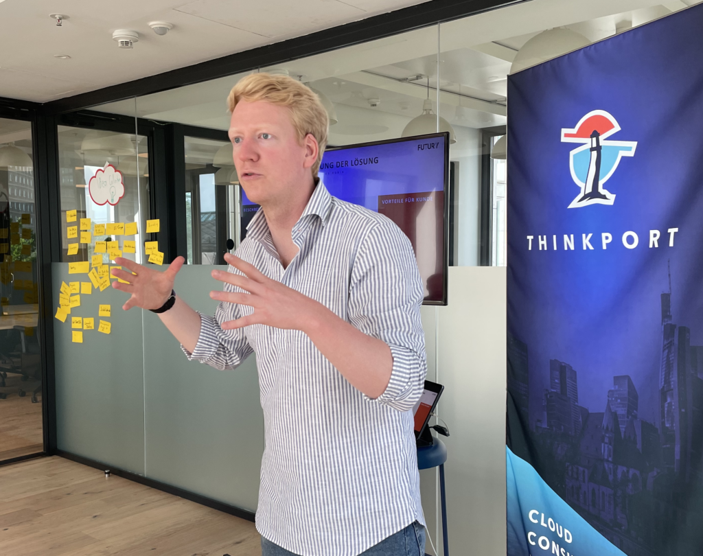
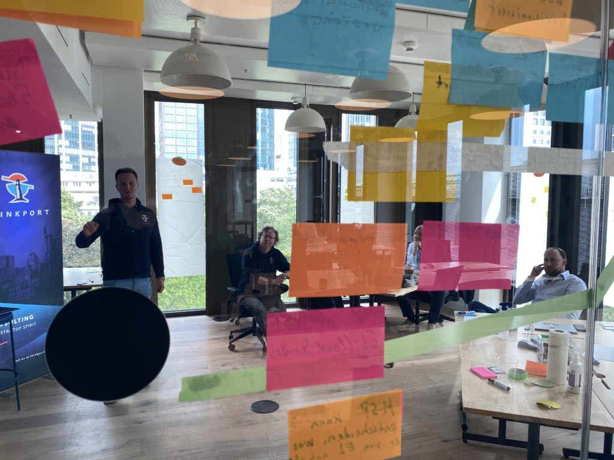

 

Prüfen Sie mit unseren Experten die Zukunftsfähigkeit Ihrer Cloud Architektur

# Cloud Architektur Review

## Auf einen Blick

* 3 Stunden
* Individuell
* Workshop
* Remote oder vor Ort
* GRATIS

Besonders in schnellen Märkten ist es sinnvoll, die Cloud Architektur den sich stets ändernden Marktanforderungen anzupassen. Dabei sind komplexe Rahmenbedingungen zu berücksichtigen. In diesem Cloud Architektur Review stehen Ihnen ausgewiesene ExpertInnen für einen praxis-orientierten Austausch zur Verfügung. Anschließend erarbeiten wir mit Ihnen die nächsten Meilensteine Ihrer Roadmap.

[Anfragen](#sec1)

Eine bestehende Cloud Architektur wird permanent durch veränderte Rahmenbedingungen herausgefordert:

### 1.

### Notwendige Anpassungen der Leistungsfähigkeit

Gemeinsam prüfen wir, wie Sie Ihre Systemlandschaft auf neue Niveaus von Latenz, Service Level Agreement, Flexibilität und Skalierbarkeit anheben können.

### 2.

### Effiziente Datenhaltung

Anhand Ihrer Anforderungen prüfen wir die Datenhaltung und erarbeiten Vorschläge, diese unter den Aspekten Abfragegeschwindigkeit, Kostenoptimierung, Speicherdauer und DSGVO zu optimieren.

### 3.

### Aufbau einer sicheren Architektur

Abhängig von der Exponiert-heit Ihres Unternehmens, der Sensitivität seiner Daten und seiner Vulnerabilität definieren wir geeignete Standards.

### 4.

### Optimierung der Kostenstruktur

Wir entwickeln ein Konzept, wie Sie die vielfältigen Arten von Kosten (fix, variabel, initial, laufend) optimal kombinieren.

Das Cloud Architektur Review basiert auf den gesammelten Best Practices der letzten Jahre. Im Fokus sind insbesondere  
\- Data Plattformen (AWS/Azure)  
\- Event getriebene Architekturen  
\- Hybride Szenarien (Multicloud / On-Prem)  
Dafür stellen wir gerne für Sie das jeweilige Expertenteam auf unserer Seite zusammen.

.b, .c{fill:#fff; }.b, .c, .d, .e{stroke:#1d1d1b; stroke-width:5.67px; }.b, .e{stroke-miterlimit:10; }.c{stroke-linejoin:round; }.d{stroke-linejoin:bevel; }.d, .e{fill:none; }

Im ersten Teil ermitteln wir die Qualitätsanforderungen für einen optimalen Betrieb. Gemeinsam definieren wir die Anforderungen an Daten-haltung, Leistungsfähigkeit, Sicherheit und Kosten.

.b{fill:none; stroke:#343434; stroke-linecap:round; stroke-linejoin:round; stroke-width:2px; }

Im zweiten Teil analysieren wir die umgesetzte Architektur und führen anhand der ermittelten Kriterien eine Soll-Ist-Analyse durch. Wir bestimmen, wo Anforderungen erfüllt werden und zeigen potenzielle Schwachstellen auf.

.b{stroke-width:2px; }.b, .c{stroke-linecap:round; }.b, .c, .d{fill:none; stroke:#343434; stroke-linejoin:round; }.c, .d{stroke-width:2px; }

Unser Ziel ist es, dass Sie nach einem erfolgreichen Workshop eine klare Analyse Ihrer Architektur haben. Gemeinsam erarbeiten wir konkrete Vorschläge, um diese robuster, skalierbarer oder kosten-effizienter zu gestalten.

## Zielgruppe

Der Workshop ist geeignet für Geschäftsführung, Management und technische Entscheider\*Innen, welche ihre Softwarelandschaft fit für Zukunft machen wollen.

## Workshop Aufbau

[Die Agenda wird individuell mit Ihnen abgestimmt](https://www.hashicorp.com/)

### Cloud Architecture Review

* Aufnahme des Status quo
* Organisatorische Herausforderungen und Lösungen
* Technische Herausforderungen und Lösungen
* Cloud Architecture - Eine Übersicht
* Referenzarchitekturen und Best Practices aus der Praxis
* Erstellung einer Roadmap

## Erfolge

Überprüfen Sie mit uns die Zukunftsfähigkeit Ihrer Cloud Architektur. Individuell auf Ihre Anforderungen und Branche zugeschnitten. Profitieren Sie von Erfahrungen aus der Praxis.

## Kontakt

Erfahren Sie mehr zu diesem Workshop in einem persönlichen Gespräch

 Termin vereinbaren

## Weitere Workshops
