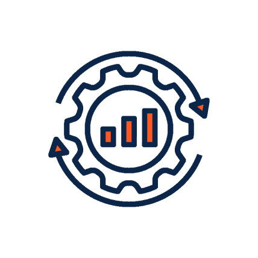

 

# Cloud Consulting für deutsche Großunternehmen

Wir navigieren Großunternehmen durch extraordinäre Cloud Projekte.

0 + Technologie-Partner 0 + Cloud Projekte 0 Zertifizierte Architekten [Linkedin](https://www.linkedin.com/company/11759873) [Instagram](https://www.instagram.com/thinkport/) [Youtube](https://www.youtube.com/channel/UCnke3WYRT6bxuMK2t4jw2qQ) [Envelope](mailto:tdrechsel@thinkport.digital)

## Cloud Consulting mit Leidenschaft

Sie prüfen eine Migration in die moderne Cloud-Welt von AWS, Azure oder GCP und planen Ihre zukünftige Architektur sowie Services? Oder nutzen Sie bereits einen der großen Cloud Provider und sind unsicher über die nächsten Entwicklungsschritte? Als Cloud Consulting Partner bieten wir Ihnen den kompletten Full Service für Cloud Beratung an. Gerne unterstützen wir Sie individuell. Und entwickeln mit Ihnen die zukunftsfähige Cloud Strategie Ihres Unternehmens sowie deren Umsetzung.

## Cloud Consulting & Thinkport

Was unser Startup Spirit für Ihre Cloud Beratung bedeutet? Ganz einfach. Wir setzen auf Engagement, um unsere Hingabe an jedes Projekt aufrechtzuerhalten, die Verantwortung zu übernehmen und es zu Ende zu führen. Wir lieben Geschwindigkeit, weil wir wissen, dass schneller Fortschritt den Erfolg fördert. Wir nehmen Herausforderungen an und sehen sie als Chance, um zu wachsen. Kundenorientierung ist unser Mantra - ihr Erfolg ist unser Erfolg. Denn wir wissen, dass unser eigener Erfolg darin liegt, Kunden zum Erfolg zu führen.

Termin vereinbaren

### Migration in die Cloud

Für Sie bauen wir effizientere IT-Systeme. Wir automatisieren und optimieren Prozesse auf der Cloud mit Microsoft Flows und Microsoft Power Apps.

### Event Streaming

Als offizieller Confluent Partner helfen wir Ihnen Apache Kafka Daten von on-premise in die Cloud zu spiegeln oder Micro Services in einer Event-Driven Architecture zu verbinden.

### Datenplattform für AI

Wir helfen Big Data mithilfe diverser Cloud-Tools skalierbar zu verarbeiten und anzulegen. Somit präparieren wir Daten für Advanced Analytics und Artificial Intelligence.

### Multi & Hybrid Cloud

Wir reduzieren erfolgreich den Vendor Lock-in, indem wir Ihre Infrastruktur auf mehrere Cloud Anbieter und Ihr eigenes Rechenzentrum verteilen.

## Thinkport Stärken

* 100% Cloud fokussiert
* Startup Spirit
* Zertifizierter Partner von AWS, Azure und GCP
* Arbeiten Lösungsorientiert
* Expertise durch permanentes Lernen
* Starkes, sich unterstützendes Team

## Thinkport's Kernkompetenzen für ihr Cloud Projekt

Sie benötigen eine Beratung zur Cloud-Architektur? Oder eine neue Anwendung in beliebiger Größe oder für beliebige Zwecke? Oder Unterstützung für die bestehende Infrastruktur? Wir teilen gerne unser Wissen und unsere Erfahrung mit Ihnen.

  

## Unsere Erfolge - Success Stories

### Reta Award Winning Cooperation

Implementation of a innovative architecture using Solace Pub Sub+ hosted on Microsoft Azure [EDEKA DIGITAL decided to enable access to real-time changes in ERP systems to an instore mobile app solution used by EDEKA employees using an event streaming architecture to access changes to master data in real time. Success Story](https://thinkport.digital/reta-award-winning-cooperation) 

### Echtzeit Streaming von Auto-Daten in der Cloud

Aufbau einer erweiterbaren Infrastruktur [Thinkport Experten bauen eine einfach zu erweiternde Infrastruktur um Daten der Automobile weltweit in Echt-Zeit zu empfangen, prozessieren, transformieren und an die Consumption-Points zu liefern. Zur Success Story](https://thinkport.digital/echtzeit-streaming-von-auto-daten-bmw/) 

### Bildanalyse in der Cloud für Bayer

Machine Learning Plattform für den Pflanzenschutz der Zukunft [Eine moderne, cloud-basierte Lösung, SIMPL (Small Molecules Imaging Plattform), die den gesamten Prozess rund um Analyse und Tests von Wirkstoffen komplett neugestaltet. Dieser innovative Ansatz ermöglicht Bayer neue Erkenntnisse über den zukünftigen Pflanzenschutz. Zur Success Story](https://thinkport.digital/simpl-aws-machine-learning-fur-bayer/) 

### API für einen 360° Kunden-Dialog der Deutschen Telekom

Hochskalierbar & alle IT-Sicherheitsanforderung erfüllend [Thinkport Experten unterstützten ein Team von internen Entwicklern von der Konzeption bis hin zum Produktivgang der Anwendung. Das Ergebnis ist eine performante, hochskalierbare, vollständig automatisierte Anwendung, die ein hohes Maß an Flexibilität und Kosteneffizienz bietet. Zur Success Story](https://thinkport.digital/api-fuer-einen-360-kunden-dialog-der-deutschen-telekom/) 

### Azure Data Plattform ermöglicht Data Science für LSG

Skalierbare und kosteneffiziente Datenstrukturen in der Cloud [Für die LSG Group entwickelt Thinkport in Zusammenarbeit mit der verpartnerten AI-Strategie Agentur Birds On Mars eine prototypische Data Analytics Infrastruktur für wichtige Unternehmenskennzahlen in der Azure Cloud.​ Zur Success Story](https://thinkport.digital/azure-data-analytics-infrastruktur-fur-lsg/) 

### Machine Learning Architektur für SparkView

Prototyp eines AI-Modells zur Umsatzprognose von Unternehmen [Für das Fintech SparkView entwickeln Thinkport Consultants ausgefeilte Machine Learning Modelle in der AWS Cloud. Dieses fortschrittliche Projekt automatisiert anhand einer modernen ETL-Pipeline und cutting edge KI-Technologien das Backend quasi vollständig. Zur Success Story](https://thinkport.digital/aws-machine-learning-infrastruktur-sparkview) 

### Quantencomputer Frontend für AQT

Azure Architektur für den weltweit ersten Quantencomputer [Thinkport Experten bauen für den Betreiber eines Quantencomputers eine umfassende IT Infrastruktur in der Azure Cloud. Die innovative Architektur vereint zahlreiche Azure Services in einem zentralen, hocheffizienten Cloudsystem mit einem personalisierten Zugangsportal.​ Zur Success Story](https://thinkport.digital/azure-cloud-fuer-den-ersten-quantencomputer) 

### Skalierbare Schulcloud für das HPI

Cloud System zum Betreiben einer Echtzeit-Videokonferenzplattform [Für das Hasso-Plattner-Institut tragen unsere Experten in großem Maße zur Digitalisierung deutscher Schulen bei. In diesem breit aufgesetzten Projekt sorgen unsere Architekten dafür, dass sich die HPI Schul-Cloud grenzenlos skalieren lässt und somit jederzeit zugänglich bleibt. Zur Success Story](https://thinkport.digital/digitale-schule-thinkport-realisiert-die-hpi-schul-cloud)

### Thinkport awarded “Top Supplier Retail 2023” for EDEKA DIGITAL Event Streaming Project

[Implementation of a innovative architecture using Solace Pub Sub+ hosted on Microsoft Azure.](https://thinkport.digital/echtzeit-streaming-von-auto-daten-bmw/)

[Zur Success Story](https://thinkport.digital/reta-award-winning-cooperation)

### Echtzeit Streaming von Auto-Daten in der Cloud für BMW

[Für die BMW AG baute Thinkport eine einfach zu erweiternde Infrastruktur um Daten der Automobile weltweit in Echt-Zeit zu empfangen, prozessieren, transformieren und an die Consumption-Points zu liefern.](https://thinkport.digital/echtzeit-streaming-von-auto-daten-bmw/)

[Zur Success Story](https://thinkport.digital/azure-data-analytics-infrastruktur-fur-lsg/)

### Bildanalyse in der Cloud für die Bayer AG

Eine moderne, cloud-basierte Lösung, SIMPL (Small Molecules Imaging Plattform), die den gesamten Prozess rund um Analyse und Tests von Wirkstoffen komplett neugestaltet. Dieser innovative Ansatz ermöglicht Bayer neue Erkenntnisse über den zukünftigen Pflanzenschutz.

[Zur Success Story](https://thinkport.digital/simpl-aws-machine-learning-fur-bayer/)

### API für einen 360° Kunden-Dialog der Deutschen Telekom

Thinkport Experten unterstützten ein Team von internen Entwicklern von der Konzeption bis hin zum Produktivgang der Anwendung. Das Ergebnis war eine performante, hochskalierbare, vollständig automatisierte Anwendung, die ein hohes Maß an Flexibilität und Kosteneffizienz bietet.

[Zur Success Story](https://thinkport.digital/api-fuer-einen-360-kunden-dialog-der-deutschen-telekom/)

### Automatisierte Data Analytics Plattform für LSG

Für die LSG Group entwickelt Thinkport in Zusammenarbeit mit der verpartnerten AI-Strategie Agentur Birds On Mars eine prototypische Data Analytics Infrastruktur für wichtige Unternehmenskennzahlen in der Azure Cloud.

[Zur Success Story](https://thinkport.digital/azure-data-analytics-infrastruktur-fur-lsg/)

### Automatisch Skalierendes Backend für das HPI

Für das Hasso-Plattner-Institut tragen unsere Experten in großem Maße zur Digitalisierung deutscher Schulen bei. In diesem breit aufgesetzten Projekt sorgen unsere Architekten dafür, dass sich die HPI Schul-Cloud grenzenlos skalieren lässt und somit jederzeit zugänglich bleibt.

[Zur Success Story](https://thinkport.digital/digitale-schule-thinkport-realisiert-die-hpi-schul-cloud)

### Machine Learning Architektur für SparkView

Für das Fintech SparkView entwickeln Thinkport Consultants ausgefeilte Machine Learning Modelle in der AWS Cloud. Dieses fortschrittliche Projekt automatisiert anhand einer modernen ETL-Pipeline und cutting edge KI-Technologien das Backend quasi vollständig.

[Zur Success Story](https://thinkport.digital/aws-machine-learning-infrastruktur-sparkview)

### Cloud Infrastruktur mit personalisiertem Frontend für AQT

Thinkport Experten bauen für den Betreiber eines Quantencomputers eine umfassende IT Infrastruktur in der Azure Cloud. Die innovative Architektur vereint zahlreiche Azure Services in einem zentralen, hocheffizienten Cloudsystem mit einem personalisierten Zugangsportal.

[Zur Success Story ](https://thinkport.digital/azure-cloud-fuer-den-ersten-quantencomputer)

## Unsere Top 3:

Cloud Workshops

Die Inhalte unserer vielfältigen Cloud Workshops werden von unseren Experten ganz an Ihre Bedürfnisse angepasst. In den Cloud Workshops erarbeiten Sie gemeinsam mit unseren zertifizierten Cloud Profis, von der Strategie bis zur wirklichen Umsetzung, wie Sie moderne Anwendungen erstellen oder bereitstellen können.

Gerne schneiden wir auch unsere bestehenden Trainingsmaßnahmen oder Workshops ganz individuell auf Ihre Bedürfnisse zu. Sprechen Sie uns diesbezüglich gerne an, gemeinsam finden wir eine Lösung.

[Mehr ](https://thinkport.digital/cloud-trainings-workshops/)

## Wissen & Expertise: Unsere erfahrenen Cloud Coaches.

### Roman

Senior Cloud Architect

### Roman

Senior Cloud Architect

### Keith

Senior Cloud Architect

### Keith

Senior Cloud Architect

### Chris

Cloud Architect

### Chris

Cloud Architect

Inspiriert? Werde Teil unseres Trainerteams

 

## Unsere Thinkport Versprechen

     

Als ausgezeichneter Cloud Consulting Partner bieten wir Ihrem Unternehmen ein qualifiziertes, zertifiziertes und engagiertes Team an. Unsere umfangreichen Praxis-Erfahrungen decken das komplette Spektrum aller Leistungen rund um die Cloud von AWS, Azure sowie GCP ab. Ob Private, Public, Hybrid oder Multi-Cloud – wir sind Ihr Partner auf Augenhöhe. Und finden mit Ihnen gemeinsam die besten Cloud-Lösungen. Wir freuen uns auf Ihre Kontaktaufnahme.

Cloud-Beratung mit Start-Up Mentalität

## Ihr Ansprechpartner

Patrick Aigner

Director Sales

[paigner@thinkport.digital](mailto:paigner@thinkport.digital)

+49 175 5386808

*  
