## Cloud Consulting Partner

Weil gemeinsame Ideen heller leuchten

0 Technologiepartner 0 Consultingpartner 0 Education Partner

### Technologie Partner

Wir nutzen Technologien, die zünden. Unsere Tech Partner entwickeln bahnbrechende Lösungen. Ob Cloud-Anwendungen, Analyse-Tools oder Management Software. [Linkedin](https://www.linkedin.com/company/11759873) [Instagram](https://www.instagram.com/thinkport/) [Youtube](https://www.youtube.com/channel/UCnke3WYRT6bxuMK2t4jw2qQ) [Envelope](mailto:tdrechsel@thinkport.digital)

### Consulting Partner

In der IT braucht es kreative Köpfe. Deshalb arbeiten wir mit Menschen, die überzeugen. Gemeinsam mit unseren Consulting Partnern entwickeln wir einzigartige Konzepte und Strategien.

### Education Partner

Wir glauben an frische Ideen. Und die kommen von jungen Menschen. Deshalb arbeiten wir eng mit diversen Hochschulen zusammen und bieten attraktive Fortbilungsangebote.

## Cloud Plattformen

Unsere zertifizierten Architekten greifen in ihren Projekten auf die gesamte Tool-Palette der weltweit größten Cloud Provider zurück und entwickeln die Lösung, die am besten zu ihrem Kunden passt. Durch exklusive Partnership Ressourcen gewährleistet Thinkport immer den modernsten technologischen Cloud Standard. [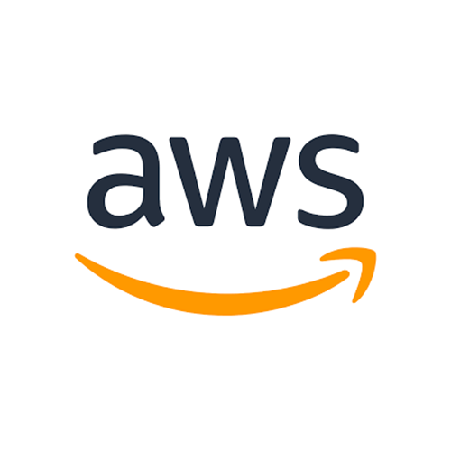](https://aws.amazon.com/de/partners/find/partnerdetails/?n=Thinkport%20GmbH&id=0010L00001tBb55QAC)

### Amazon Web Services

Consulting Partner - Select

[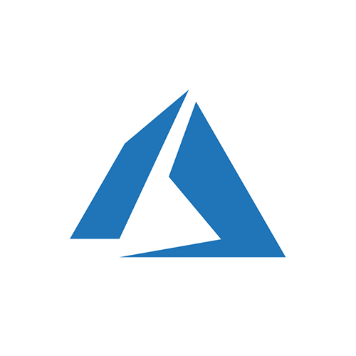](https://appsource.microsoft.com/en-us/marketplace/partner-dir/12e29f7c-8633-4490-ab9d-95ba84981681/overview)

### Microsoft Azure

Consulting Partner - Gold

## Technologie Partnerschaften  

mit Vorreitern in der Cloud Entwicklung

### HashiCorp

Official Reseller

Als zertifizierte Terraform Experten sind wir Profis im Bereich Multi Cloud. Als Gründer der HC User Group Frankfurt arbeiten wir sehr eng mit HashiCorp zusammen. [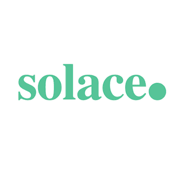](https://solace.com/)

### Solace

Strategic Partner

Als offizieller Partner verankern wir die Technologien und die fachliche Cloud Expertise von Solace in vielen unserer Kundenprojekte. [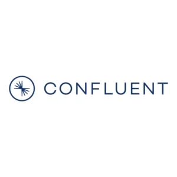](https://de.confluent.io/)

### Confluent

Official SI Partner

Durch die Kollaboration mit Confluent profitieren wir von den besten Event Streaming Technologien. Diese fachliche Expertise geben wir in unseren Workshops weiter. [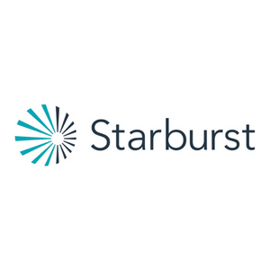](https://www.starburst.io/)

### Starburst

Official Partner

Wir arbeiten u.a. mit Starburst zusammen, da Starburst eine der schnellsten, effizientesten Analyse-Engine für Ihr Data Warehouse, Data Lake oder Data Mesh bietet.

## Consulting Partner  

für nachhaltige Strategien

[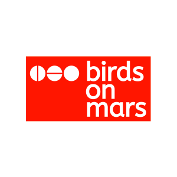](https://www.birdsonmars.com/)

### Birds on Mars

Strategie Partner

Birds on Mars ist unser Premier Partner für kreative Ansätze und Strategie im Bereich KI und Big Data. [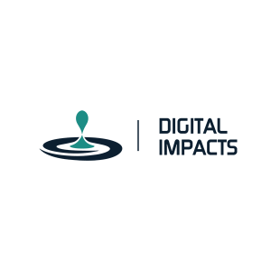](https://www.digitalimpacts.net/)

### Digital Impacts

Strategie Partner

Mit Digital Impacts entwickeln wir nachhaltige IT Strategien und setzen sie für unsere Kunden um. 

### STRATECO

Strategie Partner

In Kooperation mit STRATECO optimieren wir Prozesse für unsere gemeinsamen Kunden. 

### Woodmark

Strategie Partner

Woodmark Consulting ist unser Partner für Data Analytics und Business Intelligence Projekte.

## Ausbildungspartner

[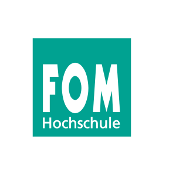](https://www.fom.de/)

### FOM  

Hochschule

In Kooperation mit der Fachhochschule für Wirtschaft und Management bieten wir die Möglichkeit eines berufsbegleitenden Studiums. [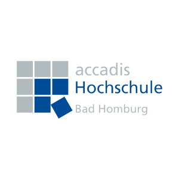](https://www.accadis.com/)

### accadis  

Hochschule

In enger Zusammenarbeit mit der accadis Hochschule bilden wir junge Talente aus und bieten beispielsweise duale Studienplätze an. [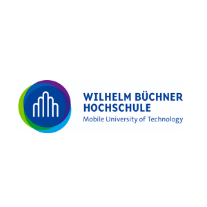](https://www.wb-fernstudium.de/)

### Wilhelm Büchner  

Hochschule

An der Wilhelm Büchner Hochschule in Pfungstadt bei Darmstadt sind wir regelmäßig präsent. [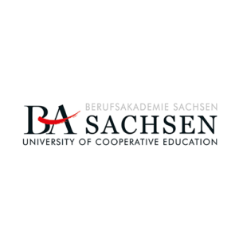](https://www.ba-leipzig.de/)

### Berufsakademie  

Leipzig

Als Praxispartner bieten wir am Standort Leipzig die Möglichkeit eines berufsbegleitenden Studiums an.

Werden auch Sie Cloud Partner

## Ihr Ansprechpartner

Tobias Drechsel

CEO & Senior Cloud Consultant

[tdrechsel@thinkport.digital](mailto:tdrechsel@thinkport.digital)

+49 151 63417156

* 
* 

## [Thinkport - Silicon Valley technologies for German enterprises](https://thinkport.digital/kontaktieren/)
