# Cloud Walker - Azure

8 Wochen Cloud Bootcamp für Berufs- und Quereinsteiger! Bis zum Start sind es

Tage Stunden [Jetzt Anmelden](https://form.typeform.com/to/pEGRd7gX)

## Das erwatet dich

Unsere erfahrenen Berater:innen vermitteln 8 Wochen praxisnahes Wissen am Puls der Zeit. Verschiedene Module vermitteln sowohl Cloud Grundlagen als auch spezifische Kenntnisse zu Microsoft Azure und AWS. Unser Mentoring und spannende Projekte ermöglichen einen umfassenden Einblick in die Welt der Cloud.

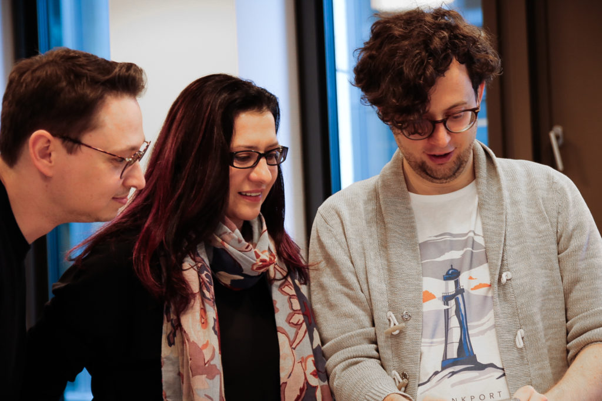

## Das bringst du mit

Keine Angst! Wenn du dir nicht sicher bist ob es pass beraten wir dich gerne bei der Anmeldung.

### Grundlegendes IT-Verständnis

### Erste Programmiererfahrung

### Gute Deutschkenntnisse (Level B2)

## Programm

Unsere erfahrenen Berater:innen vermitteln 8 Wochen praxisnahes Wissen am Puls der Zeit. Verschiedene Module vermitteln sowohl Cloud Grundlagen als auch spezifische Kenntnisse zu Microsoft Azure und AWS. Unser Mentoring und spannende Projekte ermöglichen einen umfassenden Einblick in die Welt der Cloud.

### 1\. Woche

Grundlagen IT Schritt für Schritt erwirbst Du hier solides Basiswissen auf dem Gebiet der Informationstechnologie mit der Einführung der ersten Tools und Methoden.

### 2\. Woche

Grundlagen Cloud Aufbauend auf den IT Grundlagen aus dem Modul 1 lernst Du nun die Grundlagen der Cloud sowie Architecture Patterns.

### 3\. Woche

Einführung in Azure In diesem Wochen-Modul erhältst Du eine umfassende Übersicht über Azure und den wichtigsten integrierten Funktionen. Dabei erstellst Du mit Terraform die ersten Azure Ressourcen.

### 4\. Woche

Deep Dive Azure Aufbauend auf das Basis-Wissen aus Modul 3 steigst du nun tiefer in wichtige ausgewählte Azure Dienste und Features.

### 5\. Woche

Deep Dive Azure  
Fortsetzung Du steigst noch tiefer in PaaS ein und baust Deine erste Datenplattform.

### 6\. Woche

Mini Projekt Jetzt werden die vielen Bausteine der vergangenen Module zusammengefügt und das erste Mini Projekt kann starten.

### 7\. Woche

Team Projekt Nun wird es Zeit, dass erlernte Wissen in einem größerem Team Projekt umzusetzen.

### 8\. Woche

Team Projekt und  
Abschluss Weiterführung des Team Projektes mit abschließender Präsentation einschließlich Auswertung und Feedback von unseren Experten.

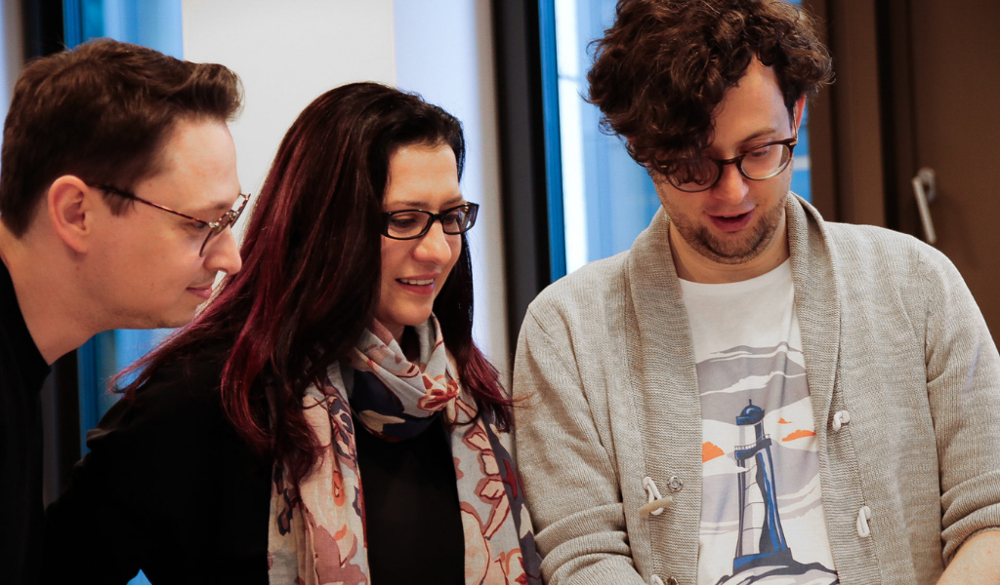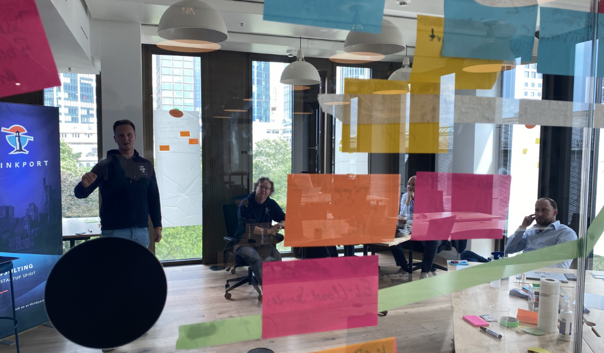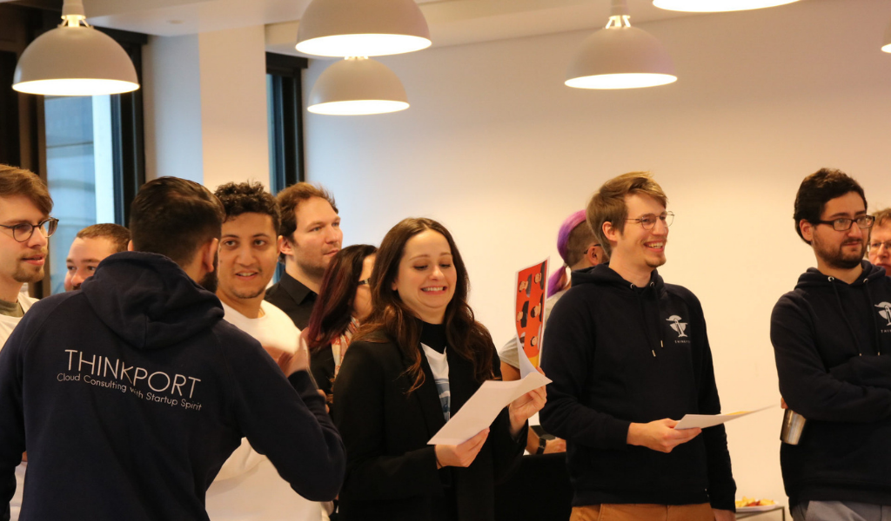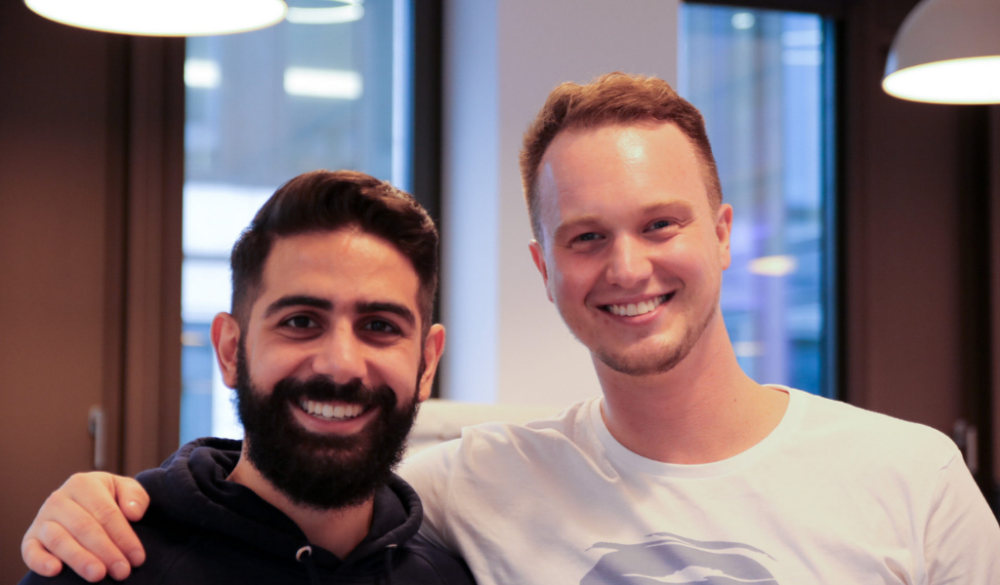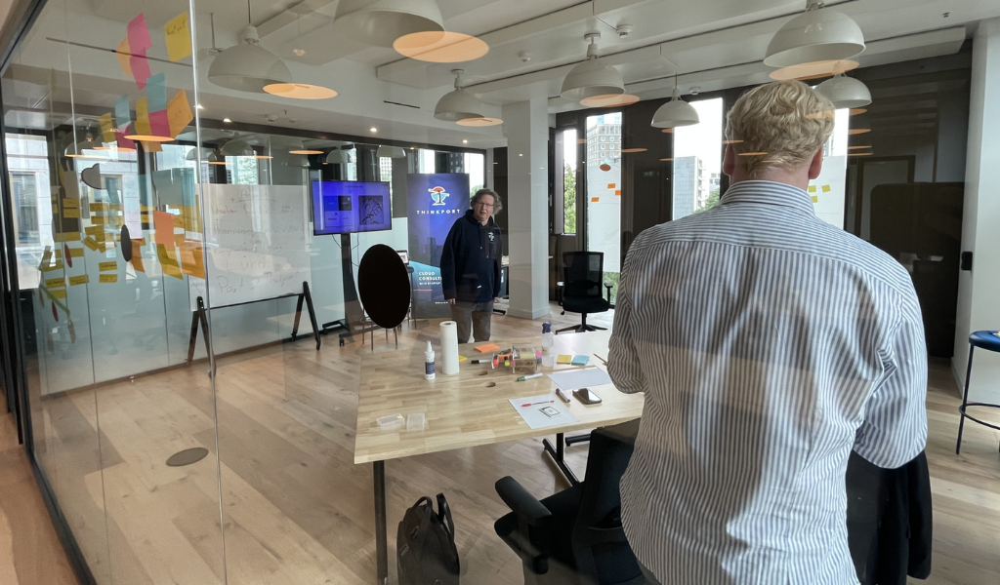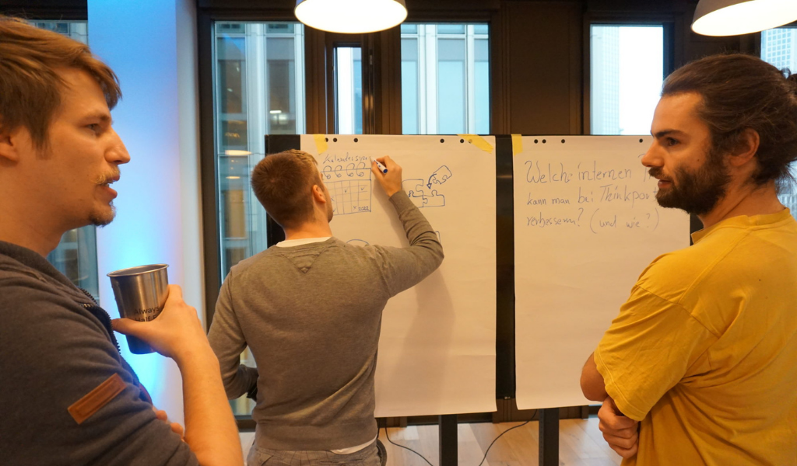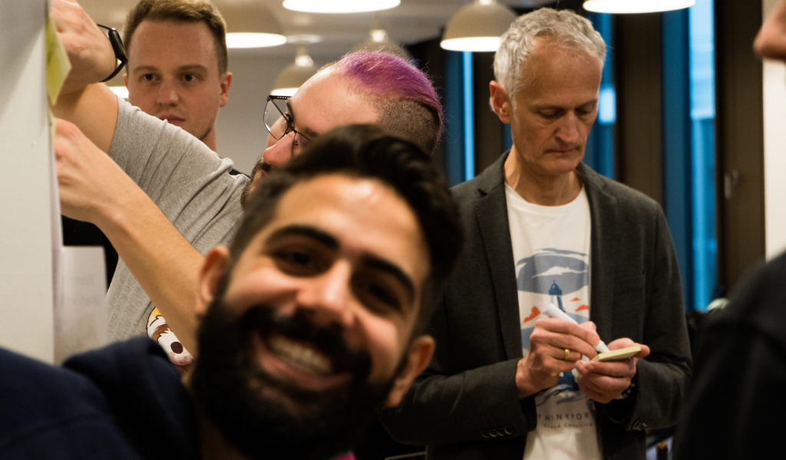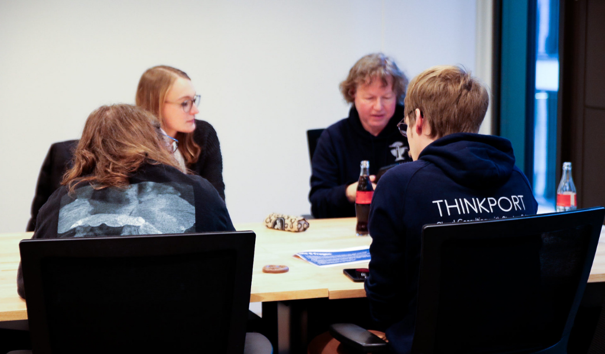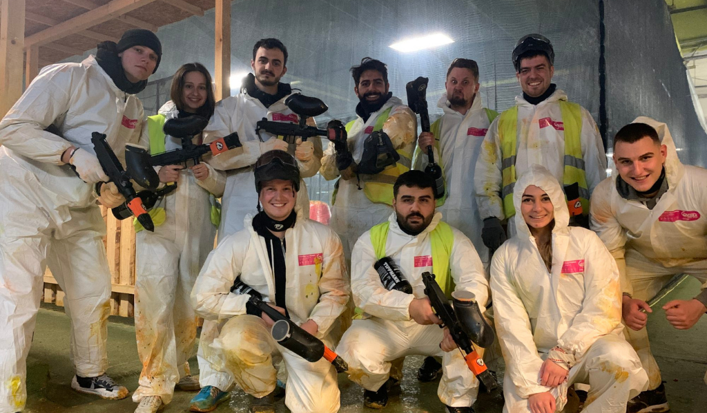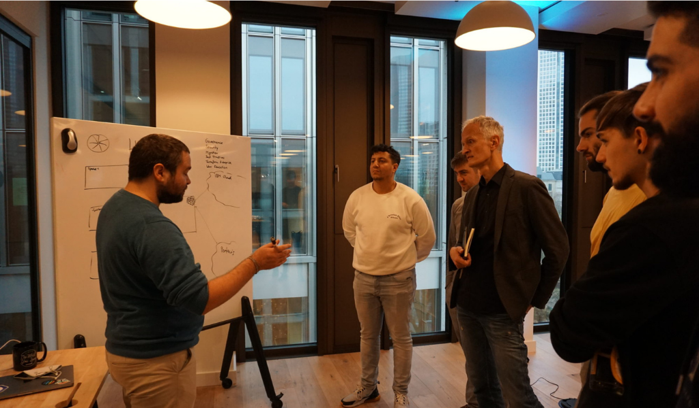

Zurück Weiter

## Die Arbeit bei Thinkport

Thinkport ist eine IT Beratung mit dem Fokus auf Cloud, gegründet 2017 in Frankfurt am Main. Wir beraten und entwickeln Softwarelösungen für große Unternehmen und DAX Konzerne in der Amazon oder Microsoft Cloud. Unser Fokus liegt dabei hauptsächlich auf der Architektur und Umsetzung. Power Point Folien werden also selten erstellt. Viele unserer Kollegen haben einen Background in Startups oder innovativen Unternehmen. Diese hands-on Mentalität ist Teil unserer Kultur, zu der auch die Werte "make others succeed" und "take ownership of issues" gehören.

[Mehr erfahren](https://thinkport.digital/karriere-in-der-cloud) https://youtu.be/Mn29lZ0gvg8

### Ein Tag bei Thinkport

Erlebe einen ganzen Arbeitstag im Leben eines Cloud Consultant mit Philipp

### Teamevent Graffiti

Mach mit uns die Wände unsicher beim Teamevent Graffiti sprayen in Frankfurt

https://www.youtube.com/watch?v=srgd9bZdR4A&t=23s

## Klingt gut ?

Dann bewirb dich hier mit folgenden Informationen und wir melden uns bei dir!

## [Thinkport - Silicon Valley technologies for German enterprises](https://thinkport.digital/kontaktieren/)
