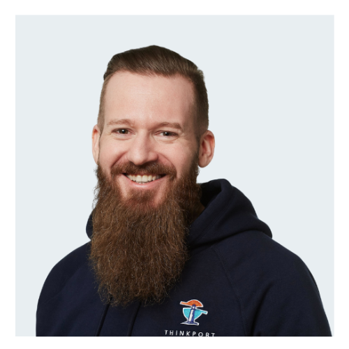

 

Wir unterstützen Sie bei Ihren Ideen und erarbeiten mit Ihnen Ihre Strategien mit unseren

# Cloud Workshops für Ihren Erfolg

 Wunsch-Termin vereinbaren 0 Exzellenz-Workshops 0 + Erfolgreiche Teilnehmer 0 Zertifizierte Trainer

## Cloud Workshops

Ganz nach Ihren Bedürfnissen.

Workshops für Sie und ihre Mitarbeiter, in denen unsere Cloud Experten Ihnen auf die Herausforderungen einer modernen Cloud Architektur aufmerksam machen und Ihr Wissen mit unseren Disruption Days oder dem Cloud Review gemeinsam evaluieren. Ihre Cloud hat einen Notfall? Dann ist unsere Cloud Soforthilfe genau das richtige für Sie. Alle unsere Workshops zielen darauf ab ihre digital Cloud-Infrastruktur auf ein state-of-the-art Level zu optimieren.  
  
Stehen Sie vor einer komplexen Herausforderung? Dann wünschen Sie sich einen auf Ihre Belange individuell zugeschnittenen Cloud Workshop mit gemeinsamer Lösungsfindung Ihrer Cloud-Herausforderungen. Hierzu haben wir vorbereitete Formate. Oder wir entwickeln ein individuelles Format nach Ihren eigenen Vorstellungen.

[Linkedin](https://www.linkedin.com/company/11759873) [Instagram](https://www.instagram.com/thinkport/) [Youtube](https://www.youtube.com/channel/UCnke3WYRT6bxuMK2t4jw2qQ) [Envelope](mailto:tdrechsel@thinkport.digital) 

### Disruption Days

Von der Idee zum Prototypen. Wir erarbeiten mit Ihnen zusammen eine individuelle Lösung für Ihr Unternehmen. [Durch strukturierte Vorgehensweise entwickeln wir mit Ihnen in nur kurzer Zeit einen Prototypen. Nutzen Sie dabei die Praxiserfahrung unserer Trainer für Ihr Unternehmen. Mehr Infos](https://thinkport.digital/disruption-days-mit-futury/) 

### Hybrid Cloud Strategie

Erarbeiten Sie die Hybrid Cloud Strategie für Ihr Unternehmen und modernisieren Sie Ihre IT Infrastruktur. [Eine funktionierende Hybrid Cloud Strategie zu entwerfen erfordert Erfahrungen aus der Praxis. Nutzen Sie die Projektreferenzen unserer Trainer für Ihr Unternehmen. Mehr Infos](https://thinkport.digital/hybrid-cloud-strategie) 

### Individueller Workshop

Was immer Sie in die Cloud bringen möchten, wir machen Ihre Herausforderung zu Unserer. [Nutzen Sie das umfangreiche Wissen und die Erfahrungen unserer Trainer in Theorie sowie in der Praxis für einen auf Ihr Unternehmen zugeschnittenen Workshop. E-Mail](mailto:tdrechsel@thinkport.digital) 

### Cloud Architecture Review - gratis -

Prüfen Sie mit uns Ihre Cloud Architektur. Dabei berücksichtigen wir die Herausforderungen und Besonderheiten Ihres Unternehmens. [In dynamischen Märkten sind auch die Anforderungen an die Cloud ständig neuen Ansprüchen ausgesetzt. Nutzen Sie die Erfahrung unserer Experten, um Ihre Softwarelandschaft zukunftsfähig zu machen. Mehr Infos](https://thinkport.digital/cloud-architecture-review/) 

### Cloud Notfall Soforthilfe

Ihr Projekt ist komplex, Ihre IT bereits am Limit? Und dann kommt das unvorhergesehene Problem dazu. [Thinkport unterstützt Sie flexibel und kurzfristig mit der Cloud-Soforthilfe. Mehr Infos](https://thinkport.digital/cloud-soforthilfe/) 

### Databricks MLOps

Werden Sie MLOps Expert:in mit unserem Training [Dadurch können wir uns auf die fachlichen Inhalten bei einer kurzen Time-to-Value fokussieren. Mehr Infos](https://thinkport.digital/databricks-mlops-workshop/)

Noch unsicher, ob einer der oben aufgeführten Workshops zu Ihren Bedürfnissen passt? Dann nehmen Sie doch gerne Kontakt mit uns auf, denn neben unseren bewährten (hier aufgeführten) Formaten, entwickeln wir mit Ihnen auch gerne ein ganz individuelles Format, ganz nach Ihren Bedürfnissen und Vorstellungen.

Wir beraten Sie gerne

 Termin vereinbaren "Mit dem individuellen Workshop von Thinkport konnten wir genau unsere Cloud Strategie erarbeiten. Vielen Dank Tobias, für die kompetente Beratung und die perfekte Moderation des Workshops. Hier merkte man deutlich den großen Erfahrungsschatz, von dem wir sehr profitieren konnten." Lisa R. Managerin "Die Überprüfung unser Cloud Architektur gemeinsam mit den Experten von Thinkport hat uns sehr geholfen. Dabei wurde einiges an Verbesserungspotenzial aufgedeckt, was wir nun schrittweise angehen werden. Vielen Dank dafür." Christian H. Manager Anterior Siguiente

Cloud-Beratung mit Start-Up Mentalität

## Ihr Ansprechpartner

Dominik Fries

CTO & Lead Cloud Architect

[dfries@thinkport.digital](mailto:dfries@thinkport.digital)

+49 151 63417156

* 
* 
