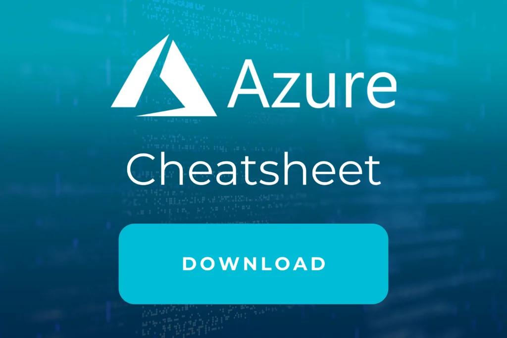

Werden Sie Experte beim

# Aufbau einer Datenplattform mit Azure  

und Databricks Training

## Auf einen Blick

* 2 Tage
* Monatlich und Individuell
* Technisches Training
* Remote und vor Ort verfügbar

Lernen Sie mit unserem Training, individuelle Datenplattformen zu entwerfen und einen Proof of Concept zu definieren. Profitieren Sie von Projekterfahrung unserer Experten und Cloud-Architekten mit Erfahrung direkt aus der Industrie.

[Anfragen](#sec1)

Daten sind essentiell für die Innovation in Ihrem Unternehmen und bilden die Grundlage für den Aufbau von Machine Learning (AI) und Advanced Analytics Use Cases. Eine Datenplattform Strategie ist dafür der Grundpfeiler und ermöglicht es Ihnen, die nötigen Daten von verschiedenen Quell-Systemen zu sammeln, zu kategorisieren und zu archivieren. [Azure](https://thinkport.digital/was-ist-azure/)\- Datalake, als Persistenzschicht, Data Factory für die Orchestrierung und den Datenabzug und Azure Databricks für die Verarbeitung (ETL) der Daten helfen unter anderem dabei, allen Ihren Anforderungen gerecht zu werden.  
Thinkport hat bereits bei verschiedenen Großunternehmen die Entstehung von Datenplattformen von Architektur bis zur Produktion aktiv begleitet. In diesem Azure Databricks Training wollen wir mit Ihnen, für Ihr Unternehmen, gemeinsam eine individuell auf Sie abgestimmte Datenplattform entwerfen und einen ersten Rahmen für einen Proof of Concept (PoC) definieren.

[Linkedin](https://www.linkedin.com/company/11759873) [Instagram](https://www.instagram.com/thinkport/) [Youtube](https://www.youtube.com/channel/UCnke3WYRT6bxuMK2t4jw2qQ) [Envelope](mailto:tdrechsel@thinkport.digital)

## Termine

12.06. - 13.06.24 Datenplattform mit Azure und Databricks Training

25.07. - 26.07.24 Datenplattform mit Azure und Databricks Training

12.08. - 13.08.24 Datenplattform mit Azure und Databricks Training

\* individuelle Termine möglich

## Preis

1.400 € zzgl. MwSt.

## Zielgruppe

Der Kurs ist geeignet für...

* [Projekte / Teams in der Azure Cloud eine Datenplattform aufbauen wollen](https://thinkport.digital/was-ist-azure/)
* Architekten und Entscheidungsträger mit grundlegendem IT Verständnis
* Unternehmen mit einer Cloud Strategie

## Referenz

Success Story basierend auf diesem Training

## Aufbau

Die Agenda kann individuell angepasst werden

### Status Quo Tag I

* Grundlagen und Konzepte von Datenplattformen
* Vorstellung von Referenzarchitekturen
* Bestandsaufnahme des IST Zustands des Unternehmen
* Sammeln und bewerten von individuellen Use Cases

### Zielbild Tag II

* Analyse der Liefersysteme und Datenstrukturen
* Auswahl von Cloud Services und Komponenten
* Entwicklung einer Zielarchitektur
* Definition von weiteren Schritten

* Grundlagen und Konzepte von Datenplattformen
* Vorstellung von Referenzarchitekturen
* Bestandsaufnahme des IST Zustands des Unternehmen
* Sammeln und bewerten von individuellen Use Cases

* Analyse der Liefersysteme und Datenstrukturen
* Auswahl von Cloud Services und Komponenten
* Entwicklung einer Zielarchitektur
* Definition von weiteren Schritten

## Erfolge

Die Lerninhalte des [Azure](https://thinkport.digital/was-ist-azure/)\- Databricks Trainings werden von unseren Experten spannend und eingänglich vermittelt. Unsere Cloud-Profis begleiten Sie aktiv bei der Entwicklung von Datenplattformen - 
von Architektur bis zur Produktion.

## Unterstützung

Wir haben die von unseren Entwicklern am häufigsten verwendeten Befehle in einem Cheatsheet zusammengefasst, das während der Schulung und nach deren Abschluss verwendet werden kann. Wenn Sie sich damit vertraut machen wollen, können Sie es hier herunterladen.

## Kontakt

Erfahren Sie mehr zu diesem Training in einem persönlichen Gespräch

Sie setzen mit uns individuelle Schwerpunkte und erhalten ein zugeschnittenes Angebot für Ihre Anforderungen 24h nach dem Termin

 Termin vereinbaren

## FAQs

Hier finden Sie eine kurze Zusammenstellung von oft gestellten Fragen und den dazugehörigen Antworten.

Was versteht man unter Datenplattform?

Eine Datenplattform ist eine IT-Infrastruktur, die es Unternehmen ermöglicht, Daten zu sammeln, zu speichern, zu verarbeiten, zu analysieren und zu verwalten. Eine Datenplattform kann aus verschiedenen Komponenten bestehen, wie beispielsweise Datenbanken, Data Warehouses, Big-Data-Technologien, Cloud-Plattformen und Analysesoftware.

Die Hauptfunktionen einer Datenplattform sind die Verwaltung von Daten, die Bereitstellung von Zugriff auf Daten und die Analyse von Daten. Eine Datenplattform bietet Unternehmen eine zentrale Stelle zur Speicherung und Verwaltung von Daten, was es erleichtert, Daten in verschiedenen Formaten und aus verschiedenen Quellen zu verwalten.

Was ist Databricks?

Databricks ist eine Cloud-basierte Analytics-Plattform, die auf Apache Spark basiert. Es wurde von den Entwicklern von Apache Spark gegründet und bietet eine benutzerfreundliche Umgebung für die Verarbeitung großer Datenmengen.

Databricks ermöglicht es Benutzern, Daten in Echtzeit zu verarbeiten, maschinelles Lernen anzuwenden, Datenvisualisierungen zu erstellen und Abfragen durchzuführen. Es bietet auch eine breite Palette von APIs und Bibliotheken, um Entwicklern die Verarbeitung von Daten in verschiedenen Formaten zu erleichtern, einschließlich strukturierter Daten, unstrukturierter Daten, Texte und maschinellem Lernen.

Welche Vorteile bringt Databricks?

Databricks bietet viele Vorteile, darunter:

* Skalierbarkeit
* Leistungsstarke und schnelle Verarbeitung
* Einfachheit (benutzerfreundliche Oberfläche)
* Zusammenarbeit in Teams möglich
* Integration (in eine Vielzahl von Datenquellen und Tools)
* Sicherheit
* Kosten (flexible, pay-as-you-go Preisgestaltung)

Insgesamt bietet Databricks eine leistungsstarke, skalierbare und benutzerfreundliche Plattform für die Verarbeitung von Big Data, die von vielen Unternehmen und Organisationen in verschiedenen Anwendungsbereichen genutzt wird.

## Weitere Workshops
