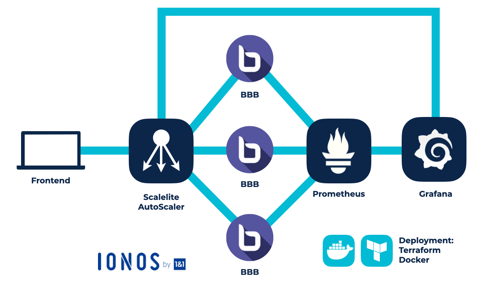

# Digitale Schule: Thinkport realisiert die HPI Schul-Cloud

0 K+ Nutzer allein in Brandenburg 0 Pilotschulen 0 Cloudsysteme

## [Der Kunde](https://hpi.de/)

Thinkport und das HPI digitalisieren Deutschlands Bildung mit der Schul-Cloud! Die Corona-Krise stellt Lehrer und Schüler bundesweit vor großen Herausforderungen. Das in Zusammenarbeit mit dem HPI entwickelte Projekt versucht Schulen in punkto Digitalisierung zukunftsfähig zu machen. Durch eine cloud-basierte Open-Source Videoplattform soll der Schulunterricht digitalisiert und somit für Fälle wie den Corona Lockdown krisenfester gemacht werden. 

Als Grundlage dient die datenschutzkonforme, deutsche Videokonferenz-Plattform BigBlueButton.

Das Hasso-Plattner Institut betreut in Kooperation mit der Universität Potsdam die Fakultät Digital Engineering. Langfristig möchte das HPI das Schul-Cloud Projekt ausweiten und die IT-Infrastruktur an allen Schulen vereinheitlichen. 

Experten für einzigartige

## Konzepte

Ob Performance, Kosteneinsparung oder Skalierung. 

Wir bieten pragmatische Lösungen für den individuellen Projektfokus jedes unserer Kunden.

[Experten Kontaktieren](https://thinkport.digital/kontaktieren)

### Hohe Ausfallsicherheit

Wir entwickelten dafür eine zuverlässige Plattform, die dank verschiedener Sicherheitsmechanismen eine Zero-Downtime aufweist. Schüler und Lehrer sollen unabhängig von Zeit, Ort und momentanem Datenaufkommen jederzeit auf das Dienstangebot zugreifen können. Die Access Anywhere Schule soll ihrem Namen gerecht werden.

### Dynamische Skalierbarkeit

Da die Lastanforderungen der ausgerollten Lösung über den Tag hinweg sehr stark variieren, war eine automatische Skalierung essentiell. Durch eine eigens dafür gebaute Softwarekomponente, welche die verschiedenen Maschinenmetriken auswertet, konnten wir die Skalierung sicherstellen. Bei Lastspitzen werden nun automatisch neue Ressourcen bereitgestellt und nicht mehr benötige Ressourcen werden freigestellt um Kosten zu sparen.

### Logging von Messwerten

Durch den Aufbau eines hochfunktionalen Dashboards ist die Überwachung aller Maschinen im Cluster jederzeit gewährleistet. Jede Maschine schickt dafür verschiedene technische Metriken an den Monitoring Stack, welche dort aggregiert und visualisiert werden.  

Die Nutzer melden sich über das von Scalelite bereitgestellte Zugangsportal an. Sobald eine Session gestartet wird, kümmern sich der Scalelite Load Balancer um die Lastverteilung an verschiedene BigBlueButton Server. Ein Autoscaler skaliert zusätzlich die Performance der einzelnen Maschinen. Je nach Bedarf werden neue Server gestartet oder die Ressourcen bestehender Maschinen aufgestockt. Ein Node Exporter stellt verschiedene Metriken zum Messen der Serverleistung bereit. Diese Messwerte werden von Prometheus an Grafana weitergeleitet, welches die Daten anschaulich aufarbeitet und dem Autoscaler wieder zur Verfügung stellt. Als Sicherheitsstandard wurde das TLS Verschlüsselungsprotokoll gewählt. Die gesamte Infrastruktur wird in Form von Docker Containern mit Terraform automatisch deployed. So wird eine flexible, zuverlässige und zugleich sichere Plattform geschaffen.

## Herausragende  

Technologien

## Ergebnisse mit Weitsicht

Unsere Experten arbeiten an innovativen Lösungen, um deutsche Unternehmen fit für die Zukunft zu machen.

### Bequemes  

Cloud Hosting

Die gesamte Plattform ist in der IONOS-Cloud entwickelt. Vom Anmeldeportal über die Nutzerdaten bis hin zu den Inhalten wird alles cloud-basiert verarbeitet. So wurde der Verwaltungsaufwand für die Betreiber der Plattform minimiert.

### Start-Stop Automatismus

Ausfälle werden durch das automatisierte System zur Skalierung minimiert. Zu Peak-Zeiten werden zusätzliche Ressourcen automatisch hochgefahren, ohne dass zusätzlicher Arbeitsaufwand anfällt. Dadurch ist die Infrastruktur langfristig nachhaltig.

### Datenschutz und Sicherheit

Die modernen Sicherheitsprotokolle und die state of the art Verarbeitungs-prozesse garantieren Datenschutzkonformität und einen hohen Sicherheitsstandard. Darüber hinaus ist das gesamte Projekt Open-Source, was individuelle Anpassungen problemlos möglich macht.

Cloud-Beratung mit Start-Up Mentalität

## Ihr Ansprechpartner

Dominik Fries

CTO & Lead Cloud Architect

dfries@thinkport.digital

+49 151 63417156

* 
* 

## [Weitere Success Stories](https://thinkport.digital/cloud-excellence-workshops)

## [Thinkport - Silicon Valley technologies for German enterprises](https://thinkport.digital/kontaktieren/)
