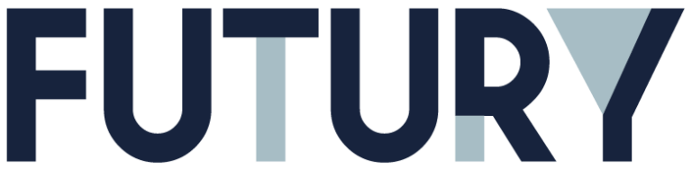

 

Disruption Days ist für Ihr Unternehmen ein

# Digital Innovation Workshop mit Futury

## Auf einen Blick

* 3 Tage
* Individuell
* Workshop
* Vor Ort

Neuartige Ideen haben oft ein Umsetzungsproblem. Es gibt zahlreiche Bedenken, ungeklärte Ziele und noch kein Konzept. Hier setzt Ihr individueller Innovation Workshop an, der in einer moderierten Struktur die mutige Vision zur konkreten Lösung führt – bis hin zum greifbaren Prototyp. Ihr Experte: Thinkport. Ihr Moderator: Futury. Für wen ist das ideal? Für IT Entscheider in mittelständischen bis großen DAX-Unternehmen. Jetzt Termin sichern.

[Anfragen](#sec1)

<iframe width="560" height="630" src="https://www.youtube-nocookie.com/embed/l6vHDcZmNo0" title="YouTube video player" frameborder="0" allow="accelerometer; autoplay; clipboard-write; encrypted-media; gyroscope; picture-in-picture; web-share" allowfullscreen></iframe>

[Um auf dem sich stetig wandelnden Markt erfolgreich zu agieren, müssen Unternehmen sich permanent weiterentwickeln. Dazu benötigt es neben dem Willen zur Veränderung, dem Wissen um den Kunden, den Ideen und Visionen, vor allem aber auch deren zielorientierte Umsetzung. Genau hier setzt der Innovationsworkshop "Disruption Days" an. Er ermöglicht Ihnen in kurzer Zeit, Probleme zu definieren, erste Lösungsansätze zu sammeln, zu priorisieren und eine individuell auf Sie abgestimmte Lösung,  in Form eines ersten Prototypen, zu definieren.](https://www.hashicorp.com/)

[Linkedin](https://www.linkedin.com/company/11759873) [Instagram](https://www.instagram.com/thinkport/) [Youtube](https://www.youtube.com/channel/UCnke3WYRT6bxuMK2t4jw2qQ) [Envelope](mailto:tdrechsel@thinkport.digital)

## Ziel

Teilnehmer haben nach Abschluss...

* Klarheit über Kundengruppen und Probleme
* Priorisierung sowie Validierung von Anforderungen und Lösungen
* Erstellung eines ersten Prototypens
* Erstellung einer konkreten Roadmap für die Umsetzung

## Teilnehmer

Der Kurs ist geeignet für Personen mit...

* Kundenfokus und Verständnis der Use Cases
* Strategen und Visionäre
* Überblick über bestehende technische Systeme

## Partner

Futury ist eine Innovations- und Venture-Plattform, die unternehmerische Talente mit Marktführern verbindet, um gemeinsam digitale Innovationen zu entwickeln. Mit Unternehmenspartnern und Experten aus der Praxis bietet Futury strukturierte Innovations- und Inkubationsprogramme, um neue Lösungen und marktreife Geschäftsmodelle für eine nachhaltigere Zukunft zu entwickeln.

## Workshop Aufbau

[Ein Raum für Ideen und Use Cases mit handfestem Outcome](https://www.hashicorp.com/)

### Ideation Tag I

* Introduction Round
* Customer Definition and Journey
* Lunch Break
* Definition of customer pain points
* Brainstorming and Ideation
* Wrap up

### Validation Tag II

* Warm Up
* Ideation Makeover
* Prioritization Matrix
* Lunch Break
* Market Analysis
* Technical Feasibility and Validation
* Summarize - Longlist and Shortlist

### Prototyping Tag III

* Setting the Scope
* Prototyping
* Lunch Break
* Prototyping
* Presentation
* Sum up and Roadmap

## Design Thinking

Mit erprobten Methodiken des Design Thinking, werden Ideen generiert und strukturiert. Dabei hilft die jahrelange Erfahrung mit Innovation und Produktentwicklung von Futury, den Kunden besser zu verstehen und neue Lösungen zu entwickeln.

 

## Rapid Prototyping

Erstellen Sie mit den erfahrenen Trainern von Thinkport einen ersten Prototypen am dritten Tag des digitalen Innovation Workshops. Dabei wird gemeinsam mit Ihnen ein Scope definiert und eine Roadmap für weitere Schritte in der Umsetzung entwickelt.

## Kontakt

Erfahren Sie mehr zu diesem Workshop in einem persönlichen Gespräch

Sie setzen mit uns individuelle Schwerpunkte und erhalten ein zugeschnittenes Angebot für Ihre Anforderungen 24h nach dem Termin

 Termin vereinbaren

## Weitere Workshops
