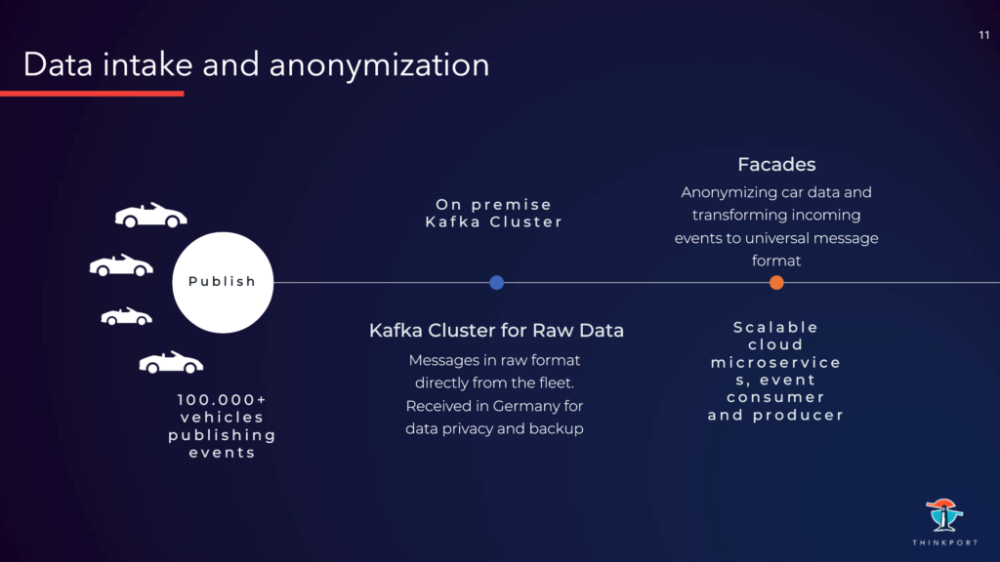

 

# Echtzeit Streaming von Auto-Daten  

in die Cloud für BMW

\+ 0 mio Automobile + 0 mio Messages / Sekunde 0 sec Latenz

## [Der Kunde](https://www.fairside.capital/)

BMW AG

Die BMW AG (Bayerische Motoren Werke Aktiengesellschaft) ist ein börsennotierter Automobil- und Motorradhersteller mit Sitz in München. Die Markenpalette umfasst zudem die Automarken Mini und Rolls-Royce sowie die BMW-Submarken BMW M und BMW i. BMW gehört mit 111 Milliarden Euro Umsatz und rund 118.900 Beschäftigten im Geschäftsjahr 2021 zu den größten Wirtschaftsunternehmen Deutschlands. Mit einer Jahresproduktion von 2, 52 Millionen Automobilen und 118.900 Motorrädern im Jahr 2021 zählt BMW zu den 15 größten Kraftfahrzeugherstellern der Welt. 53% der Aktien sind im weltweiten Streubesitz.

## [Die Aufgabe](https://www.fairside.capital/)

"Echtzeit Streaming"

Automobile werden immer smarter und übernehmen vielfältige (Assistenz-) Aufgaben für den Fahrer. Hierzu bedarf es mehr, besseren und zeitnah ermittelten Daten. Vielfältige Dritt-Dienstleistungen (Vendoren) haben ein starkes Interesse an den Sensor- und IoT-Daten der PKW im laufenden Betrieb. Hierbei gilt es, Daten der Automobile weltweit in Echt-Zeit zu empfangen, prozessieren, transformieren und an die Consumption-Points zu liefern. Das Ziel war zudem eine Infrastruktur, die in der Zukunft einfach und robust zu betreiben ist (das System muss dabei mit großen Spikes im Datenfluss umgehen können) sowie erweiterbar für neue Sensoren-Daten ist.

## Die Herausforderung

### Vielfalt

Viele unterschiedliche Sensoren produzieren Daten in unterschiedlichen Formaten. Eine abstrakte Struktur musste erschaffen werden, um alle Art von Informationen zu speichern - von Scheibenwischer Sensoren bis zu Unfall- und Notfall Sensoren -, sodass diese in einer einheitlichen Weise in den Pipelines verarbeitet werden können.

### Einsatz

Jeder Empfänger interessiert sich für unterschiedliche Teil der Daten. Und erwartet diese in spezifischen Formaten. Von HTTP bis AWS Kinesis. Zudem benötigen einige die Daten als Batch, andere als Stream. Das Liefer-System muss alle Interessen bedienen und konfigurierbar sein.

### Frische

Daten verlieren mit der Zeit schnell an Wert. Die Lieferung hat die Daten in real-time (oder zumindest near-real-time) sicherzustellen. Z. B. ist ein Notfallsignal in 5 Minuten wertlos – es muss in unter einer Sekunde geliefert werden. Auch Navigations-daten nutzen den Fahrern nicht, wenn sie schon im Stau festsitzen. Hierfür ist eine niedrige Latenz sicher-zustellen.

### Skalierbarkeit

Über 100.000 Autos mit jeweils ca. 20 Sensoren und einer Taktung in Sekunden oder Millisekunden erzeugen eine riesige Daten-Menge. Hinzu kommen Spitzenlasten unter der Woche zu den morgen- und abendlichen Stoßzeiten. Das System musste ausreichend flexibel und skalierbar sein, um diesen Anforderungen zu ent-sprechen.

Ob Performance, Kosteneinsparung oder Skalierung. Wir bieten pragmatische Lösungen für den individuellen Projektfokus jedes unserer Kunden.

[Experten kontaktieren](https://thinkport.digital/kontaktieren)

## Das Lösungs-Konzept

Erste Überlegungen gingen in die Richtung einer klassischen Micro-Service Architektur mit Rest APIs, HTTP Kommunikation und Datenbank Cluster, um die Daten vorrätig zu halten.  
  
Dies wäre jedoch nachteilig geworden, da die Services voneinander abhängen und nicht unabhängig hätten weiterentwickelt werden können. Manche Services können zudem zu Engpässen führen und damit die Performance negativ beeinflussen. So ist HTTP ist eine Blocking Art von Kommunikation, wo der ein Service erst auf die Antwort wartet, bis es neue Anfragen verschickt. Eine schlechte Latenz wäre die Folge. Eine unerwartete Eventual Consistency kann dort auftreten, wo Services auf noch nicht gespeicherte Daten zugreifen wollen und dadurch Requests fehlschlagen. Services müssen für Daten „pollen“, solange bis die verfügbar sind. Das kostet Zeit und verschwendet Ressourcen. Alles würde führt zu einer unakzeptabel hohen Latenz führen.

Wir haben uns stattdessen für eine Event Driven Architektur-Lösung entschieden. Hier erfolgt die Kommunikation über einen Event Broker, der die Services entkoppelt und keine Bottlenecks entstehen lässt.  
  
Eventual Consistency ist normal für diese Art von Architektur. Daten werden auf reaktive Weise veröffentlicht. Das bedeutet, Services stellen die Daten zu Verfügung und jeder Service, der daran interessiert ist, kann diese abonnieren – und muss weder pollen noch blocking Anfragen schicken. Services bekommen die Daten “gepusht” und prozessieren nur “on-demand”. Das spart Ressourcen. Somit minimieren alle diese Punkte die Latenz.

In einer Event Driven Architektur gibt es Producer (hier die Autos), Consumer (hier die Vendoren) und das Event Broker Cluster (hier Kafka).  
  
Producer publizieren Events an Kafka. Kafka speichert die unterschiedlichen Events in unterschiedlichen Topics. Diese werden auf Broker repliziert für Resilienz. Consumer wiederum abonnieren Topics, um die Events zu erhalten. Diese kommen zuerst aus Datenschutzgründen an einem on-prem Cluster in Deutschland an. Die Daten haben hier ein raw Format, welches von dem jeweiligen Sensor abhängt. Und erhalten noch zusätzlich sensible Informationen wie genaue GPS Koordinaten.

 

Im nächsten Schritt werden die Daten mit „Fassaden“ anonymisiert. Sensible Informationen werden in dem Zug entfernt oder geclustert, so das einzelne Fahrzeuge nicht zuordnungsbar sind. Daraufhin werden die Daten in ein einheitliches Format transformiert, so dass sie in einer gleichen Weise in den Pipelines verarbeitet werden können. Es erfolgt der Versand an einen MSK (AWS Kafka) Cluster. Diese Task wird von Kafka Clients (Java Microservices mit Consumer und Producer) in der Cloud ausgeführt.

In einem MSK werden die Events mit einheitlichen Payload gespeichert und bereitgestellt für den Transformation-Services. Sie extrahieren relevante Informationen von jedem Event und bringen sie in ein „Produkt-Format“, das für Kunden interessant ist. Trotzt der großen Datenmenge konnten wir hier eine Latenz von unter 1 ms erreichen. Dank Kafka kann ein Event von unterschiedlichen Transformers gleichzeitig konsumiert werden. Ein Event kann also Teil von mehreren Produkten sein. Die transformierten Events werden in anderen Topics in den gleichen Cluster geschrieben und sind bereit für die Distribution.

Somit liegen die Daten nun in einem “verkaufbaren“ Format in Topics in MSK. Von hier werden - als letzter Schritt - die richtige Daten an den richtige Consumer geschickt. Das erledigen die Distribution Services. Die Kafka Clients (Java Microservices mit Consumer und Producer) laufen in der Cloud.

## Hier gibt es für die Vendoren mehrere Herausforderungen

### Interfaces

Die Services müssen viele verschiedene Interfaces ansprechen. Von HTTP, Kafka, SNS bis zum Kinesis

### Security

Die Events müssen serialisiert und verschlüsselt werden. Abhängig vom Kunden müssen die Services sich unterschiedlich authentifizieren, mit Benutzer + Passwort oder mit Zertifikaten, etc.

### Integrity

Um die Third-Party-Integration zu stabilisieren, wird Schema Registry eingesetzt, d.h. die Clients werden über das gelieferte Datenformat in Payload zu informiert. Eine eventuelle Änderungen an der Struktur von Payload erfolgt reibungslos.

### Geschwindigkeit

Alle Abläufe erfolgen near-real-time. Die jeweils neuesten Daten sind die wertvollsten

## "Der Erfolg"

Die definierten Ziele wurden in der vereinbarten Zeit erreicht:

* Die realisierte Lösung erreicht bei mehr als 1 Million Nachrichten/Sekunde eine Latenz von 1 Sekunde.
* Die Daten können von dem Kunden sehr unterschiedlich verwendet werden: Für statistische Auswertungen, Wartungs-Vorhersage, Flottenkommunikation, Navigation, Rettungsdienste, etc.
* Die Applikation ist vorbereitet für eine einfache Erweiterung mit neue Sensoren (dank der Abstraktion in den Fassaden Services).
* Neue Daten-Empfänger können ebenso einfach hinzugefügt werden (dank der Konfigurierbarkeit von Distribution Services). Skalierung ist kein Problem (dank AWS Cloud und Kafka).
* Terraform - als Infrastructure as Code – ermöglicht es, die Cloud Deployments und unterschiedliche Environments bequem zu verwalten.
* Datadog ermöglicht flexiblen Dashboards und Trendanalyse ein robustes Monitoring sowie ein gutes Alarm-System.

Cloud-Beratung mit Start-Up Mentalität

## Ihr Ansprechpartner

Tobias Drechsel

CEO & Senior Cloud Consultant

[tdrechsel@thinkport.digital](mailto:tdrechsel@thinkport.digital)

+49 151 63417156

* 
* 

## [Weitere Success Stories](https://thinkport.digital/cloud-excellence-workshops)

## [Thinkport - Silicon Valley technologies for German enterprises](https://thinkport.digital/kontaktieren/)
