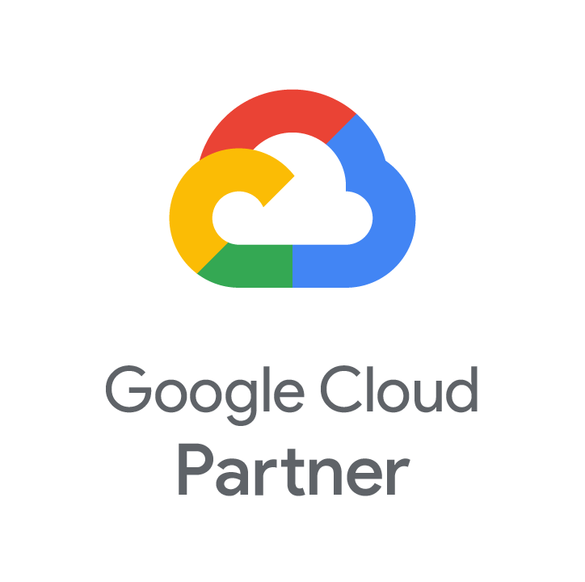
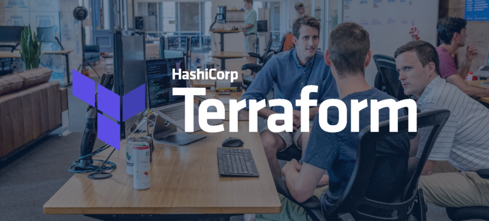
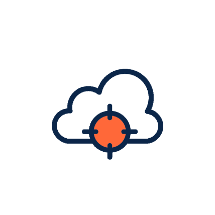

## Ihr Google Cloud Consulting Partner für die bessere Cloud

> Wir machen Sie fit für die Google - Cloud!

0 Google Cloud Zertifikate 0 Erfolgreiche Projekte 0 Qualifizierte Mitarbeiter [Linkedin](https://www.linkedin.com/company/11759873) [Instagram](https://www.instagram.com/thinkport/) [Youtube](https://www.youtube.com/channel/UCnke3WYRT6bxuMK2t4jw2qQ) [Envelope](mailto:tdrechsel@thinkport.digital)

Sie prüfen eine Migration in die moderne Google Cloud-Welt und planen Ihre zukünftige Architektur und Services?  
Oder nutzen Sie bereits Google Cloud und sind unsicher über die nächsten Entwicklungsschritte?  
Als Google Cloud Consulting Partner bieten wir Ihnen den kompletten Full Service der Google Cloud Beratung an.  
Gerne unterstützen wir Sie individuell. Und entwickeln mit Ihnen die zukunftsfähige Cloud Strategie  
Ihres Unternehmens sowie deren Umsetzung.

## Google Cloud & Thinkport

Die Google Cloud gehört zu den weltweit führenden Anbietern von Cloud-Lösungen. Mit einem breiten Spektrum an innovativen Services bietet Google Cloud Unternehmen jeder Größe die Möglichkeit, ihre IT-Infrastruktur zu optimieren, Kosten zu senken und neue Geschäftspotenziale zu erschließen.  
Als zertifizierter Google Cloud Partner schöpfen wir aus dem vollen Umfang von Google Cloud und bieten Ihnen maßgeschneiderte Lösungen für Ihre individuellen Anforderungen.  
  
**Unsere Expertise ist Ihr Vorteil:**  
  
**Sicherheit**: Wir gewährleisten die Sicherheit Ihrer Daten und Systeme durch modernste Sicherheitsstandards und Verfahren.  
**Zuverlässigkeit**: Profitieren Sie von einer hochverfügbaren und skalierbaren Infrastruktur, die selbst höchsten Anforderungen gerecht wird.  
**Kosteneffizienz**: Optimieren Sie Ihre IT-Kosten durch transparente Preismodelle und bedarfsgerechte Nutzung von Ressourcen.  
**Data Analytics, Big Data & AI**: Wir unterstützen Sie bei der Analyse Ihrer Daten und der Nutzung von Big Data und KI, um neue Geschäftspotenziale zu erschließen.

Richard Markgraf

 Termin vereinbaren

## Google Cloud Stärken

* Ausgezeichnete Data & Analytics Services
* Gute Integration mit anderen Google Services
* Hohe Benutzerfreundlichkeit und trotzdem tiefe Kontrollmöglichkeiten
* Hervorragende first party client libraries und APIs
* Umfangreiche Dokumentation zu Services mit Beispielen und Best Practices

## Thinkport's Kernkompetenzen für ihr Google Cloud Projekt

Sie benötigen eine Beratung zur Google Cloud-Architektur? Oder eine neue Anwendung in beliebiger Größe  
oder für beliebige Zwecke? Oder Unterstützung für die bestehende Infrastruktur?  
Wir teilen gerne unser Wissen und unsere Erfahrung mit Ihnen.

Beratung Unsere erfahrenen Berater navigieren Sie zu den passenden Cloud-Lösungen, die Ihre Geschäftsleistung steigern und Kosten optimieren.

&

Entwicklung Unser Entwicklerteam setzt modernste Cloud-Technologien ein, um zukunftsfähige Lösungen zu erstellen, die perfekt auf Ihre Bedürfnisse zugeschnitten sind. 

 Cloud Strategy Unsere Cloud-Strategie umfasst eine ganzheitliche Analyse Ihrer Geschäftsziele, um maßgeschneiderte Lösungen darzulegen, die Ihre digitale Transformation unterstützen. Cloud Planung Unserer Cloud-Planung berücksichtigt sorgfältig Ihre Anforderungen und erstellt eine umfassende Roadmap, die eine nahtlose Integration von Cloud-Technologien ermöglicht. Cloud Development Im Cloud-Developments setzen wir modernste Technologien ein, die nicht nur leistungsstark und skalierbar sind, sondern auch nahtlos in Ihre bestehende IT-Infrastruktur integriert werden. Cloud Migration Bei der Cloud-Migration sorgen wir für einen reibungslosen Übergang Ihrer Anwendungen und Daten in die Cloud, inkl. Berücksichtigung von Sicherheitsaspekten und Optimierung der Leistung. Dev. Ops DevOps ist ein integraler Bestandteil unseres Ansatzes, bei dem Entwicklung und Betrieb nahtlos zusammenarbeiten. Data Daten bilden das Fundament, wobei wir durch umfassende Analyse und intelligente Verarbeitung dazu beitragen, wertvolle Einblicke zu gewinnen und datengetriebene Entscheidungen zu ermöglichen. "Ein herzliches Dankeschön an das Team für das informative und praxisorientierte GCP (Google Cloud Platform) mit Terraform Workshop! Die Mischung aus fundierten Erklärungen und hands-on Labs hat mir geholfen, ein solides Verständnis für die Nutzung von Terraform in der GCP zu entwickeln. Besonders hilfreich waren die Tipps und Best Practices, die mir dabei halfen, potenzielle Fallstricke zu vermeiden. Ich fühle mich nun sicherer in der Erstellung und Verwaltung von Infrastruktur als je zuvor. Ich kann diesen Workshop nur wärmstens empfehlen!" Julio H. Junior Developer "Ich war angenehm überrascht von der Qualität des GCP (Google Cloud Platform) mit Terraform Workshops. Obwohl mein Team nur begrenzte Erfahrung mit Terraform hatte, konnten wir dank der strukturierten Präsentationen und der praktischen Übungen schnell Fortschritte erzielen. Der Workshop hat uns nicht nur dabei geholfen, die Grundlagen von Terraform zu verstehen, sondern auch spezifische Techniken und Strategien vermittelt, um effektiv mit der GCP umzugehen. Dieses Training war definitiv ein Wendepunkt für uns und wird uns in unseren zukünftigen Projekten enorm unterstützen. Danke an das gesamte Team für diese wertvolle Erfahrung!" Miriam T. Junior Cloud Engineer Previous Next 

## Unsere Google Cloud Workshop

Die Lerninhalte unserer vielfältigen Trainings werden von unseren Experten spannend und eingänglich vermittelt. In den Trainings lernen Sie praxisorientiert von zertifizierten Cloud Profis, wie Sie moderne Anwendungen erstellen und bereitstellen.  
  
Gerne schneiden wir auch unsere bestehenden Trainingsmaßnahmen oder Workshops ganz individuell auf Ihre Bedürfnisse zu. Sprechen Sie uns diesbezüglich gerne an, gemeinsam finden wir eine Lösung.

[Mehr](https://thinkport.digital/cloud-trainings-workshops/) 

## Wissen & Kompetenz: Unsere erfahrenen Cloud Experten.

### Richard

Cloud Architect[

### Richard

Cloud Architect](mailto:rmarkgraf@thinkport.digital)

### Max

Senior Cloud Engineer[

### Max

Senior Cloud Engineer](mailto:mkrotov@thinkport.digital)

Inspiriert? Werde Teil unseres Expertenteams

## Unsere Thinkport Versprechen

      

Als ausgezeichneter Google Cloud Consulting Partner bieten wir Ihrem Unternehmen ein qualifiziertes, zertifiziertes und engagiertes Team an. Unsere umfangreichen Praxis-Erfahrungen decken das komplette Spektrum aller Leistungen rund um die Cloud von Google Cloud ab. Ob Private, Public, Hybrid oder Multi-Cloud – wir sind Ihr Partner auf Augenhöhe. Und finden mit Ihnen gemeinsam die besten Cloud-Lösungen. Wir freuen uns auf Ihre Kontaktaufnahme.

Cloud-Beratung mit Start-Up Mentalität

## Ihr Ansprechpartner

### Dominik Fries

CTO & Lead Cloud Architect

* [dfries@thinkport.digital](mailto:dfries@thinkport.digital)
* [+49 151 63417156](tel:+4915163417156)
* [LinkedIn](https://www.linkedin.com/in/dominik-fries-497ab7107/?originalSubdomain=de)
* [Dominik Fries](https://www.xing.com/profile/Dominik_Fries5)
