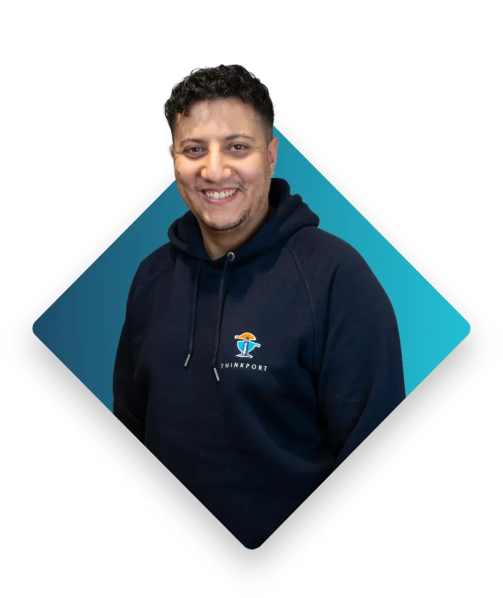
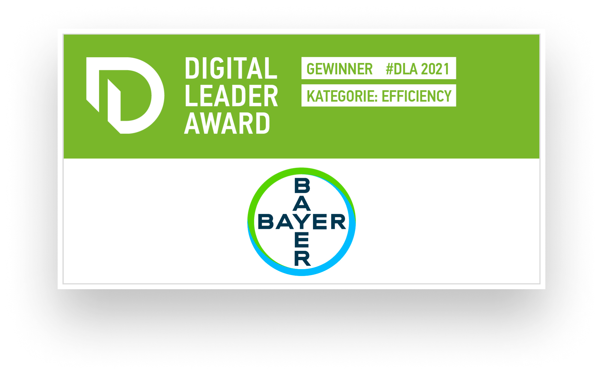
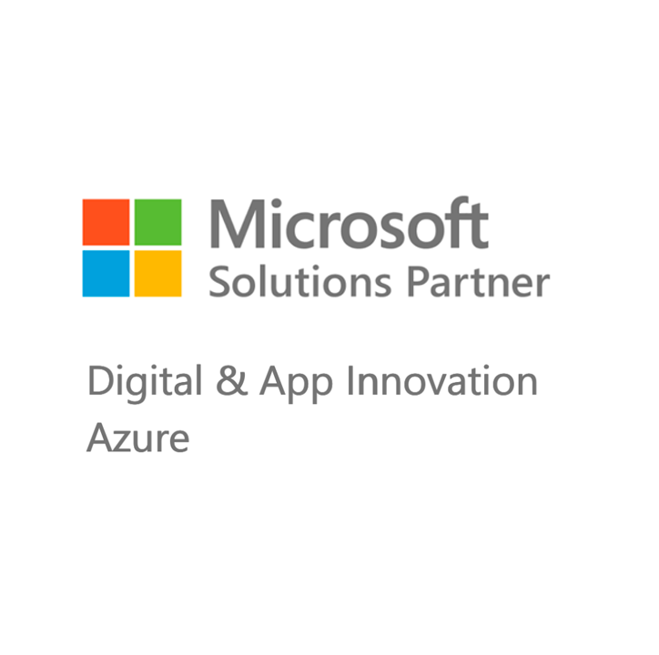
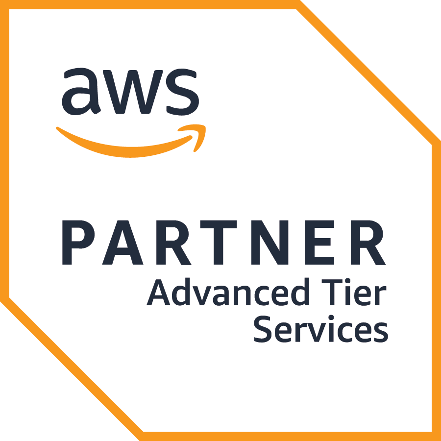
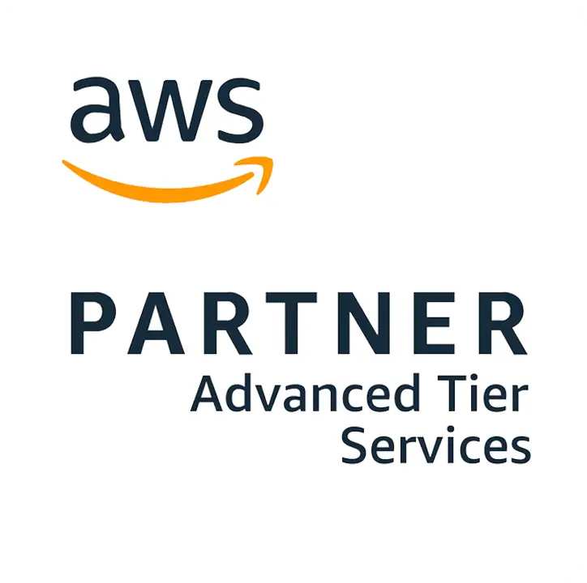
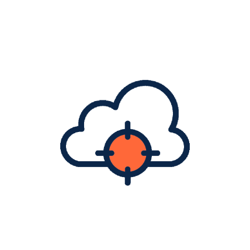
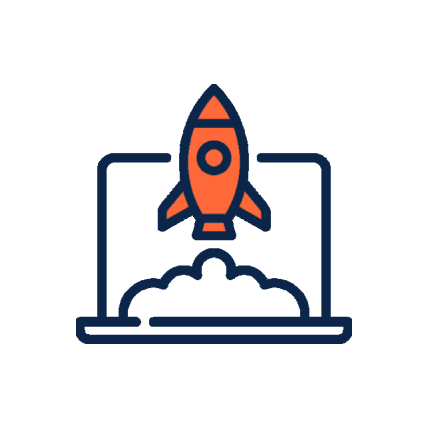
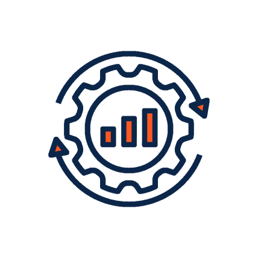
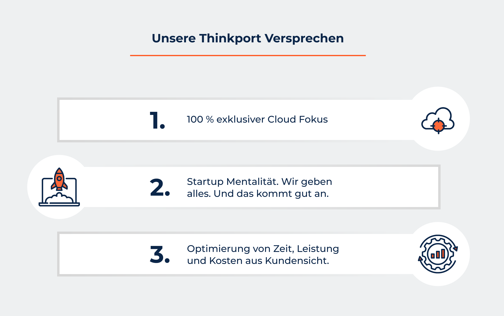
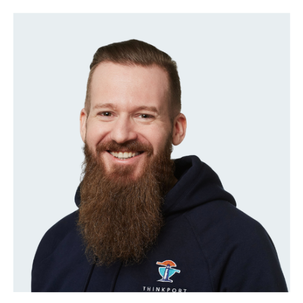

## Ihr Hybrid Cloud Consulting Partner für die bessere Cloud

> Wir machen Sie fit für die Hybrid - Cloud!

0 Technologie Partner 0 + Cloud Projekte 0 Qualifizierte Mitarbeiter [Linkedin](https://www.linkedin.com/company/11759873) [Instagram](https://www.instagram.com/thinkport/) [Youtube](https://www.youtube.com/channel/UCnke3WYRT6bxuMK2t4jw2qQ) [Envelope](mailto:tdrechsel@thinkport.digital)

Sie prüfen eine Migration in die moderne Cloud-Welt und planen Ihre zukünftige Architektur und Services?  
Oder nutzen Sie bereits verschiedene Cloud bzw. on-premise Lösungen und sind unsicher über die nächsten Entwicklungsschritte?  
Als Hybrid Cloud Consulting Partner bieten wir Ihnen den kompletten Full Service der Beratung an.  
Gerne unterstützen wir Sie individuell. Und entwickeln mit Ihnen die zukunftsfähige Cloud Strategie  
Ihres Unternehmens sowie deren Umsetzung.

## Hybrid Cloud & Thinkport

„Als Circle Lead des Hybrid Circles bei Thinkport bin ich stolz darauf, seit über fünf Jahren an der Entwicklung von hybriden Cloud-Lösungen zu arbeiten. Unsere maßgeschneiderten Lösungen bieten Unternehmen Flexibilität und Kontrolle, indem sie **das Beste aus verschiedenen Cloud-Anbietern** und dem eigenen Rechenzentrum kombinieren. Unser zertifiziertes Expertenteam unterstützt Kunden bei der nahtlosen Integration und Verbindung von Cloud- und lokalen Ressourcen. Thinkport begleitet Unternehmen auf ihrer Reise in die hybride Cloud und maximiert die Vorteile dieser innovativen Technologie.“  
Samir Hamiani

Termin vereinbaren

## Hybrid Cloud Stärken

- Flexibilität
- Kontrolle und Sicherheit
- Kostenoptimierung
- Nahtlose Integration
- Disaster Recovery und Business Continuity
- Skalierbarkeit und Agilität

## Thinkport's Kernkompetenzen für ihr Hybrid Cloud Projekt

Sie benötigen eine Beratung zur Hybrid Cloud Architektur? Oder eine neue Anwendung in beliebiger Größe  
oder für beliebige Zwecke? Oder Unterstützung für die bestehende Infrastruktur?  
Wir teilen gerne unser Wissen und unsere Erfahrung mit Ihnen.

Beratung Unsere erfahrenen Berater navigieren Sie zu den passenden Cloud-Lösungen, die Ihre Geschäftsleistung steigern und Kosten optimieren.

&

Entwicklung Unser Entwicklerteam setzt modernste Cloud-Technologien ein, um zukunftsfähige Lösungen zu erstellen, die perfekt auf Ihre Bedürfnisse zugeschnitten sind.  Cloud Strategy Unsere Cloud-Strategie umfasst eine ganzheitliche Analyse Ihrer Geschäftsziele, um maßgeschneiderte Lösungen darzulegen, die Ihre digitale Transformation unterstützen. Cloud Planung Unserer Cloud-Planung berücksichtigt sorgfältig Ihre Anforderungen und erstellt eine umfassende Roadmap, die eine nahtlose Integration von Cloud-Technologien ermöglicht. Cloud Development Im Cloud-Developments setzen wir modernste Technologien ein, die nicht nur leistungsstark und skalierbar sind, sondern auch nahtlos in Ihre bestehende IT-Infrastruktur integriert werden. Cloud Migration Bei der Cloud-Migration sorgen wir für einen reibungslosen Übergang Ihrer Anwendungen und Daten in die Cloud, inkl. Berücksichtigung von Sicherheitsaspekten und Optimierung der Leistung. Dev OPS DevOps ist ein integraler Bestandteil unseres Ansatzes, bei dem Entwicklung und Betrieb nahtlos zusammenarbeiten. Data Daten bilden das Fundament, wobei wir durch umfassende Analyse und intelligente Verarbeitung dazu beitragen, wertvolle Einblicke zu gewinnen und datengetriebene Entscheidungen zu ermöglichen.

## Unsere Hybrid Cloud - Success Stories

<figure>

<figcaption>

Woodmark

</figcaption>

</figure>

<figure>

<figcaption>

ParcIT

</figcaption>

</figure>

## Partnerschaften

## Unsere Top 3:

Hybrid Cloud Trainings

Die Lerninhalte unserer vielfältigen Hybrid Cloud Trainings werden von unseren Experten spannend und eingänglich vermittelt. In den Trainings lernen Sie praxisorientiert von zertifizierten Cloud Profis, wie Sie moderne Anwendungen erstellen und bereitstellen.

Gerne schneiden wir auch unsere bestehenden Trainingsmaßnahmen oder Workshops ganz individuell auf Ihre Bedürfnisse zu. Sprechen Sie uns diesbezüglich gerne an, gemeinsam finden wir eine Lösung.

## Wissen & Kompetenz: Unsere erfahrenen Cloud Experten.

### Alex

Senior Cloud Architect[

### Alex

Senior Cloud Architect](mailto:aortner@thinkport.digital)

### Samir

Senior Cloud Engineer[

### Samir

Senior Cloud Engineer](mailto:kontakt@thinkport.digital)

### Chris

Cloud Architect[

### Chris

Cloud Architect](mailto:culpinnis@thinkport.digital)

Inspiriert? Werde Teil unseres Expertenteams

## Unsere Thinkport Versprechen

      

Als Hybrid Cloud Consulting Partner bieten wir Ihrem Unternehmen ein qualifiziertes, zertifiziertes und engagiertes Team an. Unsere umfangreichen Praxis-Erfahrungen decken das komplette Spektrum aller Leistungen rund um die Cloud von AWS, Azure sowie GCP ab. Ob Private, Public, Hybrid oder Multi-Cloud – wir sind Ihr Partner auf Augenhöhe. Und finden mit Ihnen gemeinsam die besten Cloud-Lösungen. Wir freuen uns auf Ihre Kontaktaufnahme.

Cloud-Beratung mit Start-Up Mentalität

## Ihr Ansprechpartner

### Dominik Fries

CTO & Lead Cloud Architect

- [dfries@thinkport.digital](mailto:dfries@thinkport.digital)
- [+49 151 63417156](tel:+4915163417156)
- [LinkedIn](https://www.linkedin.com/in/dominik-fries-497ab7107/?originalSubdomain=de)
- [Dominik Fries](https://www.xing.com/profile/Dominik_Fries5)
