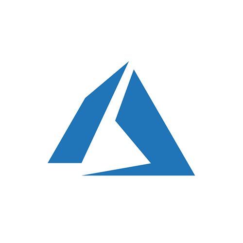
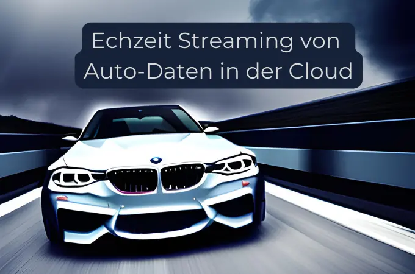
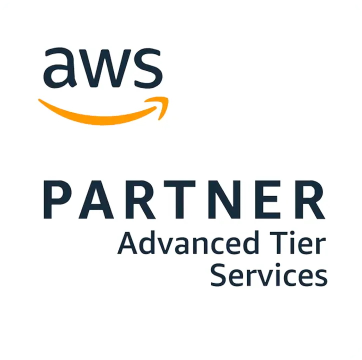

## Thinkport | Cloud Consulting

# Digital Innovation Hub

Digital Innovation Hub – Exploring the Cloud Solutions of Tomorrow

# Unser Portfolio

# Strategie & Innovation

Zusammen mit unseren Experten erarbeiten Sie individuelle Lösungen, die Ihr Unternehmen voranbringen. Jeder Strategie oder Assessment Workshop findet entweder in persona, hybrid oder rein digital bei Ihnen oder bei uns statt und am Ende erstellen unsere Experten eine Dokumentation des Inhalts für Sie. Weitere Empfehlungen, wie Sie die IT Ihres Unternehmens verbessern können nehmen Sie als zusätzlichen Mehrwert mit.

### Cloud Strategie

Je besser ihre Cloud Architektur, desto zukunftssicherer ist ihre IT-Lösung. Unsere Experten beraten SIe gerne. [Innovative Herangehensweise um ihre Cloud-Lösung zu realisieren Mehr Infos](https://thinkport.digital/terraform-fuer-azure-lernen/)

### Datenstrategie

Mit unseren Experten individuelle Datenstrategien erarbeiten. Kontaktieren Sie uns noch heute. [Datenstrategien sind die Basis für KI Anwendung und die Auswertung ihres Datenschatzes Mehr Infos](https://thinkport.digital/datenplattform-mit-azure-und-databricks/)

### KI Strategie

Machen Sie mehr aus ihren Daten. Nutzen Sie KI Anwendungen um ihre MItarbeitenden effizienter arbeiten zu lassen [Praktische Erfahrungen unserer Cloud-Experten, welche KI-Lösungen bei vielen Großkunden etabliert und optimiert haben. Mehr Infos](https://thinkport.digital/airflow-in-der-cloud)

### Data Landscape Map

Sie haben ein Unternehmen aber wissen nicht genau wo ihre Daten überall liegen? Unsere Experten bringen Licht in den Daten Jungle. [Die Evaluierung ihrer Datenhaltung hilft Ihnen IT-Prozesse zu optimieren und Kosten durch eine Moderne Architektur einzusparen. Mehr Infos](https://thinkport.digital/terraform-fuer-azure-lernen/)

### Data Maturity Level

Ist ihre IT veraltet oder brandneu? Wir evaluieren ihr Data Maturity Level durch unser Assessment und helfen Ihnen bei der Optimierung. [Unsere Experten beurteilen den Status ihrer IT-Landscape um Ihnen optimalen Handlungsempfehlungen für Veränderungen geben zu können. Mehr Infos](https://thinkport.digital/datenplattform-mit-azure-und-databricks/)

### Kommen Sie ins Gespräch mit uns

Falls Sie Fragen und Wünsche haben, melden Sie sich gerne bei uns [Praktische Erfahrungen unserer Cloud-Experten, welche Airflow bei vielen Großkunden eingerichtet und optimiert haben. Mehr Infos](https://thinkport.digital/airflow-in-der-cloud)

# Innovation Enablement

# Workshops & Konzepte

Zusammen mit unseren Experten erarbeiten Sie individuelle Lösungen, die Ihr Unternehmen voranbringen. Jeder Workshop findet entweder in persona, hybrid oder rein digital bei Ihnen oder bei uns statt und am Ende erstellen unsere Experten eine Dokumentation des Inhalts für Sie. Weitere Empfehlungen, wie Sie die IT Ihres Unternehmens verbessern können nehmen Sie als zusätzlichen Mehrwert mit.

### ESG Workshop

ESG, kurz für Environmental, Social and Governance ist ein Thema, das jede Firma umsetzen muss. Wir beraten Sie gerne und unterstützen dabei. [Was genau für ESG Reporting benötigt wird und wie das für SIE einfach und kostengünstig realisiert wird lernen Sie zusammen mit unseren Experten in einem Workshop. Mehr Infos](https://thinkport.digital/terraform-fuer-azure-lernen/)

### Innovation Enablement

Sie wollen etwas in ihrer IT verändern? Haben aber noch nicht den richtigen Hebel gefunden? Sprechen Sie uns an. [Mit verschiedenen Methodiken evaluieren wir ihr Innovationspotential und bringen ihr Unternehmen voran Mehr Infos](https://thinkport.digital/datenplattform-mit-azure-und-databricks/)

### Use Case Evaluierung

Sie haben eine grobe Idee, was Sie gerne verändern möchten? Unsere Cloud Erfahrung gibt Ihnen den Gesamtüberblick für Ihren Use Case [Praktische Erfahrungen unserer Cloud-Experten, welche KI-Lösungen bei vielen Großkunden etabliert und optimiert haben. Mehr Infos](https://thinkport.digital/airflow-in-der-cloud)

„Im Innovation Hub setzen wir auf agile, kundenorientierte Workshops, die es uns ermöglichen, individuelle Herausforderungen unserer Kunden direkt und effektiv anzugehen. Mit diesem Ansatz schaffen wir Raum für kreative Lösungsfindung und entwickeln gemeinsam maßgeschneiderte Strategien, die perfekt auf die spezifischen Anforderungen Ihres Unternehmens abgestimmt sind.“

Dominik Fries, _CTO_

## Innovation News

## Cloud Plattformen

Unsere zertifizierten Architekten greifen in ihren Projekten auf die gesamte Tool-Palette der weltweit größten Cloud Provider zurück und entwickeln die Lösung, die am besten zu ihrem Kunden passt. Durch exklusive Partnership Ressourcen gewährleistet Thinkport immer den modernsten technologischen Cloud Standard. 

### Amazon Web Services

Consulting Partner - Select

### Microsoft Azure

Consulting Partner - Gold

### Google Cloud

Partner

## Unsere Success Stories

<figure>

<figcaption>

Thinkport awarded “Top Supplier Retail 2023” for EDEKA DIGITAL Event Streaming Project

</figcaption>

</figure>

<figure>

<figcaption>

Echzeit Streaming von Auto-Daten in der Cloud

</figcaption>

</figure>

<figure>

<figcaption>

Bildanalyse in der Cloud für Bayer

</figcaption>

</figure>

<figure>

<figcaption>

API für einen 360° Kunden-Dialog der Deutschen Telekom

</figcaption>

</figure>

# Thinkport's Digital Innovation Hub

#### Unsere Vision?

Im Innovation Hub setzen wir auf effiziente und maßgeschneiderte Lösungen, die direkt bei unseren Kunden Mehrwert generieren​

#### Unsere Mission?

Gemeinsam mit Ihnen entwickeln wir Cloud-Strategien, die flexibel auf Ihre bestehende Infrastruktur aufbauen und Ihre Herausforderungen gezielt adressieren. In unseren praxisorientierten Strategie-Workshops gehen wir individuell auf Ihre Ziele und Anforderungen ein – von der Analyse Ihrer Datenstrukturen bis zur Skalierung Ihrer Cloud-Lösungen.​

#### Unsere Beratungsphilosophie?

Wir identifizieren gemeinsam bestehende Challenges und entwickeln skalierbare Lösungen, die sowohl den heutigen Anforderungen als auch den zukünftigen Zielen unserer Kunden gerecht werden.

## Unsere Partner für Cloud Technologien

## Unsere Innovationspartner

## Philipp Höllthaler

**Innovation Manager**

##### Email:

[innovation@thinkport.digital](mailto:phoellthaler@thinkport.digital)

