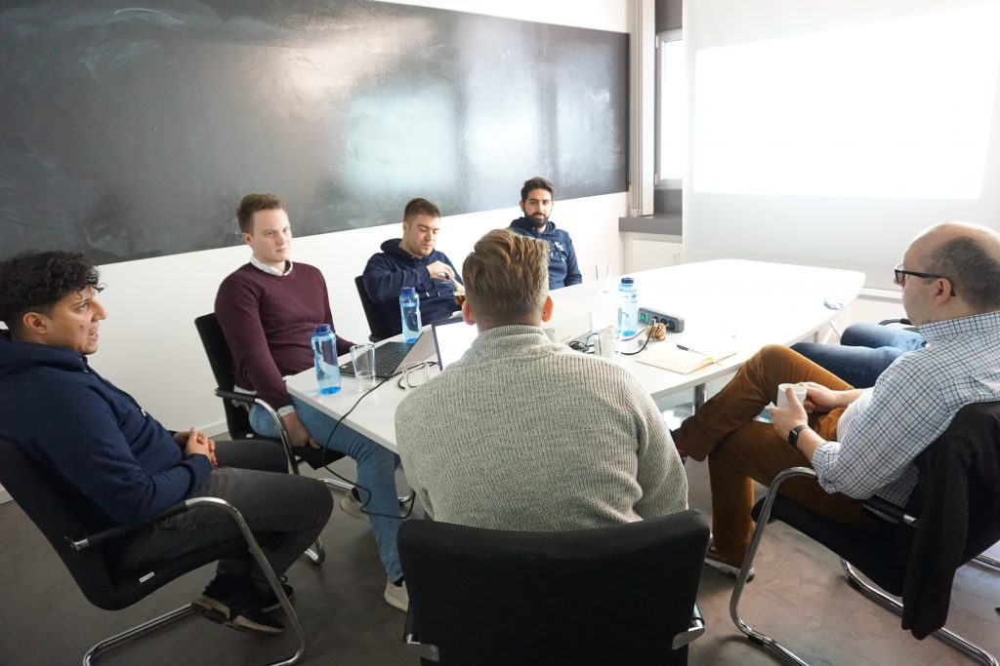

Werden Sie Experte mit dem

# Kafka Administration Training

## Auf einen Blick

* 2 Tage
* Monatlich und Individuell
* Technisches Training
* Remote und vor Ort verfügbar

Im Kafka Administration Training lernen Sie, in Echtzeit Eventstreaming Plattformen zu verwalten, zu überwachen und zu tunen. Profitieren Sie von Projekterfahrung unserer Experten und Cloud-Architekten mit Erfahrung direkt aus der Industrie.

[Anfragen](#sec1)

Anhand von Apache Kafka ist es möglich, Data Streams über eine verteilte Plattform zu verarbeiten und zu speichern. In Kafka-Clustern können Daten gelesen, geschrieben, importiert und in weitere Systeme exportiert werden. Confluent ist eine solche Kafka-basierte Event Streaming Plattform, die in Echtzeit operiert. Als offizieller Confluent-Partner bietet Thinkport praxisnahe Trainings auf unterschiedlichen Niveaus zum Thema Kafka und Event Streaming an.

[Linkedin](https://www.linkedin.com/company/11759873) [Instagram](https://www.instagram.com/thinkport/) [Youtube](https://www.youtube.com/channel/UCnke3WYRT6bxuMK2t4jw2qQ) [Envelope](mailto:tdrechsel@thinkport.digital)

## Termine

25.06. - 26.06.24 Kafka Administration Training

08.07. - 09.07.24 Kafka Administration Training

05.08. - 06.08.24 Kafka Administration Training

\* individuelle Termine möglich

## Preis

1.400 € zzgl. MwSt.

## Lernerfolge

Teilnehmer können nach Abschluss...

* Verstehen, wie Kafka und die Confluent Plattform funktionieren und wie deren Subsysteme interagieren
* Cluster aufsetzen, verwalten, überwachen, und tunen
* Kafka Best Practices aus der Industrie sauber umsetzen

## Zielgruppe

Der Kurs ist geeignet für...

* Grundlegendem Verständnis über die Kafka Architektur (z. B. Kafka Fundamentals Workshop Ableger)
* Sicherheit im Umgang mit Linux/Unix
* Grundlegendem Verständnis für TCP/IP Netzwerke und eventuell Erfahrung mit Java Virtual Machine (JVM)

## Aufbau

[Kafka Administration im Handumdrehen lernen](https://www.hashicorp.com/)

### Kafka Cluster Tag I

* Kafka Grundlagen Auffrischen
* Kafka Architektur
* Nachhaltigkeit & Langlebigkeit
* Verwaltung von Clustern

### Kafka in Action Tag II

* Kafka Performance optmieren
* Kafka Sicherheit
* Data Pipelines mit Kafka Connect
* Kafka in Production​

* Kafka Grundlagen Auffrischen
* Kafka Architektur
* Nachhaltigkeit & Langlebigkeit
* Verwaltung von Clustern

* Kafka Performance optmieren
* Kafka Sicherheit
* Data Pipelines mit Kafka Connect
* Kafka in Production

## Erfolge

Die Lerninhalte unseres Kafka Administration Trainings werden von unseren Experten spannend und eingänglich vermittelt. Von den Kafka-Profis entwickelten Best Practices lernen, wie Sie Kafka-Cluster aufbauen und verwalten.

## Unterstützung

Wir haben die von unseren Entwicklern am häufigsten verwendeten Befehle in einem Cheatsheet zusammengefasst, das während der Schulung und nach deren Abschluss verwendet werden kann. Wenn Sie sich damit vertraut machen wollen, können Sie es hier herunterladen.

## Kontakt

Erfahren Sie mehr zu diesem Training in einem persönlichen Gespräch

Sie setzen mit uns individuelle Schwerpunkte und erhalten ein zugeschnittenes Angebot für Ihre Anforderungen 24h nach dem Termin

Termin vereinbaren

## FAQs

Hier finden Sie eine kurze Zusammenstellung von oft gestellten Fragen und den dazugehörigen Antworten.

Was ist Apache Kafka?

Apache Kafka ist eine verteilte Streaming-Plattform, die in der Lage ist, große Datenströme in Echtzeit zu verarbeiten. Es wurde von LinkedIn entwickelt und später als Open-Source-Projekt der Apache Software Foundation veröffentlicht.

Kafka bietet eine skalierbare und robuste Lösung für die Verarbeitung von Echtzeit-Datenströmen und ermöglicht es Unternehmen, große Datenmengen in Echtzeit zu verarbeiten, zu speichern und zu verteilen. Es ist in der Lage, Daten von verschiedenen Quellen wie Anwendungen, Sensoren, Websites und anderen Quellen zu sammeln und sie in Echtzeit zu verarbeiten.

Was ist Kafka Connect?

Kafka Connect ist eine Komponente von Apache Kafka, die es ermöglicht, Daten zwischen Kafka und anderen Systemen nahtlos zu übertragen. Es bietet eine schnelle und zuverlässige Möglichkeit, Daten aus Quellsystemen in Kafka zu laden oder Daten aus Kafka in Zielsysteme zu schreiben.

Kafka Connect ist eine skalierbare und verteilte Architektur, die Daten-Integrations-Pipelines bereitstellt. Mit Kafka Connect können Unternehmen Datenquellen wie Datenbanken, Dateien, IoT-Geräte, Cloud-Dienste und viele andere Systeme mit Kafka verbinden und Datenströme in Echtzeit erfassen.

Was ist Confluent?

Confluent ist ein Unternehmen, das sich auf die Entwicklung von Daten-Streaming-Plattformen spezialisiert hat und eng mit Apache Kafka verbunden ist. Das Unternehmen wurde 2014 von den Schöpfern von Apache Kafka gegründet und hat sich seitdem zu einem der führenden Unternehmen in diesem Bereich entwickelt.

Confluent bietet eine breite Palette von Lösungen, darunter:

* - Confluent Platform (integrierte Streaming-Plattform)
    - Confluent Cloud (Kafka-as-a-Service-Plattform in der Cloud)
    - Confluent Enterprise (erweiterte Version der Confluent Platform)
    - Confluent Hub (ein Marktplatz für Kafka-Connectoren, -Tools und -Anwendungen)

Confluent hat auch eine große Anzahl von Kunden, die ihre Produkte und Lösungen nutzen, darunter Fortune-500-Unternehmen, Regierungsbehörden und viele andere Organisationen. Durch die Bereitstellung von leistungsstarken und flexiblen Streaming-Plattformen hat Confluent dazu beigetragen, die Art und Weise zu verändern, wie Unternehmen Daten in Echtzeit verarbeiten und nutzen.

## Weitere Trainings
