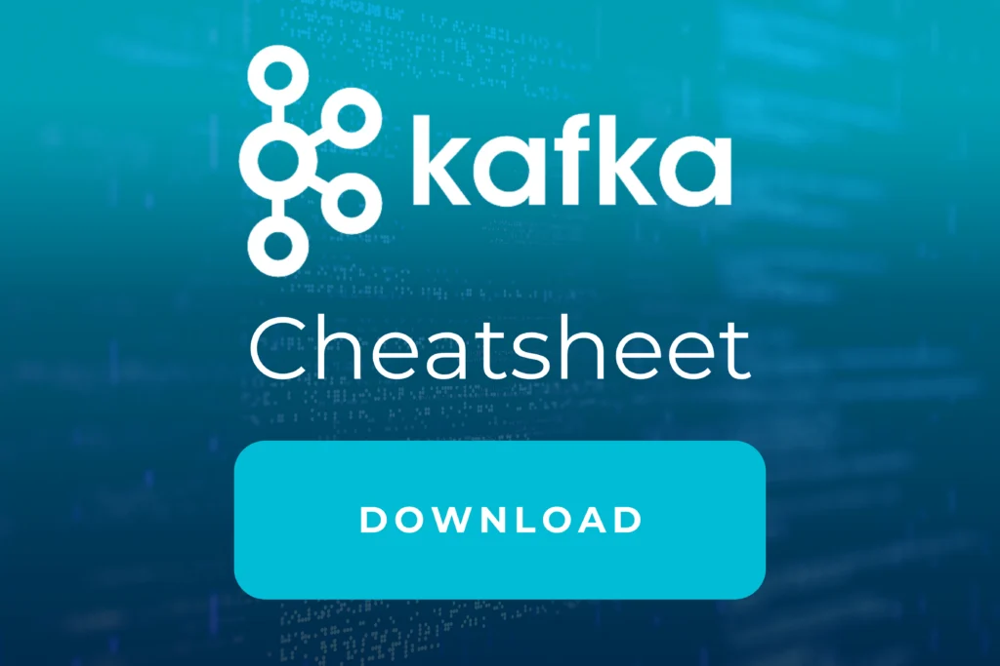

Legen Sie mit uns die Basis für Eventstreaming mit unserem

# Kafka Fundamentals Training

## Auf einen Blick

- 3 Tage
- Monatlich und Individuell
- Technisches Training
- Remote und vor Ort verfügbar

Echtzeit Eventstreaming Plattformen kennenlernen und erste Lernerfahrungen gewinnen. Profitieren Sie von Projekterfahrung unserer Experten und Cloud-Architekten mit Erfahrung direkt aus der Industrie.

[Anfragen](#sec1)

Anhand von Apache Kafka ist es möglich, Data Streams über eine verteilte Plattform zu verarbeiten und zu speichern. In Kafka-Clustern können Daten gelesen, geschrieben, importiert und in weitere Systeme exportiert werden. Confluent ist eine solche Kafka-basierte Event Streaming Plattform, die in Echtzeit operiert. Als offizieller Confluent-Partner bietet Thinkport einen praxisnahe Workshops auf unterschiedlichen Niveaus zum Thema Kafka Fundamentals und Kafka Event Streaming an.

[Linkedin](https://www.linkedin.com/company/11759873) [Instagram](https://www.instagram.com/thinkport/) [Youtube](https://www.youtube.com/channel/UCnke3WYRT6bxuMK2t4jw2qQ) [Envelope](mailto:tdrechsel@thinkport.digital)

## Termine

11.06. - 13.06.24 Kafka Fundamentals Training

01.07. - 03.07.24 Kafka Fundamentals Training

05.08. - 07.08.24 Kafka Fundamentals Training

\* individuelle Termine möglich

## Preis

2.200 € zzgl. MwSt.

## Lernerfolge

Teilnehmer können nach Abschluss...

- Gute Kenntnisse über Kafkas wichtigste Konzepte
- Einen guten Überblick über die Kafka-betriebene Event Streaming Plattform Confluent
- Eine hervorragende Grundlage, um fortgeschrittene Kafka Workshops zu belegen
- Eine Plattform für automatische Analysen in Microsoft Azure bauen

## Zielgruppe

Der Kurs ist geeignet für Personen mit...

- Grobem Verständnis des Linux OS
- Allerersten Erfahrungen mit einer Shell wie bash
- Der Absicht, in Zukunft weiterführende Kafka Trainings zu besuchen
- Dem Willen, mehr über eine mit Kafka betriebene Echtzeit-Event-Streaming-Plattform zu lernen

## Aufbau

[Kafka Fundamentals im Handumdrehen lernen](https://www.hashicorp.com/)

### Grundlagen Tag I

- Motivation und Use Cases: Wieso Event-Driven?
- Apache Kafka Grundlagen: Architektur, ZooKeeper und andere Basics
- Wie funktioniert Kafka? Sicherheit und Herangehensweise​

### Streaming Tag II

- Lab: Data Streams mit Kafka Connect und REST Proxy verwalten
- Lab: Datenformate beibehalten und Kompatibilität sichern​
- Lab: Bauen einer Echtzeit Streaming Anwendung mit Confluent ksqlDB und Kafka Streams

### Confluent Tag III

- Data Streaming Plattform als Zentrales Nervensystem​
- Verschiedene Deployment Modelle
- Confluent Basics: RBAC, Control Center, CLI, Operator, Confluent Hub

- Motivation und Use Cases: Wieso Event-Driven?
- Apache Kafka Grundlagen: Architektur, ZooKeeper und andere Basics
- Wie funktioniert Kafka? Sicherheit und Herangehensweise

- Lab: Data Streams mit Kafka Connect und REST Proxy verwalten
- Lab: Datenformate beibehalten und Kompatibilität sichern
- Lab: Bauen einer Echtzeit Streaming Anwendung mit Confluent ksqlDB und Kafka Streams

- Data Streaming Plattform als Zentrales Nervensystem
- Verschiedene Deployment Modelle
- Confluent Basics: RBAC, Control Center, CLI, Operator, Confluent Hub

## Erfolge

Die Lerninhalte des Kafka Fundamentals Workshops werden von unseren Trainern spannend und eingänglich vermittelt. In diesem Training erhalten Sie einen praxisorientierten Überblick über Kafkas Kernkonzepte und die Confluent-Plattform.

## Unterstützung

Wir haben die von unseren Entwicklern am häufigsten verwendeten Befehle in einem Cheatsheet zusammengefasst, das während der Schulung und nach deren Abschluss verwendet werden kann. Wenn Sie sich damit vertraut machen wollen, können Sie es hier herunterladen.

## Kontakt

Erfahren Sie mehr zu diesem Training in einem persönlichen Gespräch

Sie setzen mit uns individuelle Schwerpunkte und erhalten ein zugeschnittenes Angebot für Ihre Anforderungen 24h nach dem Termin

Termin vereinbaren

## FAQs

Hier finden Sie eine kurze Zusammenstellung von oft gestellten Fragen und den dazugehörigen Antworten.

Was ist Apache Kafka?

Apache Kafka ist eine verteilte Streaming-Plattform, die in der Lage ist, große Datenströme in Echtzeit zu verarbeiten. Es wurde von LinkedIn entwickelt und später als Open-Source-Projekt der Apache Software Foundation veröffentlicht.

Kafka bietet eine skalierbare und robuste Lösung für die Verarbeitung von Echtzeit-Datenströmen und ermöglicht es Unternehmen, große Datenmengen in Echtzeit zu verarbeiten, zu speichern und zu verteilen. Es ist in der Lage, Daten von verschiedenen Quellen wie Anwendungen, Sensoren, Websites und anderen Quellen zu sammeln und sie in Echtzeit zu verarbeiten.

Wie arbeitet Apache Kafka?

Kafka arbeitet auf der Grundlage eines Publish-Subscribe-Modells, bei dem Daten in Form von Nachrichten an eine Gruppe von Empfängern verteilt werden. Es kann auch als Zwischenspeicher zwischen verschiedenen Datenverarbeitungssystemen eingesetzt werden, um die Verarbeitung von Daten zu beschleunigen.

Was ist ein Publish-Subscribe-Modell?

Ein Publish-Subscribe-Modell (auch als Pub/Sub-Modell bezeichnet) ist ein Nachrichtenverarbeitungsmuster, bei dem Sender (Publisher) Nachrichten an eine Gruppe von Empfängern (Subscribers) senden, ohne dass die Sender oder Empfänger direkt miteinander kommunizieren müssen.

In diesem Modell werden Sender (Publisher) als Quelle von Ereignissen betrachtet, während Empfänger (Subscribers) als Verbraucher von Ereignissen betrachtet werden. Die Verbindung zwischen den Sendern und Empfängern wird in der Regel über einen Vermittler hergestellt, der als Broker bezeichnet wird.

In einem Publish-Subscribe-Modell können mehrere Empfänger dieselbe Nachricht erhalten und die Nachrichten können auf verschiedene Weise priorisiert oder gefiltert werden. Der Sender sendet die Nachricht an den Broker, der dann die Nachricht an alle Empfänger verteilt, die auf das Ereignis oder die Nachrichtenquelle abonniert sind.

Welche Vorteile bringt Apache Kafka?

Apache Kafka bietet viele Vorteile, darunter:

- - Skalierbarkeit
    - Echtzeitdatenverarbeitung
    - Robuste Architektur
    - Flexibilität
    - Integration
    - Großes Ökosystem von Tools und Anwendungen
    - Kosteneffizienz

Insgesamt bietet Apache Kafka eine leistungsstarke und skalierbare Plattform für die Verarbeitung von Echtzeit-Datenströmen, die von vielen Unternehmen und Organisationen in verschiedenen Anwendungsbereichen genutzt wird.

## Weitere Trainings
