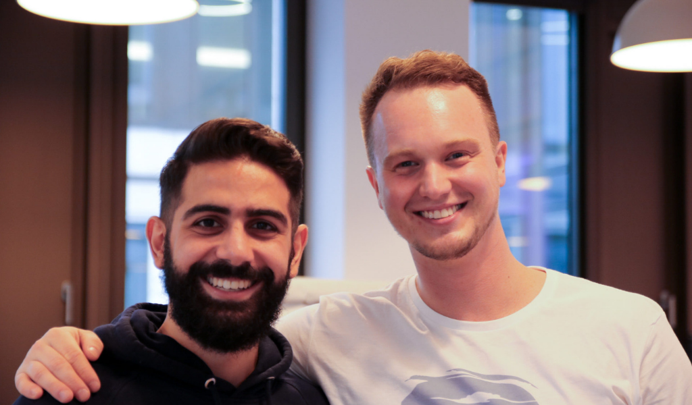
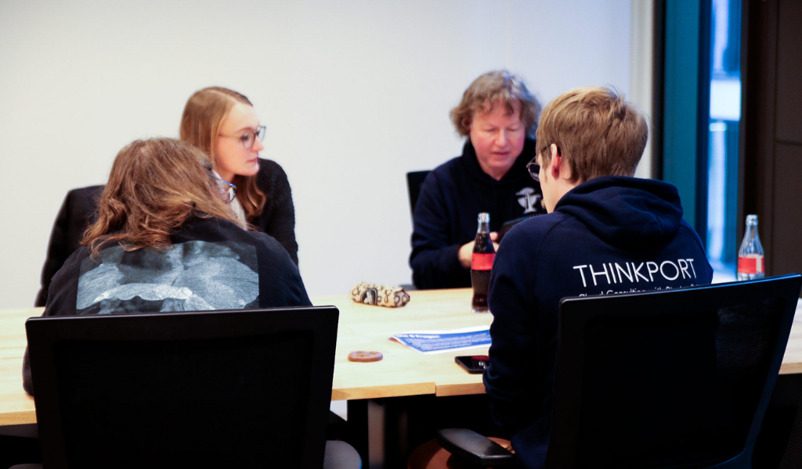
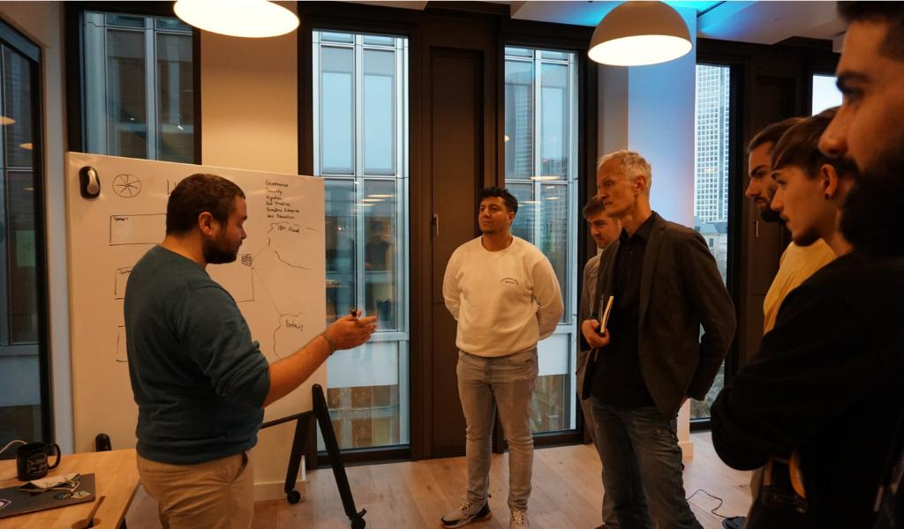
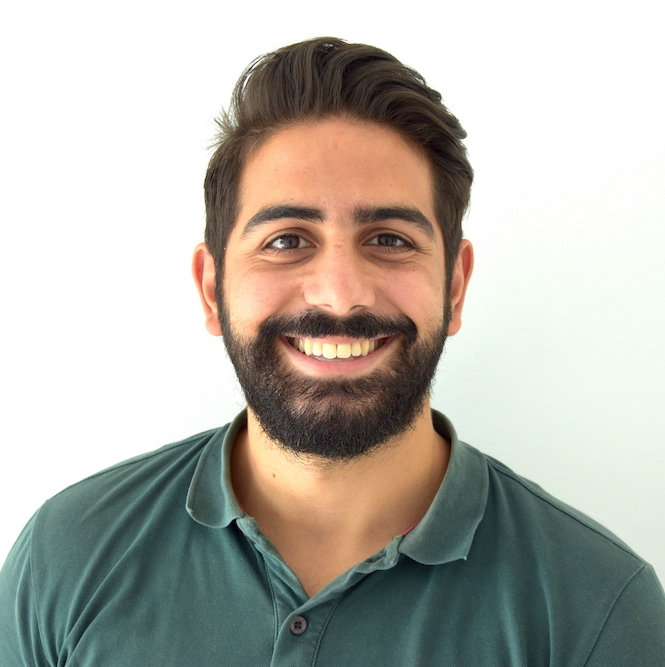
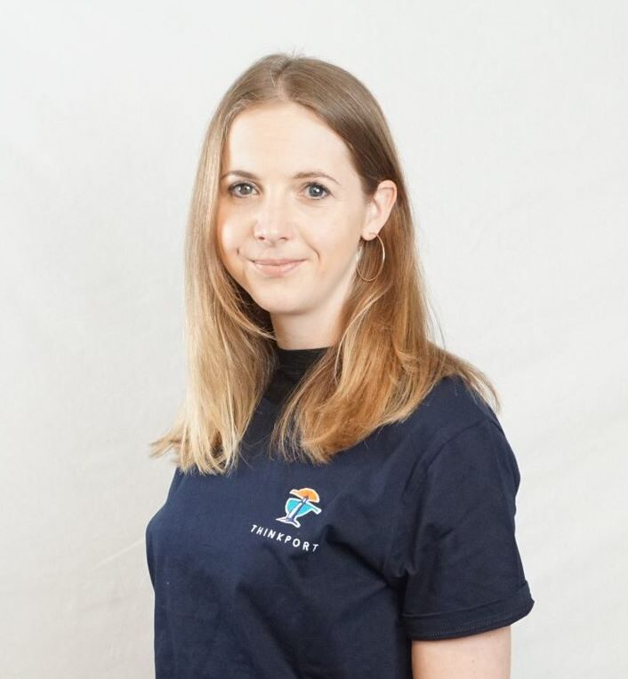

## Starte mit uns durch!

Ein Platz für Cloud Experten und die, die es werden wollen

[Alle Jobs hier!](https://thinkport-gmbh.jobs.personio.de/)

## [Thinkport unter den Top 3 der besten Arbeitgeber in Frankfurt am Main.

Das führende Portal zur Bewertung von Mitarbeiterzufriedenheit kununu hat Thinkport in der Kategorie Mittelstand als zweitbester Arbeitgeber der Finanzmetropole ausgewählt. Mehr dazu findest Du](https://news.kununu.com/beste-arbeitgeber-frankfurt/?utm_source=LinkedIn&utm_campaign=linkedin_blog&utm_medium=social) **[hier](https://thinkport.digital/kununu-2022/)** und bei **[kununu](https://www.kununu.com/de/thinkport1)**.

## Thinkport

[Linkedin](https://www.linkedin.com/company/11759873) [Instagram](https://www.instagram.com/thinkport/) [Youtube](https://www.youtube.com/channel/UCnke3WYRT6bxuMK2t4jw2qQ) [Envelope](mailto:tdrechsel@thinkport.digital)

Be part of the cloud evolution - Let's develop together!

Wir treiben Deutschlands Digitalisierung voran. Hierfür brauchen wir Deine Begeisterung und Unterstützung. Wir bieten Dir ein Umfeld, dass Kreativität, den Austausch von innovativen Ideen und die Zusammenarbeit zwischen unseren Teams fördert. Du bekommst Entwicklungsmöglichkeiten, die Dich inspirieren werden, mit den modernsten Technologien vielfältige Lösungen für unsere Kunden zu finden und umzusetzen.

Wir sind eine IT Beratung mit dem Fokus auf Cloud-Technologien, gegründet 2018 in Frankfurt am Main. Wir beraten und entwickeln Softwarelösungen für große Unternehmen und DAX Konzerne in der Amazon, Microsoft oder Google Cloud. Unser Fokus liegt dabei hauptsächlich auf der Architektur und Umsetzung. Power Point Folien werden also selten erstellt.

Aktuell sind unsere Teams in Frankfurt a. M, Leipzig, Hamburg und Berlin verteilt. Remote ist jedoch auch möglich und weitere Standorte sind in Planung.

[Die ganze Geschichte](https://thinkport.digital/thinkport-cloud-experten-uber-uns/)

## The Thinkport Code

Unser Ziel ist es schon immer eine Atmosphäre zu erzeugen in der wir alle gerne arbeiten und wachsen. Dabei orientieren wir uns an folgenden Werten:

Ready to improve

Wir handeln vorausschauend, um flexibel und lösungsorientiert auf Trends und Veränderungen zu reagieren.

Solve challenges efficiently

Wir verfolgen unsere Ziele durch eine effiziente und ergebnisorientierte Arbeitsweise und lassen uns von Problemen und Herausforderungen nicht ausbremsen.

Better together

Wir sind ein Team, welches sich durch eine gegenseitige Unterstützung auszeichnet und Wert auf den individuellen Beitrag aller Kolleg:innen legt.

Appreciation by enabling and celebration

Wir schaffen eine wertschätzende Atmosphäre, indem wir die Persönlichkeit, die Arbeit und die Erfolge unserer Kollegen und Kolleginnen bestärken und feiern.

Expertise through ongoing learning

Wir fördern unsere fachliche und vielfältige Kompetenz durch die stetige Weiterentwicklung unserer Mitarbeitenden. Sie geben ihr Fachwissen transparent aneinander weiter und bereichern unsere Projekte und Prozesse gemeinschaftlich.

## Unsere Benefits

## Gute Gründe sich bei uns zu bewerben

### Bahn Ticket

Nach einer individuellen Prognoseberechnungen unterstützen wir Deine Mobilität in Form einer Business BahnCard 25 oder 50.

### Tesla als Firmenwagen

Wir unterstützen Dich in Deiner Mobilität mit dem Firmenwagenleasing von Tesla mit einer Pauschale von 400€ im Monat.

### Jobrad

Du hast die Möglichkeit bei uns ein Dienstfahrrad zu leasen, bei dem wir Dich mit 50€ bei der monatlichen Rate unterstützen.

### Moderne Hardware

Wir stellen dir die neusten Betriebssysteme und damit verbundenen Geräte zur Verfügung. Darüber hinaus bieten wir Dir für Deine individuelle Ausstattung ein Hardware Budget von 250€ im Jahr.

### Remote Benefits

Flexibles Arbeiten von zuhause oder aus dem Office ist für uns selbstverständlich. Zusätzlich bieten wir unserem Remote Standort individuelle Benefits, wie ein CoWorking oder Home Office Paket.

### Coworking Space

In Leipzig, Hamburg und Berlin sind wir in Coworking Spaces, wie zum Beispiel, das WeWork ansässig. Dadurch bieten wir Dir zusätzliche Austauschmöglichkeiten und flexible Arbeitsweisen.

### Thinkport Academy & Budget

Deine fachliche Weiterentwicklung fördern wir mit einem Budget von 1000€ jährlich. Außerdem bieten wir regelmäßig interne Softskill Workshops an.

### Zertifizierungen

Zusätzlich zum Schulungsbudget unterstützen wir Dich dabei Zertifizierungen anzugehen, die Deine fachliche und persönliche Weiterentwicklung fordern und fördern.

### Personal Growth Meetings

Alle 3 Monate setzen wir uns mit Dir persönlich zusammen, um Deine Entwicklung und Ziele zu besprechen.

### Workation

Zu einem flexiblen Arbeitsumfeld gehört auch die Möglichkeit einer Workation. Diese ermöglichen wir Dir unter bestimmten Voraussetzungen.

### WellPass Egym Firmenfitness

Für eine Selbstbeteiligung von 20€ stellen wir Dir die Möglichkeit, am Firmenfitness-Programm von EGYM Wellpass teilnehmen, zur Verfügung. So hast Du Zugang zu 4500 Fitness- & Yogastudios, Schwimmbädern sowie Crossfit- & Boulderhallen.

### Teamevents

Ob mit Deinem Circle, mit Deinem Standort oder übergreifend mit dem ganzen Unternehmen, regelmäßige Teamevents, wie Kochkurse, Spieleabende und Skifahren gehören fest zu unserer Kultur.

## Bewirb dich jetzt!

### Cloud Architect

Für erfahrene Cloud Experten mit meheren Jahren Berufserfahrung und Zertifizierung

[Mehr erfahren](https://thinkport-gmbh.jobs.personio.de/job/1406943?language=de&display=de)

### Senior Cloud Engineer

Für Berufserfahrene mit vorzugsweise Hintergrund zu Beratung oder Entwicklung

[Mehr erfahren](https://thinkport-gmbh.jobs.personio.de/job/1401942?language=de&display=de)

Geschlecht, Herkunft und Religion egal, Hauptsache Du passt zu uns!

[Alle Jobs hier! ](https://thinkport-gmbh.jobs.personio.de/)"Das Beste ist der umfangreiche Einsatz neuester Technologien, die Möglichkeit mit großen Unternehmen zusammenzuarbeiten und echte Probleme zu lösen." Kristian NikolicCloud Architect

 „Together we work. Together we laugh. Together we grow." Gökhan YildirimSenior Cloud Engineer  "I really like to learn new things and to be challenged in my work, to evolve and not stay in the same state forever. Thinkport brings all of this together with an awesome team that supports me whenever I need." Alice ReznickovaCloud Engineer  "Bei Thinkport habe ich ein Umfeld gefunden, das mich Tag für Tag weiter fördert und fordert." Samir HamianiSenior Cloud Engineer  "Thinkport ist ein Team aus jungen und erfahrenen Talenten auf diversen Themengebieten. Es macht Spaß mit einem Team zusammenzuarbeiten, das stets offen für neue Ideen und Gedanken ist." Keith SchuijlenburgSenior Cloud Architect 

Voriger Nächster

## Einblicke in den Alltag

<iframe width="560" height="315" src="https://www.youtube-nocookie.com/embed/Mn29lZ0gvg8" title="YouTube video player" frameborder="0" allow="accelerometer; autoplay; clipboard-write; encrypted-media; gyroscope; picture-in-picture; web-share" allowfullscreen></iframe>

### Ein Tag bei Thinkport

Erlebe einen ganzen Arbeitstag im Leben eines Cloud Consultant mit Philipp

### Teamevent Graffiti

Mach mit uns die Wände unsicher beim Teamevent Graffiti sprayen in Frankfurt

<iframe width="560" height="315" src="https://www.youtube-nocookie.com/embed/srgd9bZdR4A" title="YouTube video player" frameborder="0" allow="accelerometer; autoplay; clipboard-write; encrypted-media; gyroscope; picture-in-picture; web-share" allowfullscreen></iframe>

<iframe width="560" height="315" src="https://www.youtube-nocookie.com/embed/I_DjzlNU3iQ" title="YouTube video player" frameborder="0" allow="accelerometer; autoplay; clipboard-write; encrypted-media; gyroscope; picture-in-picture; web-share" allowfullscreen></iframe>

### Deine Bewerbung

Wir zeigen dir Schritt für Schritt den Bewerbugsprozess damit du weißt was dich erwartet

<iframe width="240" height="190" src="https://www.youtube-nocookie.com/embed/Bv_3dAAHzMU" title="YouTube video player" frameborder="0" allow="accelerometer; autoplay; clipboard-write; encrypted-media; gyroscope; picture-in-picture; web-share" allowfullscreen></iframe>

<iframe width="240" height="190" src="https://www.youtube-nocookie.com/embed/d8j3x9L-5c0" title="YouTube video player" frameborder="0" allow="accelerometer; autoplay; clipboard-write; encrypted-media; gyroscope; picture-in-picture; web-share" allowfullscreen></iframe>

<iframe width="240" height="190" src="https://www.youtube-nocookie.com/embed/_7eFwES99QU" title="YouTube video player" frameborder="0" allow="accelerometer; autoplay; clipboard-write; encrypted-media; gyroscope; picture-in-picture; web-share" allowfullscreen></iframe>

<iframe width="240" height="190" src="https://www.youtube-nocookie.com/embed/545anf099-A" title="YouTube video player" frameborder="0" allow="accelerometer; autoplay; clipboard-write; encrypted-media; gyroscope; picture-in-picture; web-share" allowfullscreen></iframe>

[Mehr Videos](https://www.youtube.com/channel/UCnke3WYRT6bxuMK2t4jw2qQ/playlists)

<iframe width="240" height="190" src="https://www.youtube-nocookie.com/embed/H8NqpLibHvw" title="YouTube video player" frameborder="0" allow="accelerometer; autoplay; clipboard-write; encrypted-media; gyroscope; picture-in-picture; web-share" allowfullscreen></iframe>

<iframe width="240" height="190" src="https://www.youtube-nocookie.com/embed/zGe0H_lJWwk" title="YouTube video player" frameborder="0" allow="accelerometer; autoplay; clipboard-write; encrypted-media; gyroscope; picture-in-picture; web-share" allowfullscreen></iframe>

## Bring mit uns Deutschland in die Cloud!

Dann bist du bei uns genau richtig! Wir sind ständig auf der Suche nach neuen Talenten für unser Team. Kontaktiere uns unten und wir beantworten dir gerne alle Fragen über Thinkport und deinen zukünftigen Job.

[Alle Jobs](https://thinkport-gmbh.jobs.personio.de/)

Cloud-Beratung mit Start-Up Mentalität

## Deine Ansprechpartnerin

Sabrina Norrenbrock

Circle Lead - People & Culture

[snorrenbrock@thinkport.digital](mailto:jheidel@thinkport.digital)

+49 15111105017

* 
* 

## [Thinkport - Silicon Valley technologies for German enterprises](https://thinkport.digital/kontaktieren/)
