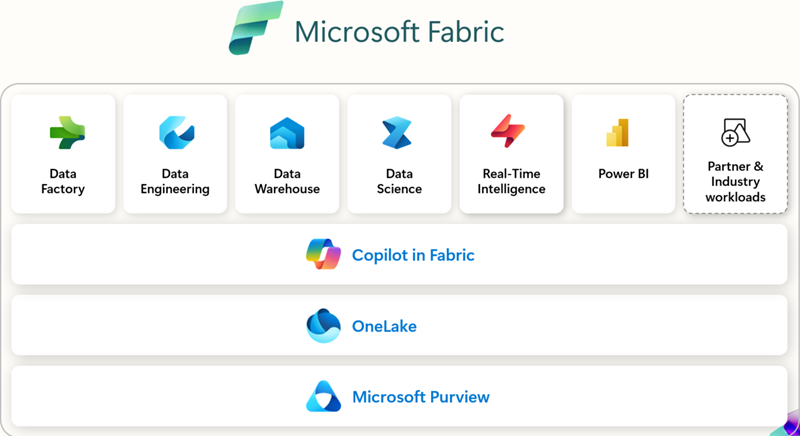

Werden Sie Experte mit dem

# Microsoft Fabric Training

## Auf einen Blick

* 2 Tage
* Individuell
* Technisches Training
* Remote und vor Ort verfügbar

Erweitern Sie Ihr Wissen mit unserem praxisnahen Microsoft Fabric Training und lernen Sie, wie Sie leistungsstarke Datenlösungen effizient umsetzen.

[Anfragen](#sec1) 

Unser Microsoft Fabric Training bietet Ihnen die ideale Grundlage, um das Potenzial von Microsoft Fabric für Ihr Unternehmen voll auszuschöpfen. In praxisorientierten Workshops lernen Sie, Datenintegration, -analyse und -visualisierung effizient zu nutzen. Von den Grundlagen bis hin zu fortgeschrittenen Anwendungen – unser Training hilft Ihnen, datengetriebene Entscheidungen zu treffen und komplexe Datenprojekte erfolgreich umzusetzen. Perfekt für Datenanalyst\*innen, IT-Fachleute und alle, die mehr aus ihren Daten herausholen möchten.

[Linkedin](https://www.linkedin.com/company/11759873) [Instagram](https://www.instagram.com/thinkport/) [Youtube](https://www.youtube.com/channel/UCnke3WYRT6bxuMK2t4jw2qQ) [Envelope](mailto:tdrechsel@thinkport.digital)

## Lernerfolge

Teilnehmer können nach Abschluss...

* Die grundlegenden Funktionen und Anwendungen von Microsoft Fabric, um datengetriebene Prozesse effizient gestalten
* Datenintegration, -analyse und -visualisierung erfolgreich in Ihrem Unternehmen anwenden
* Datenbasierte Entscheidungen treffen und Ihre Datenstrategie gezielt optimieren

## Zielgruppe

Der Kurs ist geeignet für...

* Datenanalyst\*innen und Data Engineers: Fachleute, die datengetriebene Lösungen entwickeln und optimieren möchten.
* Power-User und Data Professionals: Anwender\*innen, die regelmäßig mit Datenmodellen, Analysen und Dashboards arbeiten und ihre Effizienz steigern möchten.
* Grundlegendem Verständnis für TCP/IP Netzwerke und eventuell Erfahrung mit Java Virtual Machine (JVM)

## Aufbau

[Microsoft Fabric im Handumdrehen lernen](https://www.hashicorp.com/)

### Einführung und Grundlagen Tag I

* Komponenten und Architektur
* Erstellung und Automatisierung von Datenpipelines
* Data Warehousing & Echtzeit-Analysen:
* Erste Schritte mit Machine Learning-Modellen

### Vertiefung und Praxis Tag II

* Entwicklung interaktiver Dashboards
* Fortgeschrittene Datenmodellierung
* Sicherheit & Governance
* Workflow-Automatisierung

## Erfolge

Nach dem Training können Sie Microsoft Fabric gezielt einsetzen, Daten analysieren und visualisieren sowie datengetriebene Prozesse optimieren.

## Kontakt

Erfahren Sie mehr zu diesem Training in einem persönlichen Gespräch

Sie setzen mit uns individuelle Schwerpunkte und erhalten ein zugeschnittenes Angebot für Ihre Anforderungen 24h nach dem Termin

Termin vereinbaren Was ist Microsoft Fabric?

Microsoft Fabric ist eine umfassende Datenplattform, die Datenintegration, -analyse, -modellierung und -visualisierung in einer einzigen Umgebung vereint. Sie ermöglicht es Unternehmen, datengetriebene Entscheidungen effizient und sicher zu treffen, indem sie verschiedene Tools wie Power BI, Data Engineering und Machine Learning nahtlos integriert.

Wie läuft die Schulung ab?

Das Training ist praxisorientiert und in zwei Tage gegliedert. Jeder Tag kombiniert kurze Theorieeinheiten mit praktischen Übungen, durchgeführt mir Beratern der Thinkport GmbH.  Sie lernen nicht nur die Grundlagen, sondern wenden das Gelernte sofort an, z. B. durch den Aufbau von Datenpipelines oder die Entwicklung von Dashboards. Zudem gibt es genug Raum für Fragen und individuelle Themen.

Warum das Training von Thinkport ?

Unser Präsenztraining bietet Ihnen direkte Interaktion mit erfahrenen Trainer:_innen_. Sie profitieren von sofortigem Feedback, persönlicher Unterstützung und einem intensiveren Austausch – etwas, das bei reinen Online-Kursen oft fehlt. Außerdem legen wir großen Wert auf praxisnahe Übungen, die sich direkt auf Ihre täglichen Herausforderungen anwenden lassen. Der Inhalt kann im Vorgespräch auf die Teilnehmenden und den jeweiligen Wissensstand individuell  angepasst werden.

## Weitere Trainings
