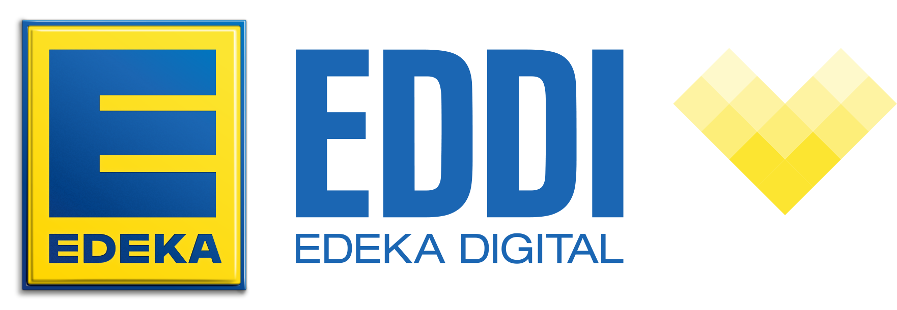
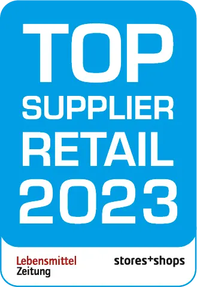
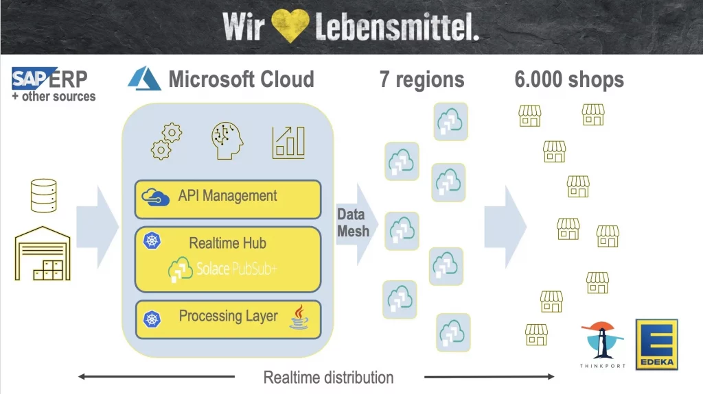

## Thinkport awarded

“Top Supplier Retail 2023”  
for EDEKA DIGITAL  
Event Streaming Project

\+ 0 Shops + 0 mio Events per day 0 % Faster Integration

At a festive event in Düsseldorf on February 27, 2023, renowned Lebensmittel Zeitung and EHI Retail Institute presented the Reta Award 2023 to EDEKA DIGITAL - and the Top Supplier Retail Award to Thinkport. In the laudatory speech, **[EDEKA DIGITAL](https://digital.edeka/projekte/)** was honored for the Best Connected Retail Solution: "EDEKA DIGITAL and its cloud consultant Thinkport have implemented an outstanding technology-based solution on a high degree of innovation and strong impact on strategic and financial benefits."

## [The customer](https://www.fairside.capital/)

Edeka

EDEKA is the largest German food retailer. The group's market share grew up to 26 % at last count. As the IT subsidiary of EDEKA headquarters, EDEKA DIGITAL GmbH, or EDDI for short, takes on the task of dovetailing the business processes of the medium-sized and cooperative EDEKA group through the successful interaction of three levels (independent retail, regional wholesale and EDEKA headquarters). With more than 600 employees at the locations Hamburg, Mannheim, Berlin and Cluj (Romania), the EDDI team combines profound IT competence and comprehensive retail knowledge. Thus, EDDI not only proactively shapes and develops the digital transformation of the EDEKA group, but is also a significant factor for further growth and success in the retail industry.

EDEKA is one of the largest retailers in Germany and has a strong customer-centric business. It wants to enable cutting-edge technologies to meet the expectation of modern-day shop staff and customers.

6, 000 shops are the interface to those customers, hence it is crucial that the centralized IT infrastructure is able to adapt to those modern needs in a distributed manner.

As per 2020, most processes in the ERP management systems are batch driven. Data is encapsulated and not accessible in real time. Plugging in new use-cases is time consuming and blocks development of innovative products using legacy systems. Speeding up time-to-market is crucial to help innovative use-cases develop at scale.

To enable innovative use-cases, it is necessary to break up those silos and open them up to real-time processes. Master data like sales prices should be provided to all processes and apps as soon as a change is populated in the core systems in a fast, reliable and secure manner.

## [Business Challenge](https://www.fairside.capital/)

"Open them up  
to real-time processes."

## Business Solution and enabling technology

Whether performance, cost savings or scaling.

We offer pragmatic solutions for the individual project focus of each of our customers. [Contact experts](https://thinkport.digital/kontaktieren)

### Cloud technology

EDEKA DIGITAL decided to enable access to real-time changes in ERP systems to an instore mobile app solution used by EDEKA employees using an event streaming architecture to access changes to master data in real time.

As the decision was to use cloud technologies, Thinkport became the leading cloud consultant of choice to implement this innovative architecture using **[Solace Pub Sub+](https://solace.com/)** hosted on Microsoft Azure.

### Unified format

Master data is collected and aggregated over several source systems and merged to a unified format and populated to a stream of data that indicates changes in the underlying domain objects. For instance, sales product details from an ERP system are merged with pictures from a PIM system and changes are provided to several target projects like the named instore management app or different online shop solutions.

### New view

The technology does not only enable real-time access. It also provides a new view on distributed data in the EDEKA organization and was used as a motivator to host new projects using the standardized access to the data streams.

## [Benefits](https://www.fairside.capital/)

"Time to market of new digital products is massively reduced."

As data is distributed from multiple sources standardized or aggregated to any new project interested in this data, time to market of new digital products and processes is massively reduced.

New use-cases can be integrated in less than six weeks as it was proven with the integration of the Picnic system. With the old integration technologies, it was estimated to take over six months. This is a reduction of 75%.

Same figures were shown with other use-cases that integrated to the data mesh.

It was also shown that a merge from monolithic SAP Retail systems to lightweight frameworks - that are manageable by small teams and are fitting in large scale retail companies like EDEKA – is possible using the right mindset and technologies:

Providing data changes for several hundred thousend products per store creates a gigabit scale of data flow containing 90 million events per day.

## Results with vision

Our experts work on innovative solutions to make German companies fit for the future.

<iframe width="560" height="530" src="https://www.youtube-nocookie.com/embed/MwnDL1ICDGU" title="YouTube video player" frameborder="0" allow="accelerometer; autoplay; clipboard-write; encrypted-media; gyroscope; picture-in-picture; web-share" allowfullscreen></iframe>

Cloud-Consulting with Start-Up Spirit

## Your Contact

Tobias Drechsel

CEO & Senior Cloud Consultant

tdrechsel@thinkport.digital

+49 151 63417156

* 

### [More Success Stories](https://thinkport.digital/cloud-excellence-workshops)

## [Thinkport - Silicon Valley technologies for German enterprises](https://thinkport.digital/kontaktieren/)
