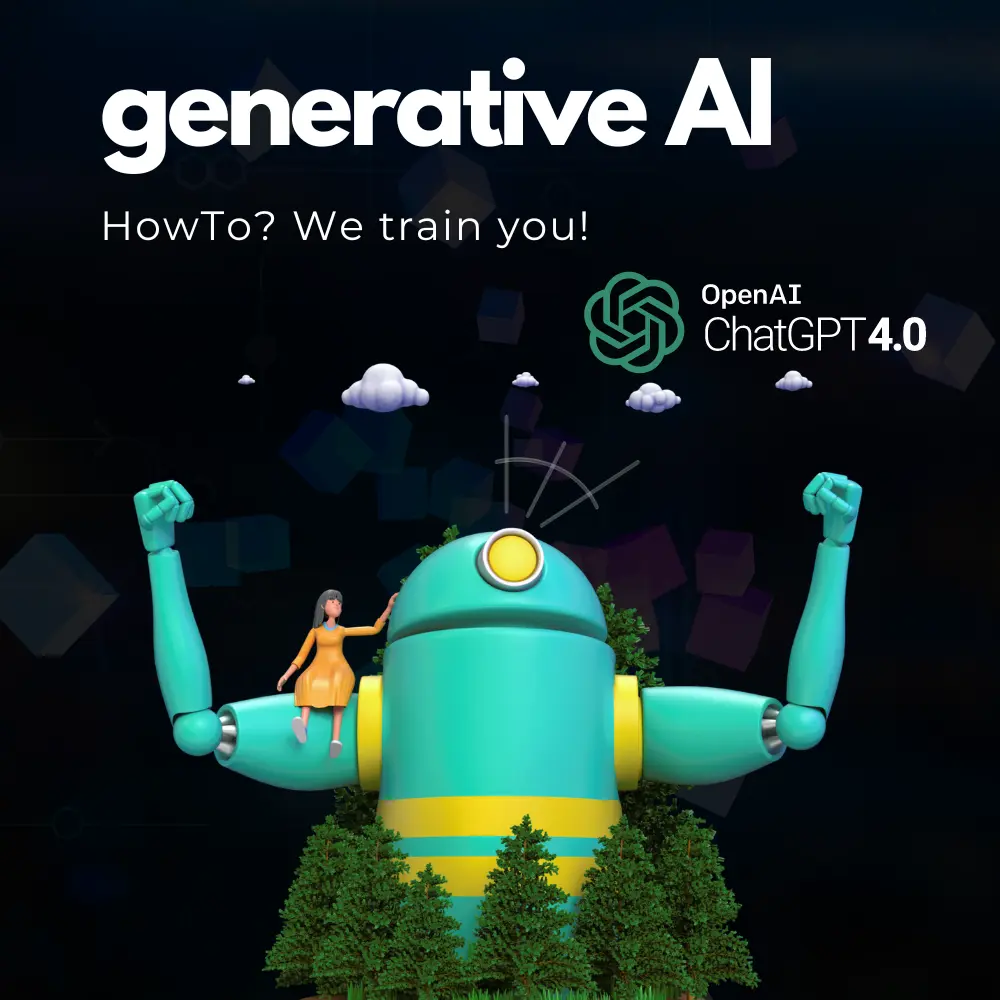
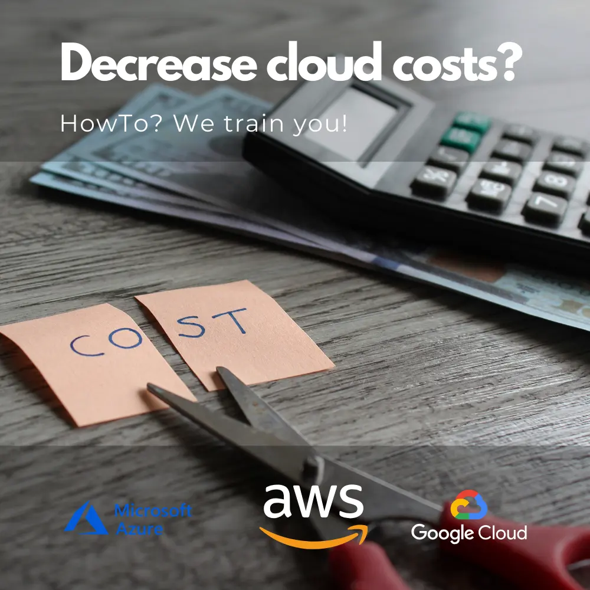
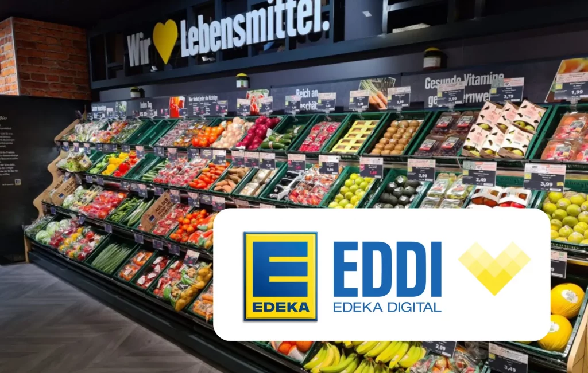
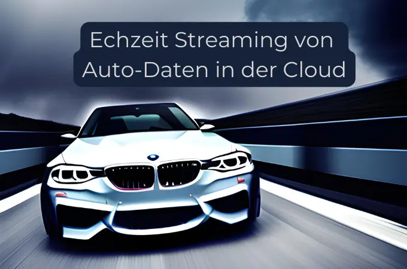
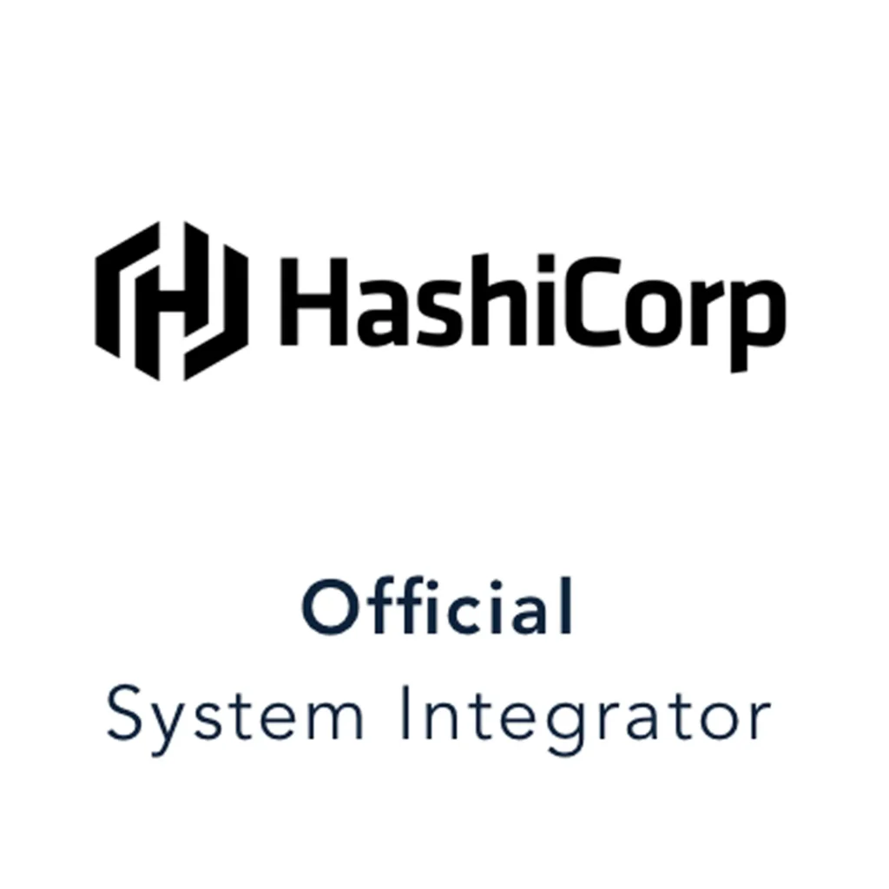
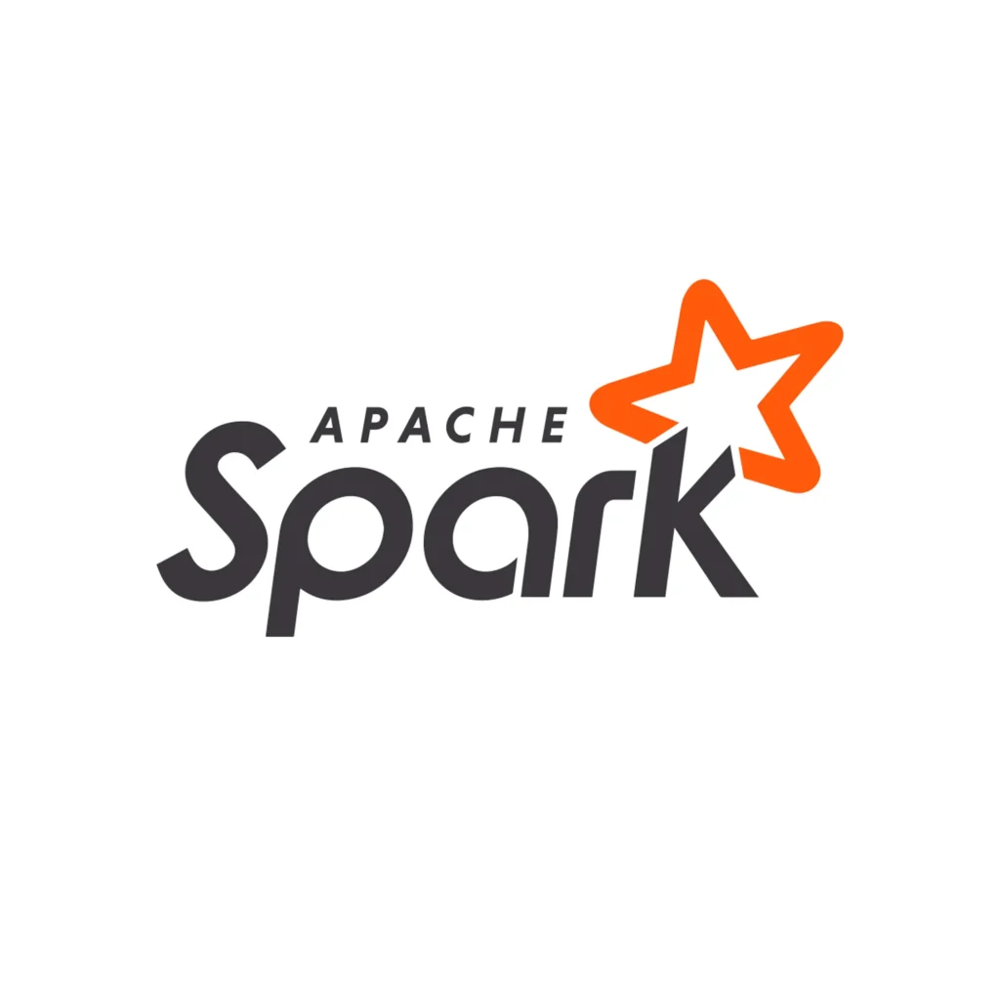
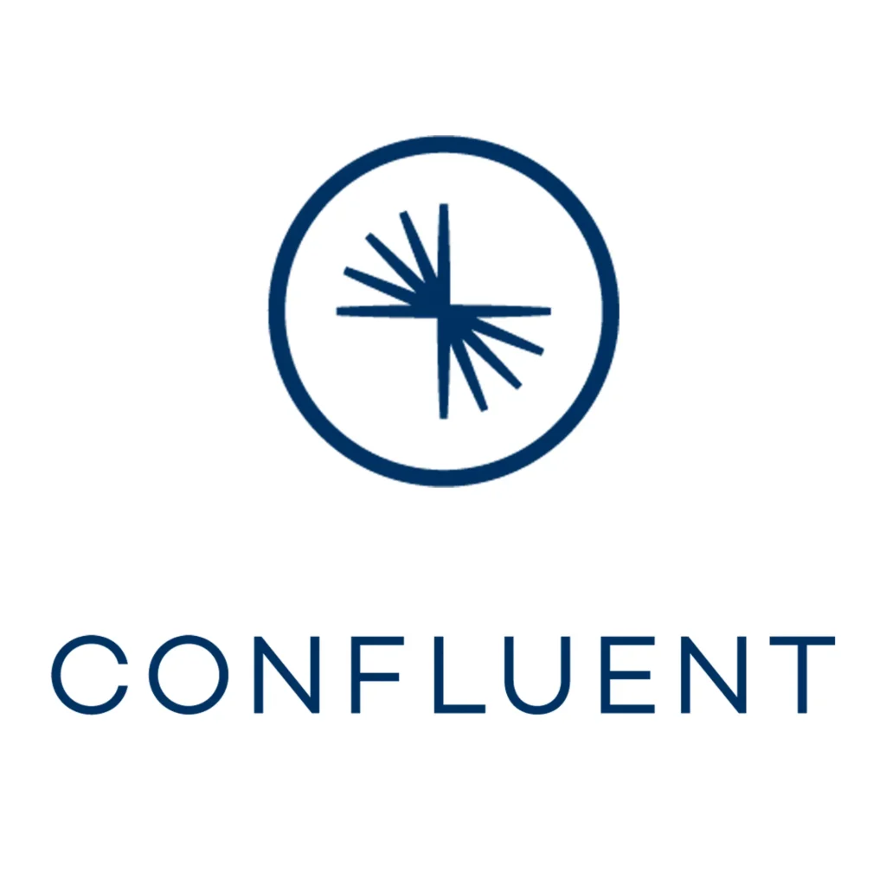
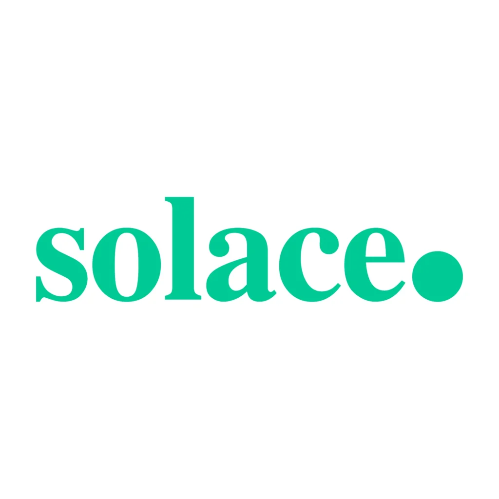
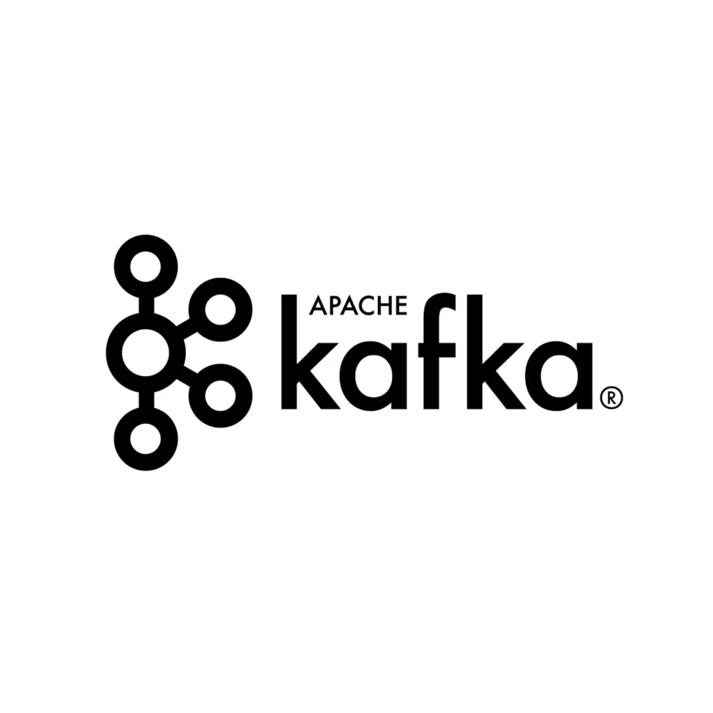
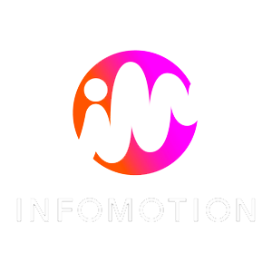

## Thinkport | Cloud Consulting

# Retail - Handel

Retail neu gedacht: Maßgeschneiderte Strategien für Ihren Erfolg

# Über uns

#### Unsere Vision?

Im Innovation Hub setzen wir auf effiziente und maßgeschneiderte Lösungen, die direkt bei unseren Kunden Mehrwert generieren​

#### Unsere Mission?

Gemeinsam mit Ihnen entwickeln wir Cloud-Strategien, die flexibel auf Ihre bestehende Infrastruktur aufbauen und Ihre Herausforderungen gezielt adressieren. In unseren praxisorientierten Strategie-Workshops gehen wir individuell auf Ihre Ziele und Anforderungen ein – von der Analyse Ihrer Datenstrukturen bis zur Skalierung Ihrer Cloud-Lösungen.​

#### Unsere Beratungsphilosophie?

Wir identifizieren gemeinsam bestehende Challenges und entwickeln skalierbare Lösungen, die sowohl den heutigen Anforderungen als auch den zukünftigen Zielen unserer Kunden gerecht werden.

 

Unser digitaler InnovationHub mit seinem Hauptsitz in Frankfurt am Main ermöglicht den Freiraum mit Hilfe von agilen Methoden innerhalb kürzester Zeit kreative Denkprozesse zu ermöglichen und alte Projekte zu re-evaluieren oder auch komplett neue Konzepte, Ideen oder Architekturen zu erschaffen. 

Wir wollen mit diversen Events, Workshops, Hackathons oder Meetups das Wissen und die Erfahrung von ihren Mitarbeiter und auch unseren Mitarbeiter in einer sich sehr schnell verändernden digitalen Welt jeden Tag einen Schritt weiter voranbringen. 

"Innovation in der Cloud bringt ihr Unternehmen voran, indem sie agile Skalierbarkeit, flexible und skalierbare Ressourcennutzung und nahtlose Zusammenarbeit ermöglicht. Durch innovative Anwendungen, rechenstarke Datenanalyse und optimierte Geschäfts-Prozesse gewinnt ihr Unternehmen Wettbewerbsvorteile und schafft eine nahtlose Customerjourney – in einer vernetzten Welt, die ständige Weiterentwicklung erfordert."

_Dominik Fries - CTO Thinkport GmbH_

## Innovation-Workshops

### ChatGPT Anwendung für Unternehmen

Es ermöglicht automatisierte und skalierbare Kundeninteraktionen über Chatbots, was die Kundenzufriedenheit steigert und Supportkosten senkt. Unternehmen können effizienter Texte, wie Produktbeschreibungen, Berichte und Marketinginhalte erzeugen. Die Technologie erleichtert auch die Mehrsprachigkeit, da sie Übersetzungen und Content-Anpassungen ermöglicht. Darüber hinaus unterstützt ChatGPT die Entscheidungsfindung, indem es auf große Datenmengen zugreift und Einblicke generiert. Insgesamt verbessert ChatGPT die operative Effizienz, erhöht die Wettbewerbsfähigkeit und fördert Innovation in einer digitalen Geschäftswelt. Unsere Trainer zeigen Ihnen wie Sie mit den neuesten AI Anwendungen der Konkurrenz einen Schritt voraus sind. Buchen Sie noch heute unseren Workshop

[Mehr Infos](https://thinkport.digital/chatgpt-workshop/) 

### Kostenoptimierung in der Cloud?

Entdecken Sie unser erstklassiges Training zur Kostenreduzierung im Cloud-Umfeld! Erfahren Sie, wie Sie Ihre Cloud-Ressourcen optimal verwalten, unnötige Ausgaben eliminieren und Ihre Betriebskosten drastisch senken können. Unsere praxisorientierten Kurse bieten Ihnen bewährte Strategien und Best Practices, um Ihre Cloud-Nutzung effizienter und budgetfreundlicher zu gestalten. Steigern Sie die Rentabilität Ihres Unternehmens und maximieren Sie Ihr ROI in der Cloud. Melden Sie sich noch heute an und starten Sie den Weg zur Kosteneinsparung und Effizienzsteigerung in der Cloud!"

[Mehr Infos](https://thinkport.digital/kostenoptimierung/) [Mehr Workshops](https://thinkport.digital/quantum-cloud-workshops/)

## Innovation News

## Unsere Success Stories

<figure>

<figcaption>

Thinkport awarded “Top Supplier Retail 2023” for EDEKA DIGITAL Event Streaming Project

</figcaption>

</figure>

<figure>

<figcaption>

Echzeit Streaming von Auto-Daten in der Cloud

</figcaption>

</figure>

<figure>

<figcaption>

Bildanalyse in der Cloud für Bayer

</figcaption>

</figure>

<figure>

<figcaption>

API für einen 360° Kunden-Dialog der Deutschen Telekom

</figcaption>

</figure>

## Unsere Partner für Cloud Technologien

 

## Unsere Innovationspartner

 

## Philipp Höllthaler

**Innovation Manager**

##### Email:

[innovation@thinkport.digital](mailto:phoellthaler@thinkport.digital)

