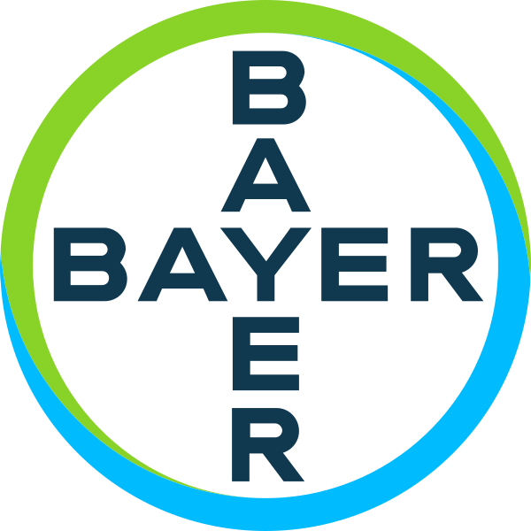

# Bildanalyse für Bayer AG - Machine Learning Pipeline in der Cloud

0 Labore 0 k+ Bilder 0 x Schnellere Ergebnisse

[Das Projekt wurde ausgezeichnet mit dem **Digital Leader Award 2021** in der Kategorie **Efficiency**](https://www.fairside.capital/)

## [Der Kunde](https://www.fairside.capital/)

Bayer AG

Die Bayer AG ist ein deutsches multinationales Pharma- und Life-Science-Unternehmen und eines der größten Pharmaunternehmen der Welt. Zu den Geschäftsfeldern von Bayer mit Hauptsitz in Leverkusen gehören Human- und Tierarzneimittel, Produkte für die  Gesundheitsvorsorge von Verbrauchern, Agrarchemikalien, Saatgut und biotechnologische Produkte. Das Geschäft wird über die drei Divisionen Pharmaceuticals,  Consumer Health und Crop Science geführt.  

Die Division Crop Science ist Hersteller von Pflanzenschutzmitteln. Gegliedert ist Crop Science in die zwei Geschäftsfelder Crop Protection/Seeds und Environmental Science. Ersteres umfasst die Geschäftsfelder Herbicides, Fungicides, Insecticides und SeedGrowth. 

Unter diesem Motto forscht Bayer - Crop Science aktuell nach neuen Wirkungsbereichen zum Pflanzenschutz. Bisher hat die Suche der Wissenschaftler nach hochwirksamen und gleichermaßen umweltverträglichen Mitteln jedoch der sprichwörtlichen Suche nach der Nadel im Heuhaufen geglichen, so die Verantwortlichen von Bayer. Riesige Wirkstoffbibliotheken, mit über 40.000 Einträgen, mussten mithilfe unzähliger Experimente an einer Vielzahl von Gewächsen getestet werden. 

Auf Grundlage dessen wurden das Projekt SIMPL (Small Molecules Imaging Plattform) gestartet. 

Die Bayer AG hat, gemeinsam mit der Thinkport GmbH und Leadvise Reply GmbH , erfolgreich den gesamte Prozess rund um Analyse und Tests von Wirkstoffen komplett neugestaltet und mit Hilfe der Cloud digitalisiert.

## [Das Projekt](https://www.fairside.capital/)

Health for all, hunger for none

## [Bekannt aus den Medien](https://www.fairside.capital/)

  

## Konzepte

Ob Performance, Kosteneinsparung oder Skalierung. 

Wir bieten pragmatische Lösungen für den individuellen Projektfokus jedes unserer Kunden.

[Experten Kontaktieren](https://thinkport.digital/kontaktieren)

### Bildanalyse

Mithilfe der von Thinkport mitentwickelten SIMPL Plattform, können Machine-Learning-Modelle automatisiert Pilze analysieren. So ist es möglich, viel schneller und vor allem mehr Wirkstoffe zu testen und so präzisere Aussagen zu den Erfolgsaussichten im gesamten Forschungsprozess zu treffen.

### Hybrid Cloud

Die ganze Architektur von SIMPL ist Cloud agnostisch und kann somit auch im eigenen Rechenzentrum betrieben werden. Alle entscheidenen Komponenten sind in Docker Container in Kubernetes deployed. Dies verringert die Abhängigkeiten zu Vendoren und Technologien.

### Data Science

Modelle unterstützen dabei verschiedenste Bilder automatische zu analysieren und neue Kenntnisse zu gewinnen. Thinkport unterstützt mit Cloud Technologien dabei die internen Data Science Teams zu enablen. Diese können neue Modelle einfach in neue Experimente integrieren und Ergebnisse erzeugen.

Mithilfe der AWS Cloud konnten von Anfang an schnelle Entwicklungsergebnisse erzielt werden. Das Projekt wurde iterativ mit einem kleinen PoC gestartet. Die Fortschritte waren so überzeugend, dass schnell mehr Ressourcen für das Projekt bereitgestellt wurden.

Ein Entscheidende Faktor war dabei der Verwendung von vielen bestehenden internen Plattformen und Open Source Software. Dies ermöglichte einen klaren Fokus auf den Mehrwert der Plattform.

## Herausragende

Technologien

## Entwicklungsgeschwindigkeit mit AWS

## Ergebnisse mit Weitsicht

Unsere Experten arbeiten an innovativen Lösungen, um deutsche Unternehmen fit für die Zukunft zu machen.

### Schnellere R&D Prozesse

Die Zeit vom Experiment bis zur Ergebnisvisualisierung könnte teilweise von drei Wochen auf eine Woche verkürzt werden. Darüber hinaus ließen sich manuelle und brüchige digitale Prozesse von sechs auf zwei Schritte reduzieren.

### Nutzung interner Strukturen

Der Wechsel von lokalen, geschlossenen Systemen hin zu einer flexiblen Cloud-Plattform erlaubt eine effizientere cross-funktionale Kollaboration, was auch weitere Einsatzszenarien beflügelt. So können auch andere Bereiche bei Bayer die Plattform nutzen, denn Daten jeder Pflanze können automatisch erfasst, bewertet und dokumentiert werden.

### Innovation in der Forschung

Die übliche Herangehensweise an die Forschung ist komplex, viele der Prozesse sind manuell und damit zeitaufwendig, die Zusammenarbeit für Mitarbeiter über Zeitzonen hinweg und die Pandemie sind weitere Hürden. Mit SIMPL werden wirksamere Pflanzenschutzprodukte effizienter, schneller und ökologischer entwickelt und die Forschung für einen zukunftssicheren Pflanzenschutz ermöglicht.

## Cloud-Beratung mit Start-Up Mentalität

## Ihr Ansprechpartner

Tobias Drechsel

CEO & Senior Cloud Consultant

tdrechsel@thinkport.digital

- 

## [Weitere Success Stories](https://thinkport.digital/cloud-excellence-workshops)

+49 151 63417156

## [Thinkport - Silicon Valley technologies for German enterprises](https://thinkport.digital/kontaktieren/)
