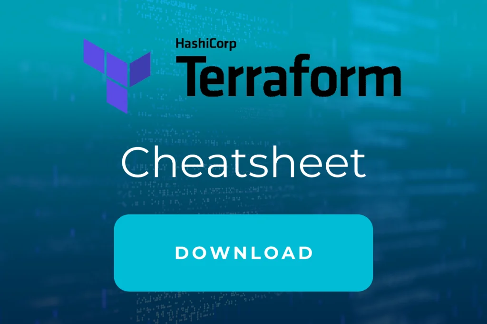

 

Werden Sie Experte durch unser

# Terraform für Azure Training

## Auf einen Blick

* 3 Tage
* Monatlich und Individuell
* Technisches Training
* Remote und Vorort verfügbar

Lernen Sie im Terraform (3.0 Update) [Azure](https://thinkport.digital/was-ist-azure/)\- Training, hands-on ganze Infrastrukturen mit IaC im Handumdrehen bereitzustellen. Profitieren Sie von Projekterfahrung unserer Experten und Cloud-Architekten mit Erfahrung direkt aus der Industrie.

[Anfragen](#sec1)

Dem Zeitgeist entsprechend, setzen zunehmend viele Unternehmen auf Infrastructure as a Service (IaaS) Lösungen, um Arbeitsumgebungen oder gar ganze IT Systeme umzusetzen. Mithilfe von Terraform, dem von HashiCorp entwickelten Infrastructure as Code (IaC) Tool, lassen sich Cloud Infrastrukturen automatisch bereitstellen. In Thinkports praxisorientiertem Terraform [Azure](https://thinkport.digital/was-ist-azure/)\- Training erfahren Sie, was es mit diesem IaC-Tool auf sich hat und lernen damit hands-on Infrastrukturen in Azure aufzusetzen.

[Linkedin](https://www.linkedin.com/company/11759873) [Instagram](https://www.instagram.com/thinkport/) [Youtube](https://www.youtube.com/channel/UCnke3WYRT6bxuMK2t4jw2qQ) [Envelope](mailto:tdrechsel@thinkport.digital)

## Termine

26.06. - 28.06.24 Terraform Azure Training  

26.07 - 28.07.24 Terraform Azure Training

08.08. - 10.08.24 Terraform Azure Training

\* individuelle Termine möglich

## Preis

2.200 € zzgl. MwSt.  

## Lernerfolge

Teilnehmer können nach Abschluss..

* Ganze Architekturen mit Terraform aufsetzen
* Skalierbare und sichere Azure Architekturen definieren
* Workflows über eine CI/CD-Pipeline anhand von Azure DevOps automatisieren (optional)

## Zielgruppe

Der Kurs ist geeignet für Personen mit...

* Grundlegendem Verständnis in den Bereichen Azure Cloud und Systemadministration
* Mittleren Scripting Kenntnissen
* Interesse, Infrastructure as Code zu lernen

## Aufbau

[Terraform für](https://www.hashicorp.com/) **[Azure](https://thinkport.digital/was-ist-azure/)**\- im Handumdrehen lernen

### Grundlagen Tag I

* Installation und Einführung in Terraform
* Kennenlernen von wichtigen Befehlen, Variablen und Outputs
* Erstellen von Terraform Modulen
* Lab: Planung einer ersten Azure Architektur mit Terraform

### Azure Infrastruktur Tag II

* Kennenlernen von wichtigen Azure Services wie VM, Azure AD, Subnets, Gateways und mehr
* Lab: Entwicklung von Azure Architekturen mit Terraform

### DevOps Tag III

* Einführung in Azure DevOps und Erstellen einer Pipeline
* Lab: Deployment einer einfachen REST API (in Python) mit Terraform, Azure DevOps, Docker und weiteren Azure Technologien
* Dieser Teil des Kurses ist optional

* Installation und Einführung in Terraform
* Kennenlernen von wichtigen Befehlen, Variablen und Outputs
* Erstellen von Terraform Modulen
* Lab: Planung einer ersten Azure Architektur mit Terraform

* Kennenlernen von wichtigen Azure Services wie VM, Azure AD, Subnets, Gateways und mehr
* Lab: Entwicklung von Azure Architekturen mit Terraform

* Einführung in Azure DevOps und Erstellen einer Pipeline
* Lab: Deployment einer einfachen REST API (in Python) mit Terraform, Azure DevOps, Docker und weiteren Azure Technologien
* Dieser Teil des Kurses ist optional

## Erfolge

Die Lerninhalte des Terraform [Azure](https://thinkport.digital/was-ist-azure/)\- Trainings werden von unseren Experten spannend und eingänglich vermittelt. Von zertifizierten Cloud Profis lernen Sie Architekturen mit Terraform aufzusetzen.

## Unterstützung

Wir haben die von unseren Entwicklern am häufigsten verwendeten Befehle in einem Cheatsheet zusammengefasst, das während der Schulung und nach deren Abschluss verwendet werden kann. Wenn Sie sich damit vertraut machen wollen, können Sie es hier herunterladen.

## Kontakt

Erfahren Sie mehr zu diesem Training in einem persönlichen Gespräch

Sie setzen mit uns individuelle Schwerpunkte und erhalten ein zugeschnittenes Angebot für Ihre Anforderungen 24h nach dem Termin

 Termin vereinbaren

## FAQs

Hier finden Sie eine kurze Zusammenstellung von oft gestellten Fragen und den dazugehörigen Antworten.

Was ist Terraform?

Terraform ist ein Open-Source-Werkzeug zur Infrastruktur-as-Code-Verwaltung. Es ermöglicht es Benutzern, Cloud-Infrastruktur und andere Systeme mithilfe von Code zu definieren und zu verwalten. Mit Terraform können Benutzer Ressourcen wie virtuelle Maschinen, Netzwerke und Speicher in der Cloud erstellen und verwalten, indem sie Code schreiben, anstatt manuell über die Benutzeroberfläche der Cloud-Plattform zu navigieren.

Was verwendet Terraform und wofür?

Terraform verwendet eine eigene HashiCorp Configuration Language (HCL), um Ressourcen zu definieren, die erstellt, geändert oder gelöscht werden sollen. Benutzer können Code schreiben, um Ressourcen in verschiedenen Cloud-Plattformen und anderen Systemen zu erstellen und zu verwalten, und dann Terraform ausführen, um die Ressourcen entsprechend zu erstellen oder zu verwalten. Terraform wird oft in DevOps-Workflows verwendet, um die Bereitstellung und Verwaltung von Infrastruktur zu automatisieren und zu vereinfachen.

Was sind Terraform Provider?

Terraform Provider sind Plugins, die Terraform ermöglichen, mit verschiedenen Systemen zu interagieren und Ressourcen in diesen Systemen zu erstellen, ändern oder löschen. Jeder Provider unterstützt eine bestimmte Art von System oder eine bestimmte Cloud-Plattform und bietet eine Reihe von Ressourcen und Operationen, die von Terraform aufgerufen werden können.

Wozu benötigt man Terraform mit Azure?

Terraform kann verwendet werden, um Ressourcen in Microsoft Azure zu erstellen und zu verwalten. Azure ist eine Cloud-Plattform, die von Unternehmen genutzt werden kann, um Anwendungen und Workloads in der Cloud auszuführen. Mit Terraform können Benutzer Code schreiben, um Ressourcen wie virtuelle Maschinen, Netzwerke, Datenbanken und Speicher in Azure zu erstellen und zu verwalten, anstatt manuell über die Benutzeroberfläche von Azure zu navigieren.

## Weitere Trainings
