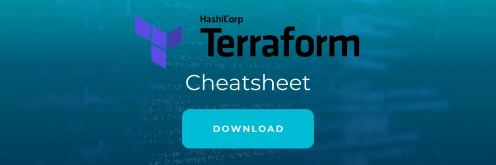
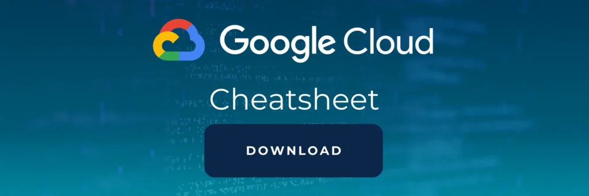

Werden Sie Experte mit dem

# Terraform für Google Cloud Training

## Auf einen Blick

* 3 Tage
* Monatlich und Individuell
* Technisches Training
* Remote und vor Ort verfügbar

Lernen Sie mit diesem Terraform GCP (Google Cloud Platform) Training hands-on ganze Infrastrukturen mit IaC im Handumdrehen bereitzustellen. Profitieren Sie von Projekterfahrung unserer Experten und Cloud-Architekten mit Erfahrung direkt aus der Industrie.

[Anfragen](#sec1)

Dem Zeitgeist entsprechend setzen zunehmend viele Unternehmen auf Infrastructure as a Service (IaaS) Lösungen, um Arbeitsumgebungen oder gar ganze IT Systeme umzusetzen. Mithilfe von Terraform, dem von HashiCorp entwickelten Infrastructure as Code (IaC) Tool, lassen sich Cloud Infrastrukturen automatisch bereitstellen. In Thinkports praxisorientiertem Terraform Google Cloud Training erfahren Sie, was es mit diesem IaC-Tool auf sich hat und lernen, damit hands-on Infrastrukturen in Google Cloud aufzusetzen.

[Linkedin](https://www.linkedin.com/company/11759873) [Instagram](https://www.instagram.com/thinkport/) [Youtube](https://www.youtube.com/channel/UCnke3WYRT6bxuMK2t4jw2qQ) [Envelope](mailto:tdrechsel@thinkport.digital)

## Termine

04.06. - 06.06.24 Terraform für GCP Training

16.07. - 18.07.24 Terraform für GCP Training

26.08. - 28.08.24 Terraform für GCP Training

\* individuelle Termine möglich

## Preis

2.200 € zzgl. MwSt.

## Lernerfolge

Teilnehmer können nach Abschluss...

* Ganze Architekturen mit Terraform aufsetzen
* Skalierbare und sichere GCP Architekturen definieren
* Workflows über eine CI/CD-Pipeline anhand von GitLab automatisieren (optional)

## Zielgruppe

Der Kurs ist geeignet für Personen mit...

* Grundlegendem Verständnis in den Bereichen GCP Cloud und Systemadministration
* Mittleren Scripting Kenntnissen
* Interesse, Infrastructure as Code zu lernen

## Aufbau

[Terraform für Google Cloud im Handumdrehen lernen](https://www.hashicorp.com/)

### Grundlagen Tag I

* Installation und Einführung in Terraform
* Kennenlernen von wichtigen Befehlen, Variablen und Outputs
* Erstellen von Terraform Modulen
* Lab: Planung einer ersten GCP-Architektur mit Terraform

### GCP Infrastruktur Tag II

* Kennenlernen von wichtigen GCP-Services wie Paas, Saas, Iaas, Gateways und mehr
* Lab: Entwicklung von GCP-Architekturen mit Terraform

### DevOps Tag III

* Einführung in GitLab und Erstellen einer Pipeline
* Lab: Deployment einer einfachen REST API (in Python) mit Terraform, GitLab, Docker und weiteren GCP Technologien
* Dieser Teil des Kurses ist optional

* Installation und Einführung in Terraform
* Kennenlernen von wichtigen Befehlen, Variablen und Outputs
* Erstellen von Terraform Modulen
* Lab: Planung einer ersten GCP-Architektur mit Terraform

* Kennenlernen von wichtigen GCP-Services wie Paas, Saas, Iaas, Gateways und mehr
* Lab: Entwicklung von GCP-Architekturen mit Terraform

* Einführung in GitLab und Erstellen einer Pipeline
* Lab: Deployment einer einfachen REST API (in Python) mit Terraform, GitLab, Docker und weiteren GCP Technologien
* Dieser Teil des Kurses ist optional

## Erfolge

Die Lerninhalte von "Terraform GCP Training" werden von unseren Trainern spannend und eingänglich vermittelt. Von zertifizierten Cloud Profis lernen Sie Architekturen mit Terraform aufzusetzen.

## Unterstützung

Wir haben die von unseren Entwicklern am häufigsten verwendeten Befehle in Cheatsheets zusammengefasst, das während der Schulung und nach deren Abschluss verwendet werden kann. Wenn Sie sich damit vertraut machen wollen, können Sie es hier herunterladen.

## Kontakt

Erfahren Sie mehr zu diesem Training in einem persönlichen Gespräch

Sie setzen mit uns individuelle Schwerpunkte und erhalten ein zugeschnittenes Angebot für Ihre Anforderungen 24h nach dem Termin

Termin vereinbaren

## Weitere Trainings
