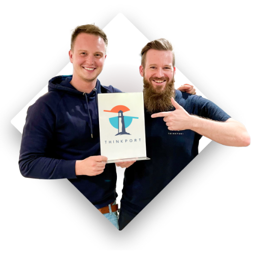

 

# Cloud Consulting

mit Startup Spirit

Wir bringen Deutschland in die Cloud.

[Kontaktieren](https://thinkport.digital/kontaktieren) 

  

## Innovationen in der Cloud

## Thinkport ist ein IT-Beratung mit dem Fokus auf Cloud, gegründet 2017 in Frankfurt am Main. Wir beraten und entwickeln Softwarelösungen für große Unternehmen und DAX Konzerne in Amazon oder Microsoft Cloud. Unser Fokus liegt hauptsächlich auf der Architektur und Umsetzung dieser sowie dem Trainer Ihrer Mitarbeiter.

[Linkedin](https://de.linkedin.com/company/thinkport) [Instagram](https://www.instagram.com/thinkport/) [Youtube](https://www.youtube.com/channel/UCnke3WYRT6bxuMK2t4jw2qQ) [Envelope](mailto:tdrechsel@thinkport.digital)

### [1.](https://thinkport.digital/cloud-consulting-fur-deutsche-grosunternehmen/)

### [Cloud Migration](https://thinkport.digital/cloud-consulting-fur-deutsche-grosunternehmen/)

### [Innovative Lösungen, die passgenau an Ihre Vorstellungen andocken. Wir optimieren Ihre IT für die Migration und richten on-premise Anwendungen in der Cloud ein.](https://thinkport.digital/cloud-consulting-fur-deutsche-grosunternehmen/)

### [2.](https://thinkport.digital/cloud-consulting-fur-deutsche-grosunternehmen/)

### [Cloud Development](https://thinkport.digital/cloud-consulting-fur-deutsche-grosunternehmen/)

### [Technische Umsetzung brandneuer Ideen. Von Front- bis Backend. Wir implementieren Ihren Use Case skalierbar in die Cloud Umgebung, die am besten zu Ihnen passt.](https://thinkport.digital/cloud-consulting-fur-deutsche-grosunternehmen/)

")

### [3.](https://thinkport.digital/cloud-consulting-fur-deutsche-grosunternehmen/)

### [Cloud Training](https://thinkport.digital/cloud-consulting-fur-deutsche-grosunternehmen/)

### [Wir bringen nicht nur Systeme, sondern auch Ihr Team in die Cloud. Durch professionelle Workshops bauen wir in Ihrem Unternehmen gezielt Fachwissen auf.](https://thinkport.digital/cloud-consulting-fur-deutsche-grosunternehmen/)

")

## Unsere Strategie für Ihren Erfolg

## [Thinkport - Silicon Valley technologies for German enterprises](https://thinkport.digital/kontaktieren/)

### Cloud Fokus

## Durch unsere Fokussierung auf die Cloud (AWS und Azure) verfügen wir über eine spezialisierte Expertise und gewährleisten unseren Kunden eine optimale Beratung.

### Start-Up Mentalität

## Unsere Leidenschaft für neue Technologien ermöglicht es uns immer, am puls der Zeit zu bleiben und den Status quo als Team stets zu hinterfragen.

### Iterative Prozesse

## Innerhalb von Kundenprojekten - wie auch intern - sind wir auf die Arbeit mit agilen Projektmanagement- Methoden und die inkrementelle und iterative Softwareentwicklung spezialisiert.

## Success

## Stories

   

## Disruption Days Workshop

## Thinkport ist ein IT-Beratung mit dem Fokus auf Cloud, gegründet 2017 in Frankfurt am Main. Wir beraten und entwickeln Softwarelösungen für große Unternehmen und DAX Konzerne in Amazon oder Microsoft Cloud. Unser Fokus liegt hauptsächlich auf der Architektur und Umsetzung dieser sowie dem Trainer Ihrer Mitarbeiter.

[Mehr](https://thinkport.digital/disruption-days-mit-futury/)

## Disruption Days Workshop

## Thinkport ist ein IT-Beratung mit dem Fokus auf Cloud, gegründet 2017 in Frankfurt am Main. Wir beraten und entwickeln Softwarelösungen für große Unternehmen und DAX Konzerne in Amazon oder Microsoft Cloud. Unser Fokus liegt hauptsächlich auf der Architektur und Umsetzung dieser sowie dem Trainer Ihrer Mitarbeiter.

[Mehr](https://thinkport.digital/disruption-days-mit-futury/) 

 

## Disruption Days Workshop

## Thinkport ist ein IT-Beratung mit dem Fokus auf Cloud, gegründet 2017 in Frankfurt am Main. Wir beraten und entwickeln Softwarelösungen für große Unternehmen und DAX Konzerne in Amazon oder Microsoft Cloud. Unser Fokus liegt hauptsächlich auf der Architektur und Umsetzung dieser sowie dem Trainer Ihrer Mitarbeiter.

[Mehr](https://thinkport.digital/disruption-days-mit-futury/)

## Erstklassige Referenzen

Zurück Weiter

## Aktuelles

Treten Sie mit uns in Kontakt!

[Kontaktieren](https://thinkport.digital/kontaktieren)
