 

# Unser Unternehmen

Cloud Consulting with Startup Spirit

0 Offices 0 + Spannende Projekte 0 Gründungsjahr

Wir sind ein Pionier in der Entwicklung innovativer Cloud-Technologien und unterstützen deutschsprachige Großunternehmen bei Projekten in den Bereichen Cloud-Migration, -Entwicklung und -Training.  
  
Dank unserer Partnerschaften mit Amazon Web Services, Microsoft Azure, HashiCorp und Confluent arbeiten wir für unsere Kunden stets mit den modernsten Tools, um unsere Vision zu verwirklichen.

[Linkedin](https://www.linkedin.com/company/11759873) [Instagram](https://www.instagram.com/thinkport/) [Youtube](https://www.youtube.com/channel/UCnke3WYRT6bxuMK2t4jw2qQ) [Envelope](mailto:tdrechsel@thinkport.digital) [Consulting](https://thinkport.digital/cloud-consulting-fuer-deutsche-grossunternehmen/) [Trainings](https://thinkport.digital/cloud-trainings-workshops/)

## Vision & Stärke

  
Wir bringen Deutschland in die Cloud.  
  
Mit unserem erfahrenen Team beschleunigen wir Digitalisierungsansätze und Softwareprojekte.  
  
Neben unserer technologischen Expertise verankern wir in den Projekten unserer Kunden auch innovative Denkweisen und Startup-Spirit. Wir überdenken bestehende Architekturen und gehen ineffiziente Lösungen an. Unsere datengetriebene und iterative Arbeitsweise richtet sich ganz nach dem avantgardistischen Geist von Silicon Valley.

## Erfolgsgeschichte

.elementor-18734 .elementor-element.elementor-element-5546cb1{text-align:center; }.elementor-18734 .elementor-element.elementor-element-5546cb1 .elementor-heading-title{color:var( --e-global-color-2186663d ); }.elementor-18734 .elementor-element.elementor-element-05f7f02{color:var( --e-global-color-2186663d ); font-family:"Montserrat", Sans-serif; font-size:22px; font-weight:400; }.elementor-18734 .elementor-element.elementor-element-95173fe{color:var( --e-global-color-2186663d ); }

## 2021

Expansion

Trotz bestehender Coronakrise stetige Akquise neuer Kunden und Projekte

Digital Leader Award 2021 in der Kategorie “Efficiency” mit dem Bayer SIMPL Projekt gewonnen

Auszeichnung mit den Clutch Award 2021

Ausbau des Expertenteams

Technologie- Partnerschaft mit Databricks

.elementor-18731 .elementor-element.elementor-element-5546cb1{text-align:center; }.elementor-18731 .elementor-element.elementor-element-5546cb1 .elementor-heading-title{color:var( --e-global-color-2186663d ); }.elementor-18731 .elementor-element.elementor-element-05f7f02{color:var( --e-global-color-2186663d ); font-family:var( --e-global-typography-secondary-font-family ), Sans-serif; font-size:var( --e-global-typography-secondary-font-size ); font-weight:var( --e-global-typography-secondary-font-weight ); }.elementor-18731 .elementor-element.elementor-element-95173fe{color:var( --e-global-color-2186663d ); }@media(max-width:1024px){.elementor-18731 .elementor-element.elementor-element-05f7f02{font-size:var( --e-global-typography-secondary-font-size ); }}@media(max-width:767px){.elementor-18731 .elementor-element.elementor-element-05f7f02{font-size:var( --e-global-typography-secondary-font-size ); }}

## 2022

Weitere Expansion

Eröffnung des Standorts Hamburg

Erneute Auszeichnung mit dem Clutch Award 2022

Gründungsmitglied des Hybrid Cloud Deutschland e. V.

Ausbau der Partnerschaft mit Confluent und Starburst

Auszeichnung mit dem Solace Award 2022

Umzug in ein größeres Office in Frankfurt

Erweiterung unseres Expertenteams auf insgesamt 65+ Mitarbeiter\*innen

.elementor-18728 .elementor-element.elementor-element-5546cb1{text-align:center; }.elementor-18728 .elementor-element.elementor-element-5546cb1 .elementor-heading-title{color:var( --e-global-color-2186663d ); }.elementor-18728 .elementor-element.elementor-element-05f7f02{color:var( --e-global-color-2186663d ); font-family:var( --e-global-typography-secondary-font-family ), Sans-serif; font-size:var( --e-global-typography-secondary-font-size ); font-weight:var( --e-global-typography-secondary-font-weight ); }.elementor-18728 .elementor-element.elementor-element-95173fe{color:var( --e-global-color-2186663d ); }@media(max-width:1024px){.elementor-18728 .elementor-element.elementor-element-05f7f02{font-size:var( --e-global-typography-secondary-font-size ); }}@media(max-width:767px){.elementor-18728 .elementor-element.elementor-element-05f7f02{font-size:var( --e-global-typography-secondary-font-size ); }}

## 2023

Weiterentwicklung

Eröffnung des Standorts Berlin

Auszeichnung mit dem Top Supplier Retail 2023 für unseren Kunden Edeka

Erweiterung unseres Expertenteams auf insgesamt 80 Mitarbeiter\*innen

Microsoft Solution Partner: Digital & App Innovation Azure

Partner von Confluent bei Data in Motion-Tour

AWS Partner Advanced Tier Services

Einführung Zero Circle für laufende Operations

.elementor-18724 .elementor-element.elementor-element-5546cb1{text-align:center; }.elementor-18724 .elementor-element.elementor-element-5546cb1 .elementor-heading-title{color:var( --e-global-color-2186663d ); }.elementor-18724 .elementor-element.elementor-element-05f7f02{color:var( --e-global-color-2186663d ); font-family:var( --e-global-typography-secondary-font-family ), Sans-serif; font-size:var( --e-global-typography-secondary-font-size ); font-weight:var( --e-global-typography-secondary-font-weight ); }.elementor-18724 .elementor-element.elementor-element-95173fe{color:var( --e-global-color-2186663d ); }@media(max-width:1024px){.elementor-18724 .elementor-element.elementor-element-05f7f02{font-size:var( --e-global-typography-secondary-font-size ); }}@media(max-width:767px){.elementor-18724 .elementor-element.elementor-element-05f7f02{font-size:var( --e-global-typography-secondary-font-size ); }}

## 2024

Weiterentwicklung

Gründung Data Circle mit Fokus ML Ops

Einführung neuer Training- und Workshop-Formate

Weichenstellung für weiteres Wachstum

.elementor-18746 .elementor-element.elementor-element-ac42710{text-align:center; }.elementor-18746 .elementor-element.elementor-element-ac42710 .elementor-heading-title{color:var( --e-global-color-2186663d ); }.elementor-18746 .elementor-element.elementor-element-0b2d888{color:var( --e-global-color-2186663d ); font-family:var( --e-global-typography-secondary-font-family ), Sans-serif; font-size:var( --e-global-typography-secondary-font-size ); font-weight:var( --e-global-typography-secondary-font-weight ); }.elementor-18746 .elementor-element.elementor-element-7a3224c{color:var( --e-global-color-2186663d ); }@media(max-width:1024px){.elementor-18746 .elementor-element.elementor-element-0b2d888{font-size:var( --e-global-typography-secondary-font-size ); }}@media(max-width:767px){.elementor-18746 .elementor-element.elementor-element-0b2d888{font-size:var( --e-global-typography-secondary-font-size ); }}

## 2018

Gründung

Realisierung des Businessplans

Gründung der Thinkport GmbH

Erste Enterprise Deals mit DAX-Größen

.elementor-18742 .elementor-element.elementor-element-5546cb1{text-align:center; }.elementor-18742 .elementor-element.elementor-element-5546cb1 .elementor-heading-title{color:var( --e-global-color-2186663d ); }.elementor-18742 .elementor-element.elementor-element-05f7f02{color:var( --e-global-color-2186663d ); font-family:"Montserrat", Sans-serif; font-size:22px; font-weight:400; }.elementor-18742 .elementor-element.elementor-element-95173fe{color:var( --e-global-color-2186663d ); }

## 2019

Rasante Erfolge

Office-Eröffnung und Aufbau eines Experten-Teams

25% des DAX als Kunden

Aufnahme ins AWS Partnernetzwerk (APN)

Abschluss der Confluent Partnerschaft

Abschluss der HashiCorp Partnerschaft und Gründung der HC User Group Frankfurt

.elementor-18737 .elementor-element.elementor-element-5546cb1{text-align:center; }.elementor-18737 .elementor-element.elementor-element-5546cb1 .elementor-heading-title{color:var( --e-global-color-2186663d ); }.elementor-18737 .elementor-element.elementor-element-05f7f02{color:var( --e-global-color-2186663d ); font-family:"Montserrat", Sans-serif; font-size:22px; font-weight:400; }.elementor-18737 .elementor-element.elementor-element-95173fe{color:var( --e-global-color-2186663d ); }

## 2020

Ausbau

Große Ausweitung des Expertenteams

Umzug in ein größeres Office in Frankfurt

Eröffnung des Standorts Leipzig

Microsoft Silver Cloud Partner nach nur zwei Jahren

Stetige Akquise neuer Kunden und Projekte trotz Coronakrise

Etablieren weiterer Partnerschaften mit Solace, Google und weiteren Cloud Agenturen

## Ein  

ausgezeichnetes  
Team

### Frankfurt

    Tobias CEO    

    Alex Business Unit Lead  
Transportation & Logistic 

    Keith Business Unit Lead  
Retail 

    Samir Business Team Lead  
Transportation 

    Philipp Business Unit Lead  
Finance 

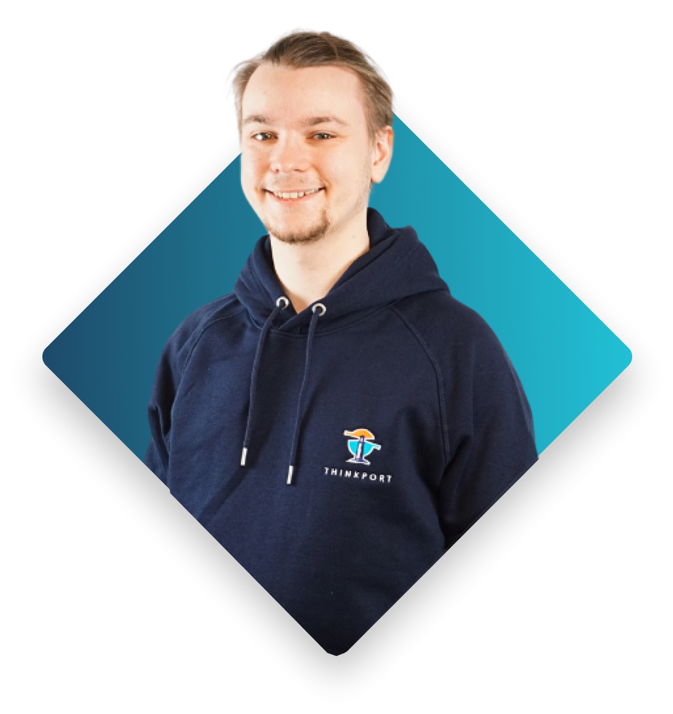    Patrick Cloud Architect    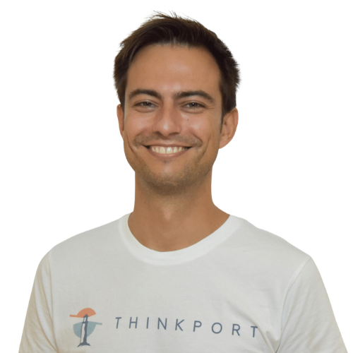

    Laszlo Business Unit Lead  
Streaming 

    Wladislaw Cloud Engineer    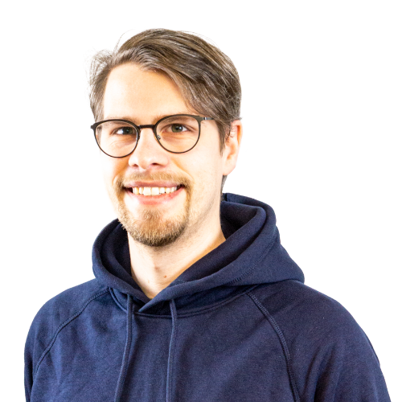    Steffen Cloud Engineer    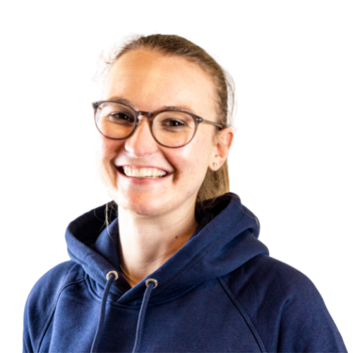    Vanessa Business Development        Joshua Senior Cloud Engineer        Philipp Innovation Manager    

    Björn Product Owner  

    Sabrina Team Lead  
People & Culture 

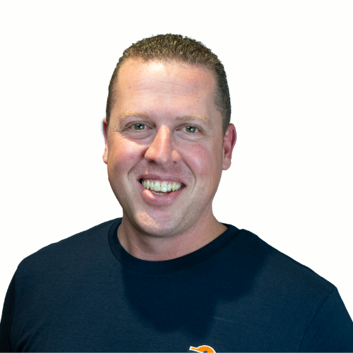

    Jan Moritz Account Manager  

    Julius Business Unit Lead  
Data 

    Tobias Senior Cloud Engineer  

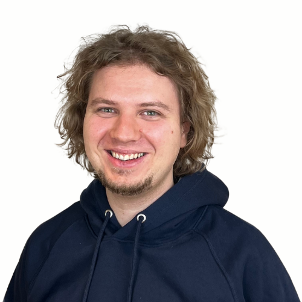

    Kristian Cloud Architect  

    Qin Cloud Engineer  

    Richard Cloud Architect  

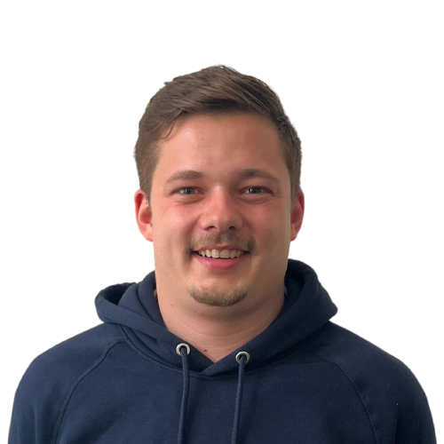

    Markus Cloud Engineer  

    Mario Cloud Developer  

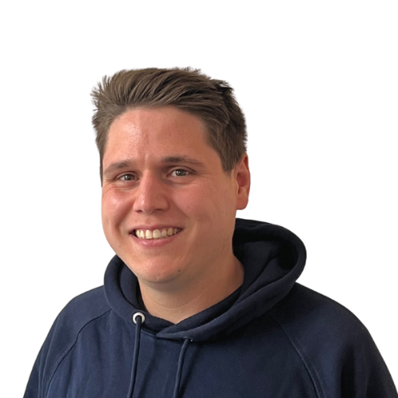

    Thomas Senior Cloud Engineer  

    Reyber Cloud Engineer  

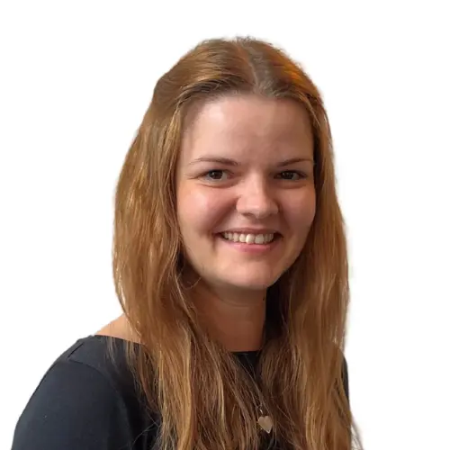

    Rebecca Finance Manager  

    Joshua Office Manager  

    Mai Ly Senior Cloud Engineer    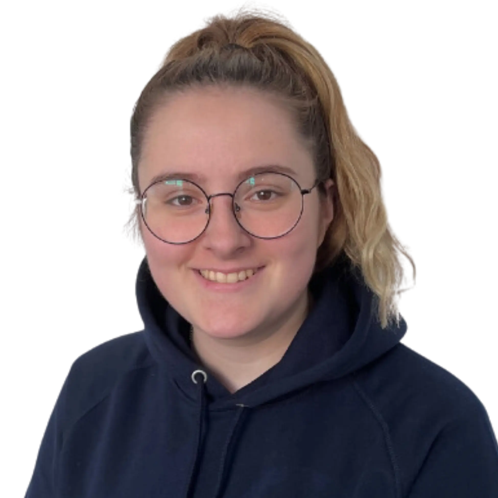    Chantal Business Development    

    Tim Product Owner    

### Hamburg

    Philipp Business Unit Lead  
General 

    Clemens Business Unit Lead  
Biotech & Chemicals 

    Jonas Cloud Engineer                      

###   

  
  
Leipzig

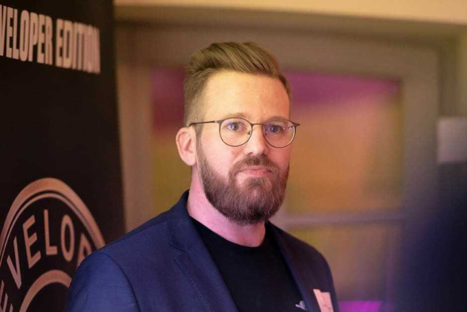    Dominik CTO        Markus Senior Cloud Architect    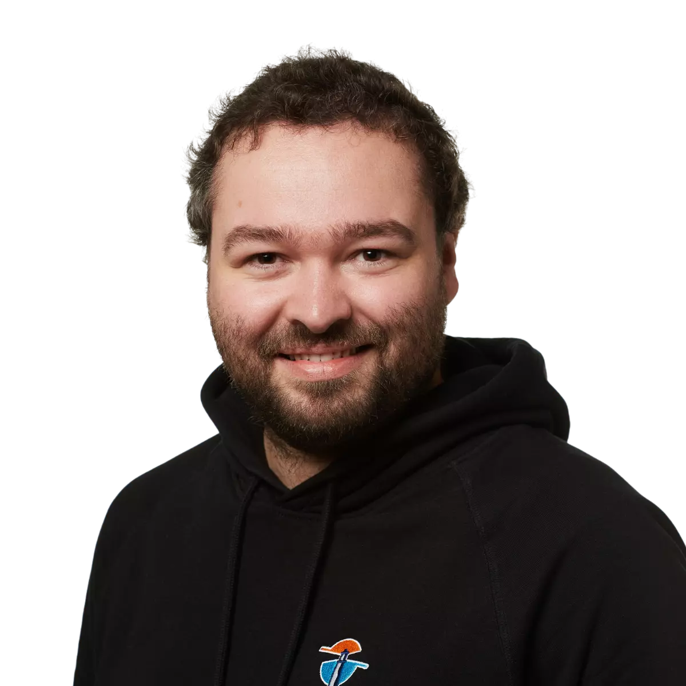    Mathias Senior Cloud Architect        Tilman Cloud Engineer    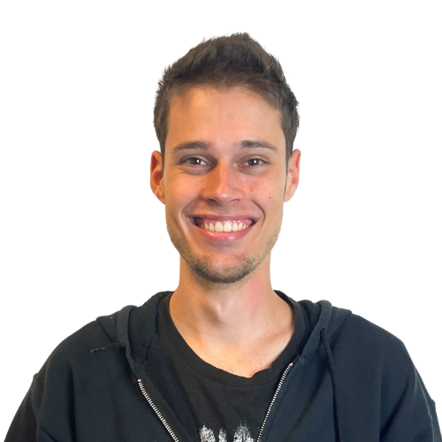    Lukas Senior Cloud Engineer        Martin Cloud Architect    

    Christina Business Unit Lead  
Zero 

    Filipp Senior Cloud Engineer        Chris Cloud Architect        Evelina Cloud Developer        Stephan Senior Cloud Engineer        André Senior Cloud Engineer    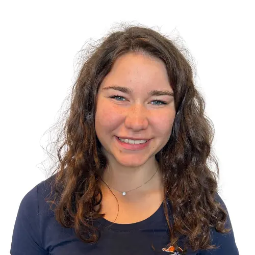    Annemarie Dual Computer Science Student        Frank Cloud Engineer    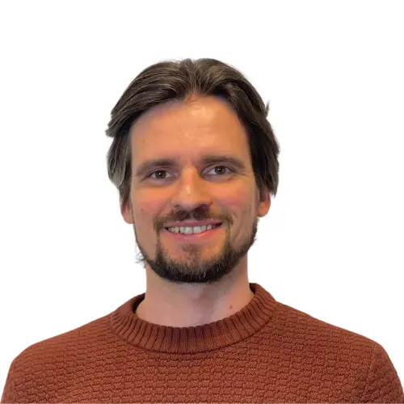

    Martin Cloud Engineer    

### Berlin

    Felix Cloud Engineer        Andreas Cloud Architect    

    René Cloud Architect                      

Cloud-Beratung mit Start-Up Mentalität

## Ihr Ansprechpartner

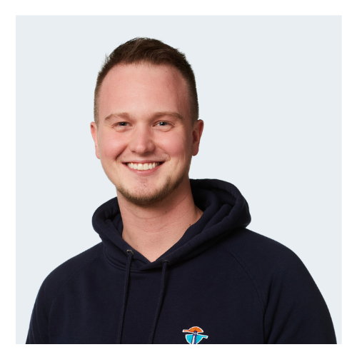

Tobias Drechsel

CEO & Senior Cloud Consultant

[tdrechsel@thinkport.digital](mailto:tdrechsel@thinkport.digital)

+49 151 63417156

* 
* 

## [Thinkport - Silicon Valley technologies for German enterprises](https://thinkport.digital/kontaktieren/)
