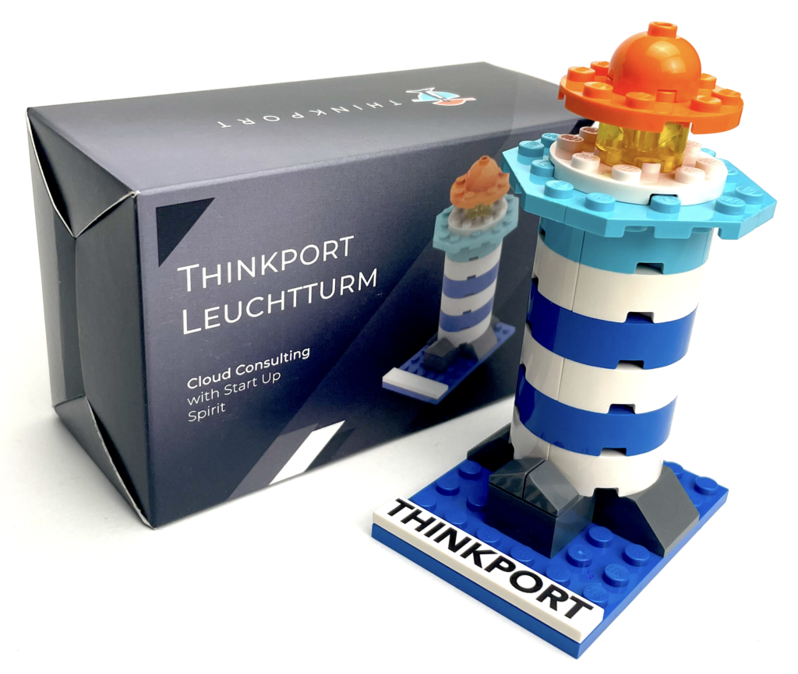
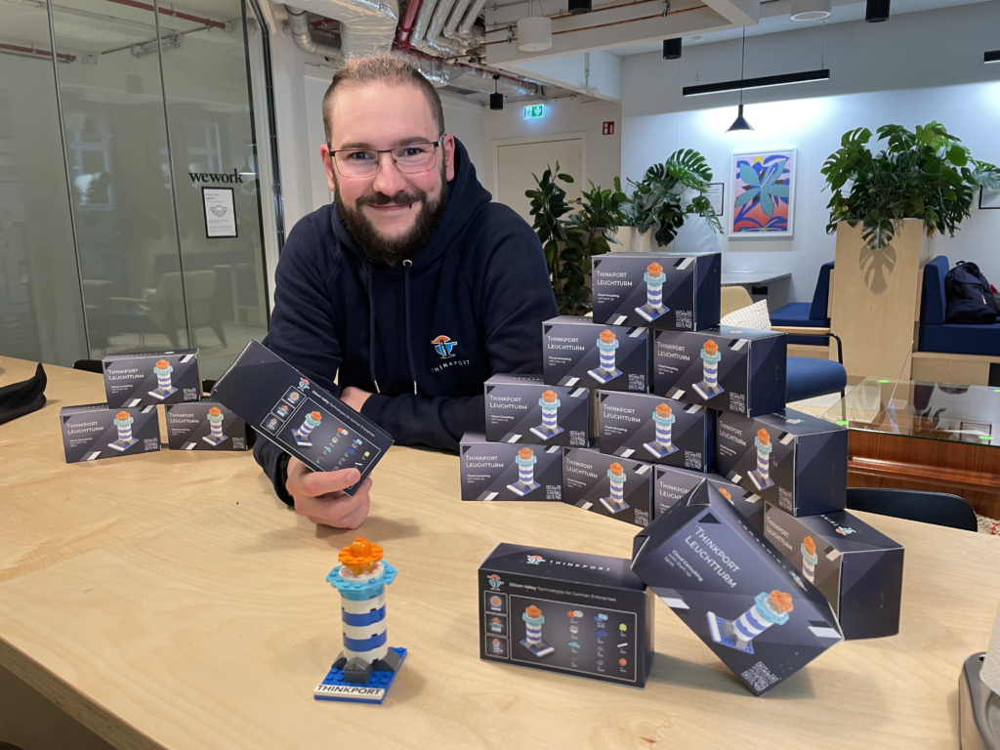
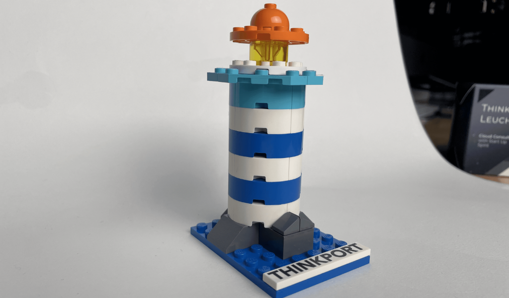
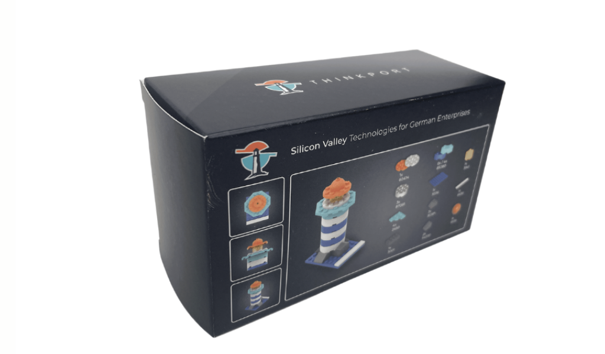
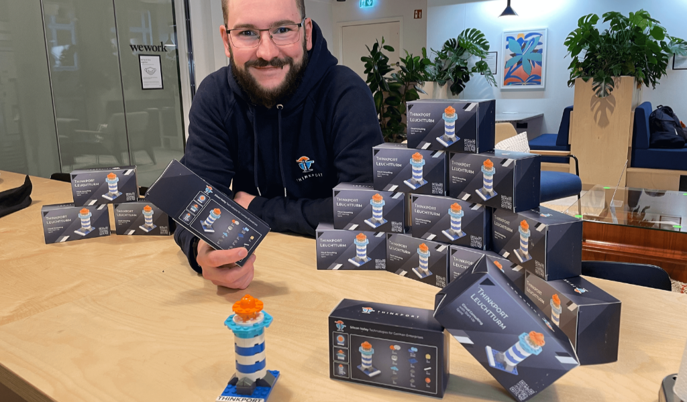
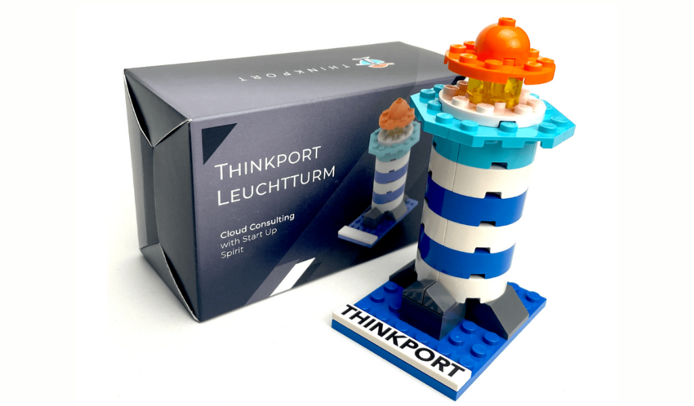
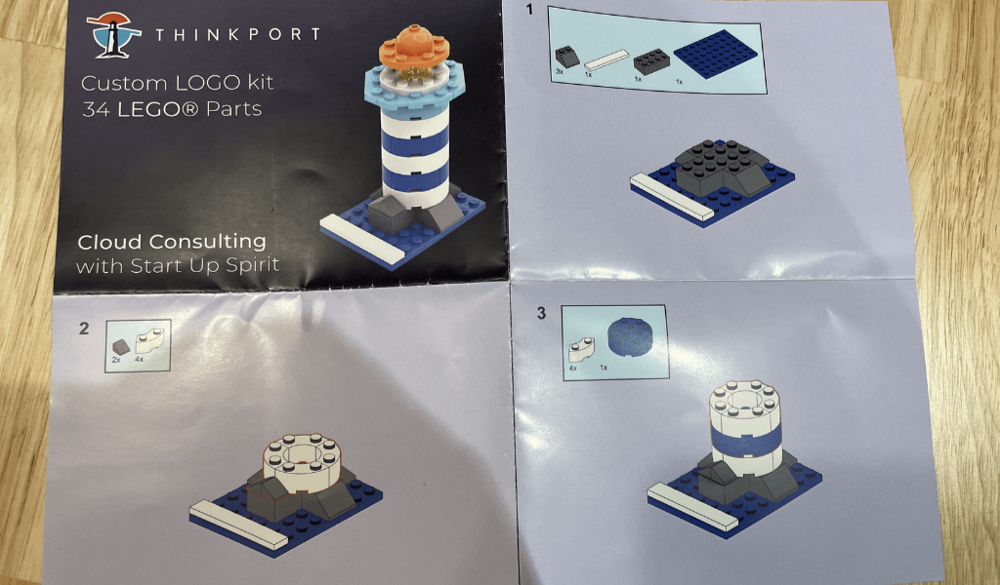
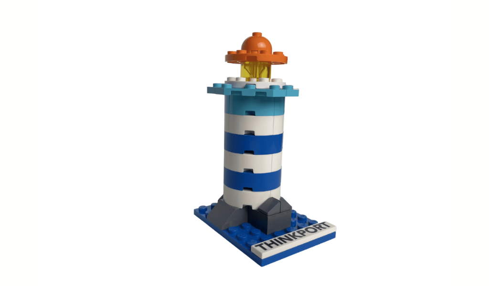
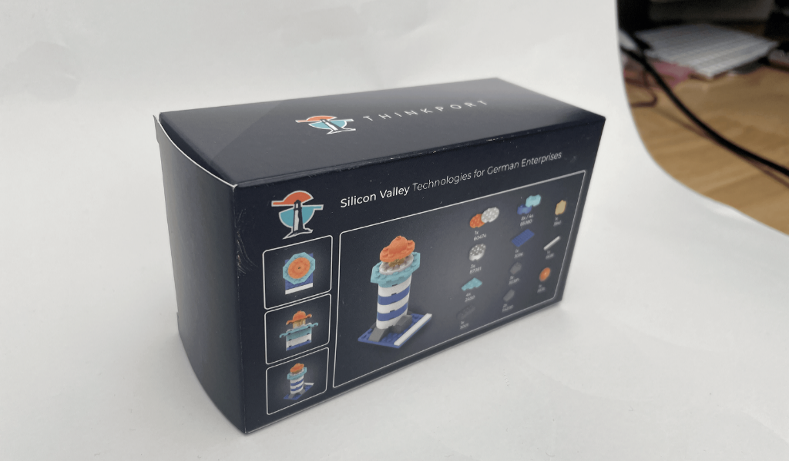
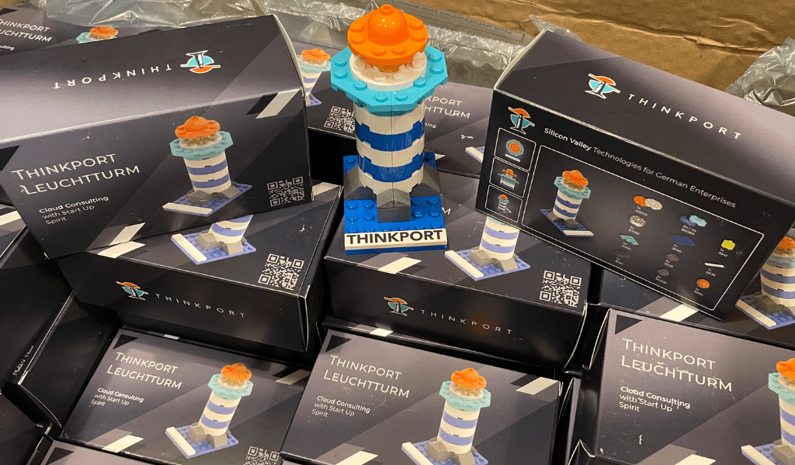

 

#SupportUkraine

# Thinkport Lego Leuchtturm

## Die Idee

Vor einigen Monaten hatten wir die verrückte Idee, unser Logo als Leuchtturm in Lego nachzubauen. Als kleines Geschenk für Kunden und Freunde des Hauses. Stunden der Konzeption, Planung und Vorbereitung gingen ins Land. Nach einigen Monaten wurden die kleinen Meisterwerke endlich geliefert. Jeder im Team war stolz auf das Resultat.  
  
Leider hat sich kurz danach die Welt um 180 Grad gedreht.  
  
Wir möchten die Leuchttürme jetzt für einen besseren Zweck einsetzen.

[Linkedin](https://www.linkedin.com/company/11759873) [Instagram](https://www.instagram.com/thinkport/) [Youtube](https://www.youtube.com/channel/UCnke3WYRT6bxuMK2t4jw2qQ) [Envelope](mailto:tdrechsel@thinkport.digital)

### Spende einen Betrag deiner Wahl

### Wir verdoppeln den Betrag. Und schicken dir einen Leuchtturm.

## Der Turm

Unser Kollege Lars Herwegh entwarf den Turm und begleitete die Produktion bis ins letzte Detail. Die Teile sind handelsübliche Lego-Teile. Sie können somit leicht durch vorhandene Teile ersetzt oder erweitert werden.

 

## Die Organisation

Die Menschen der Ukraine sind einer humanitären Katastrophe ausgeliefert. Über 1, 5 Millionen Menschen haben bereits die internationalen Grenzen überquert. Zusätzlich rechnet der UNHCR mit hunderttausenden Menschen, die innerhalb der Ukraine auf der Flucht sind. Sie brauchen dringend unsere Hilfe und  
lebensrettenden Schutz.

## Deine Unterstützung

[Du kannst gleich hier über die Seite der UNO-Flüchtlingshilfe spenden:](https://www.hashicorp.com/)

[Hier spenden](https://www.uno-fluechtlingshilfe.de/spenden-ukraine)

Oder mit normaler Überweisung auf das gleiche Spendenkonto

				
					 `BIC: COLSDE33 IBAN: DE78 3705 0198 0020 0088 50 Sparkasse KölnBonn Kontonummer: 2000 88 50 BLZ: 370 501 98`

				
			

DANKE.

Zurück Weiter

## So geht's weiter, damit du den Lego Leuchtturm erhältst. Und wir deine Spende verdoppeln können
