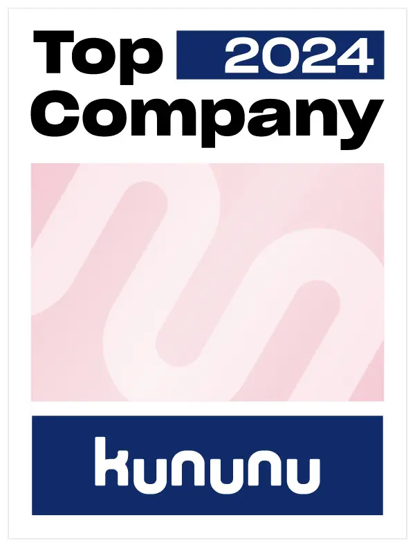
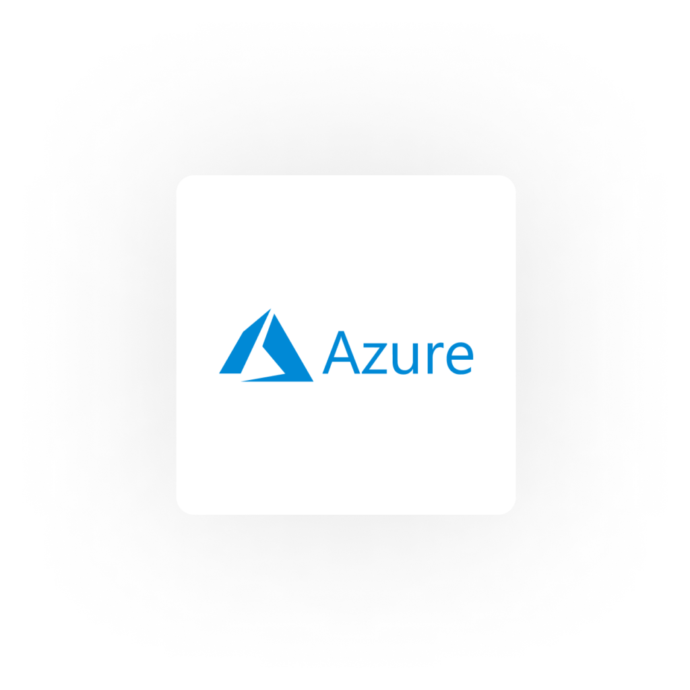

# Cloud Consulting

mit Startup Spirit

Die Experten für Leuchtturmprojekte  
bei Großunternehmen

[Kontaktieren ](https://thinkport.digital/kontaktieren)

## Innovationen in der Cloud

Wir bringen Deutschland in die Cloud. Mit Cloud Technology of Tomorrow. So beschleunigen wir Ihre Unternehmens-Agilität, senken Kosten und verbessern Ihre Kundenzufriedenheit.

[Linkedin](https://de.linkedin.com/company/thinkport) [Instagram](https://www.instagram.com/thinkport/) [Youtube](https://www.youtube.com/channel/UCnke3WYRT6bxuMK2t4jw2qQ) [Envelope](mailto:tdrechsel@thinkport.digital)

### [Cloud Migration](https://thinkport.digital/cloud-consulting-fuer-deutsche-grossunternehmen/)

Innovative Lösungen, die passgenau an Ihre Vorstellungen andocken. Wir optimieren Ihre IT für die Migration und richten on-premise Anwendungen in der Cloud ein.

### [Cloud Development](https://thinkport.digital/cloud-consulting-fuer-deutsche-grossunternehmen/)

Technische Umsetzung brandneuer Ideen. Von Front- bis Backend. Wir implementieren Ihren Use Case skalierbar in die Cloud Umgebung, die am besten zu Ihnen passt.

### [Cloud Training](https://thinkport.digital/cloud-trainings-workshops/)

Wir bringen nicht nur Systeme, sondern auch Ihr Team in die Cloud. Durch professionelle Workshops bauen wir in Ihrem Unternehmen gezielt Fachwissen auf.​

## Geheimrezept

## [Thinkport - Silicon Valley technologies for German enterprises](https://thinkport.digital/kontaktieren/)

### Klare Positionierung

Durch unsere Fokussierung auf die Cloud (AWS und Azure) verfügen wir über eine spezialisierte Expertise und gewährleisten unseren Kunden eine optimale Beratung.

### Start-Up Mentalität

Unsere Leidenschaft für neue Technologien ermöglicht es uns immer, am Puls der Zeit zu bleiben und den Status quo als Team stets zu hinterfragen.

### Iterative Prozesse

Innerhalb von Kundenprojekten - wie auch intern - sind wir auf die Arbeit mit agilen Projektmanagement-Methoden und die inkrementelle und iterative Softwareentwicklung spezialisiert.

**Sichern Sie sich unseren Artikel "HashiCorp Vault"!**

Im Formular unten können Sie Ihre E-Mail-Adresse, Ihren Namen und Ihr Unternehmen angeben, um den kostenlosen Artikel "HashiCorp Vault" herunterzuladen.

Download_Formular_HasiCorp_Vault Name \* First Last Name \* Last Email \* Company Captcha Absenden Si eres humano, deja este campo en blanco.

## Unser Cloud Consulting

## stellt die IT-Ziele großer Unternehmen und DAX Konzerne in den Mittelpunkt:

* Die Performance zu beschleunigen, 
* Agilität zu erhöhen, 
* Kosten zu senken und
* Compliance sicherzustellen.

## Hierzu fokussieren wir auf die Architektur und Umsetzungen der drei marktführenden **Cloud Service Partner** AWS, Azure und GCP. Diese mächtigen Plattformen bieten hunderte von Services an, die maßgeschneidert auf die individuellen Kunden-Bedürfnisse von uns strategisch gedacht, geplant, umgesetzt und betrieben werden.

## Hinzu kommen im Einzelfall empfohlene bis notwendige **[Technologien weiterer Partner](https://thinkport.digital/cloud-trainings-workshops/)**, die wir für unsere Kunden lösungsorientiert einsetzen und orchestrieren. Hierzu zählen im Bereich der Cloud Architektur **[Kubernetes, Docker](https://thinkport.digital/docker-und-kubernetes-lernen/)** und **[Terraform](https://thinkport.digital/terraform-trainings/)**. Für besonders anspruchsvolles Daten Management setzen wir auf **[Apache Kafka](https://thinkport.digital/cloud-consulting-fuer-deutsche-grossunternehmen/apache-kafka/)**, **[Databricks](https://thinkport.digital/datenplattform-mit-azure-und-databricks/)** und **[Spark](https://thinkport.digital/spark-fuer-big-data-lernen/)**. Sowie **[Airflow](https://thinkport.digital/airflow-in-der-cloud/)** für die Workflow Programmierung.

## Besondere Kompetenzen haben wir in diesen **Service-Bereichen** aufgebaut, die uns Kunden bereits seit 5 Jahren anvertrauen:

* Migration und Development komplexer Cloud Architekturen
* Hybride und Multi Cloud Architekturen
* Leistungsfähige Data Plattformen
* Event getriebene Streaming Architekturen

Wie können wir Ihnen helfen? Gerne stellen wir Ihnen das Experten - Team mit Best Practise Erfahrung für Ihre Aufgabe zusammen.

## Weitere Informationen

Gerne unterstützen wir Sie bei der Migration oder Neuentwicklung von innovativen Anwendungen in der Cloud. Setzen Sie sich dazu unverbindlich und unkompliziert mit unseren Cloud Experten in Verbindung.

[Kontaktieren](https://thinkport.digital/kontaktieren)

## [Thinkport - Silicon Valley technologies for German enterprises](https://thinkport.digital/kontaktieren/)
